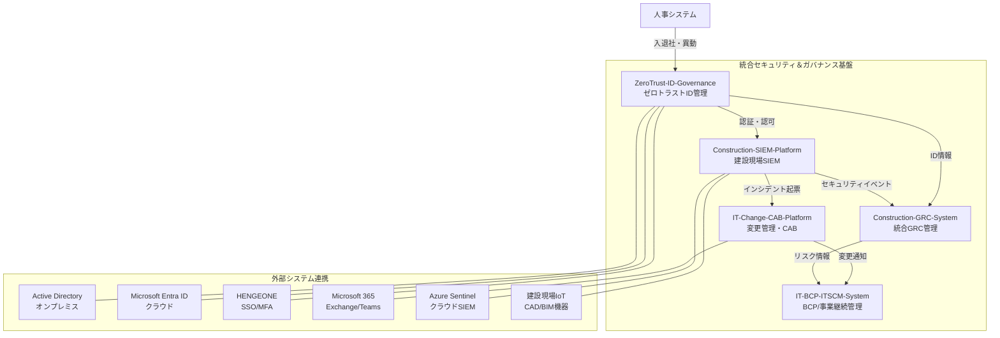

# Construction-DX-One-System

> **みらい建設工業 統合セキュリティ＆ガバナンス基盤**
>
> ゼロトラスト・SIEM・GRC・変更管理・BCP を統合した建設業DXセキュリティプラットフォーム

[](docs/)
[](docs/)
[](docs/)
[](LICENSE)

---

## 概要

Construction-DX-One-Systemは、みらい建設工業（従業員600名）のIT部門（7名）が推進する建設業DXセキュリティ統合基盤です。建設現場固有のサイバーリスクに対応しながら、ISO27001・NIST CSF 2.0・ISO20000への多規格準拠を実現します。

### なぜこのシステムが必要か

建設業では以下の課題が複合的に発生しています。

- 現場IoT機器・CAD/BIMシステムへのサイバー攻撃リスクの増大
- オンプレミスとクラウドが混在するハイブリッドID管理の複雑化
- ISO27001・建設業法・品確法など多法令対応の工数増大（年間500時間超）
- 災害・サイバー攻撃時のIT事業継続計画（BCP）の未整備
- IT変更管理プロセスの属人化・記録不備

---

## サブシステム一覧

| # | システム | リポジトリ | 目的 | 技術スタック | ステータス |
|---|---------|-----------|------|------------|----------|
| 1 | **ZeroTrust-ID-Governance** | `Kensan196948G/ZeroTrust-ID-Governance` | ゼロトラスト統合ID管理 | Python/FastAPI + Next.js 14 | 開発中 |
| 2 | **IT-Change-CAB-Platform** | `Kensan196948G/IT-Change-CAB-Platform` | IT変更管理・CAB自動化 | Node.js/Express + React 18 | STABLE ✅ |
| 3 | **IT-BCP-ITSCM-System** | `Kensan196948G/IT-BCP-ITSCM-System` | BCP/IT事業継続管理 | Python/FastAPI + Next.js (PWA) | STABLE ✅ |
| 4 | **Construction-SIEM-Platform** | `Kensan196948G/Construction-SIEM-Platform` | 建設現場SIEM・脅威監視 | Python/FastAPI + Elasticsearch | 開発中 |
| 5 | **Construction-GRC-System** | `Kensan196948G/Construction-GRC-System` | 統合GRCリスク管理 | Python/Django + Vue.js 3 | 開発中 |

---

## システム全体アーキテクチャ



---

## 準拠規格・法令

| 規格/法令 | 対応システム | 主要対応領域 |
|---------|------------|-------------|
| ISO27001:2022 | 全システム | 情報セキュリティ管理（全93管理策） |
| NIST CSF 2.0 | 全システム | IDENTIFY / PROTECT / DETECT / RESPOND / RECOVER / GOVERN |
| ISO20000-1:2018 | ICCP / IBIS | ITサービス管理・変更管理・ITSCM |
| 個人情報保護法 | ZTIG / CGRC | 個人データ処理・アクセス管理 |
| 建設業法 | CGRC | 建設業固有のコンプライアンス |
| 品確法 | CGRC | 品質確保に関する法令対応 |
| 労働安全衛生法 | CGRC / CSIEM | 現場安全管理・記録 |

---

## 開発ドキュメント構成

```
Construction-DX-One-System_README.md          ← 本ファイル（全体概要）
Construction-DX-One-System_要件定義書.md       ← 統合要件定義書
Construction-DX-One-System_詳細仕様書.md       ← API・DB・アーキテクチャ詳細

ZeroTrust-ID-Governance/
└── docs/
    ├── 01_要件定義（Requirements）/
    ├── 02_アーキテクチャ設計（Architecture）/
    ├── 03_API仕様（API_Specification）/
    ├── 04_開発ガイド（Development_Guide）/
    ├── 05_セキュリティ設計（Security_Design）/
    ├── 06_統合設計（Integration_Design）/
    ├── 07_テスト仕様（Testing）/
    ├── 08_データモデル（Data_Model）/
    ├── 09_運用保守（Operations）/
    ├── 10_プロジェクト管理（Project_Management）/
    ├── 11_コンプライアンス（Compliance）/
    └── 12_リリース管理（Release_Management）/

IT-Change-CAB-Platform/
└── docs/ （42ファイル・14カテゴリ）

IT-BCP-ITSCM-System/
└── docs/

Construction-SIEM-Platform/
└── docs/ （10カテゴリ）

Construction-GRC-System/
└── docs/
```

---

## 開発状況サマリー

| システム | テスト数 | カバレッジ | APIエンドポイント | PR数 |
|---------|---------|----------|----------------|------|
| ZeroTrust-ID-Governance | - | 90%目標 | 多数（設計中） | - |
| IT-Change-CAB-Platform | 1,253 | 100% | 18ルーター | 131 merged |
| IT-BCP-ITSCM-System | 1,012 | 80%以上 | 多数 | 173 merged |
| Construction-SIEM-Platform | 210 | 83% | 42 | - |
| Construction-GRC-System | 660以上 | 80%以上 | 多数 | - |

---

## 共通技術要件

### 開発スタック共通事項

| 項目 | 要件 |
|------|------|
| バージョン管理 | Git / GitHub |
| ブランチ戦略 | main直接push禁止・PR必須 |
| CI/CD | GitHub Actions（全プロジェクト） |
| コンテナ | Docker / Docker Compose必須 |
| テストカバレッジ | 80%以上（ZTIG: 90%以上） |
| セキュリティ | OWASP Top 10対策必須 |
| APIドキュメント | OpenAPI 3.0自動生成 |

### 使用データベース

| システム | DB | キャッシュ |
|---------|-----|---------|
| ZTIG | PostgreSQL | Redis |
| ICCP | PostgreSQL 16 + Prisma | Redis 7 |
| IBIS | PostgreSQL 16（Geo冗長） | Redis 7 Cluster |
| CSIEM | Elasticsearch 8.x | - |
| CGRC | PostgreSQL 16 | Redis 7 |

---

## Claude Codeによる開発ガイド

各プロジェクトは Claude Code（AI自律開発）による ClaudeOS v7.x 方式での開発を採用しています。

### クイックスタート（各プロジェクト）

```bash
# 1. リポジトリクローン
git clone https://github.com/Kensan196948G/<PROJECT-NAME>.git
cd <PROJECT-NAME>

# 2. CLAUDE.md を必ず最初に読む（プロジェクト固有の開発ガイド）
cat CLAUDE.md

# 3. 環境構築
docker-compose up -d

# 4. テスト実行
# Python系
pytest tests/ -v --cov
# Node.js系
npm test
```

### Claude Code推奨コマンド

```bash
/plan <タスク>           # 実装計画作成
/tdd <機能>             # TDD実装（テストファースト）
/code-review            # コードレビュー
/security-review        # セキュリティ審査
/e2e                    # E2Eテスト実行
/build-fix              # ビルドエラー修正
```

### 各プロジェクトのCLAUDE.md参照

各プロジェクトルートの `CLAUDE.md` に以下が記載されています。
- プロジェクト固有の開発規約
- コンテキスト維持のためのAI向け指示
- ClaudeOS エージェント設定
- 重要なアーキテクチャ決定事項

---

## セキュリティポリシー

本プロジェクトのセキュリティに関する報告は IT部門セキュリティ担当までご連絡ください。詳細なセキュリティポリシーは各プロジェクトの `docs/05_セキュリティ設計/` を参照してください。

**緊急セキュリティインシデント発生時**: Construction-SIEM-Platform のインシデント対応プレイブックに従い、24時間対応オンコールへ連絡してください。

---

## ドキュメントリンク

| ドキュメント | 説明 |
|------------|------|
| [統合要件定義書](./Construction-DX-One-System_要件定義書.md) | 全5システムの要件定義 |
| [詳細仕様書](./Construction-DX-One-System_詳細仕様書.md) | API・DB・アーキテクチャ詳細 |

---

*最終更新: 2026-04-15 / 対象組織: みらい建設工業 IT部門*
