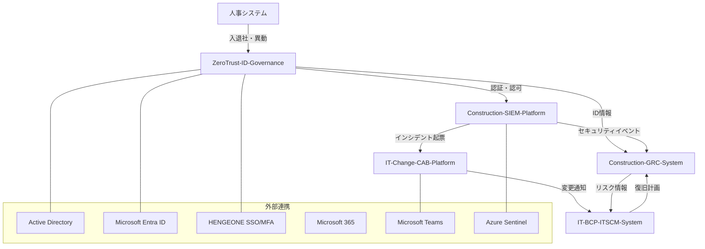

# Construction-DX-One-System 統合要件定義書

| 項目 | 内容 |
|------|------|
| **文書番号** | REQ-CDOS-001 |
| **バージョン** | 1.0.0 |
| **作成日** | 2026-04-15 |
| **対象システム群** | Construction-DX-One-System（5サブシステム） |
| **対象組織** | みらい建設工業 IT部門 |
| **準拠規格** | ISO27001:2022 / ISO20000-1:2018 / NIST CSF 2.0 |

---

## 1. システム群概要

### 1.1 背景

みらい建設工業（従業員600名、IT部門7名）では、建設業DX推進に伴いITセキュリティ・ガバナンス・事業継続の高度化が急務となっている。本プロジェクトは以下5つの統合システムを並行開発し、建設業特有のリスクに対応する「統合セキュリティ＆ガバナンス基盤」を構築する。

### 1.2 システム構成一覧

| # | システム名 | 略称 | 目的 | 優先度 | ステータス |
|---|-----------|------|------|--------|----------|
| 1 | ZeroTrust-ID-Governance | ZTIG | ゼロトラスト統合ID管理 | 高 | 開発中 |
| 2 | IT-Change-CAB-Platform | ICCP | IT変更管理・CAB自動化 | 中 | STABLE |
| 3 | IT-BCP-ITSCM-System | IBIS | BCP/IT事業継続管理 | 中 | STABLE |
| 4 | Construction-SIEM-Platform | CSIEM | 建設現場SIEM・脅威監視 | 高 | 開発中 |
| 5 | Construction-GRC-System | CGRC | 統合GRCリスク管理 | 高 | 開発中 |

### 1.3 システム間連携図

---

## 2. ZeroTrust-ID-Governance（ZTIG）要件定義

### 2.1 目的

ゼロトラスト原則（Never Trust, Always Verify）に基づき、EntraID・HENGEONE・AD を統合した単一のアイデンティティガバナンス基盤を構築する。

### 2.2 解決すべき課題

| 課題 | 現状 |
|------|------|
| アカウント管理の属人化 | 入退社・異動対応が手動・属人的 |
| 特権アカウント管理不備 | 棚卸頻度・承認フロー未整備 |
| アクセス可視化不足 | ゼロトラスト原則に基づく可視化なし |
| コンプライアンス証跡不備 | ISO27001・NIST CSF 2.0準拠証跡未整備 |

### 2.3 対象スコープ

| 対象システム | 種別 | 優先度 |
|------------|------|--------|
| Active Directory | オンプレミス | 必須 |
| Microsoft Entra ID | クラウド | 必須 |
| HENGEONE | クラウド SSO/MFA | 必須 |
| Microsoft 365 | クラウド | 必須 |
| ファイルサーバ | オンプレミス | 推奨 |

| ユーザー種別 | 人数 | 備考 |
|------------|------|------|
| 正社員・嘱託社員 | 約500名 | 全員対象 |
| 協力会社・外部 | 約100名 | 有効期限付き |
| ITシステム管理者 | 7名 | PIM対象（特権） |

### 2.4 機能要件

#### アイデンティティライフサイクル管理

| 要件ID | 要件名 | 優先度 |
|--------|--------|--------|
| ILM-001 | 入社時自動プロビジョニング | 必須 |
| ILM-002 | 異動時ロール自動更新 | 必須 |
| ILM-003 | 退職時自動デプロビジョニング | 必須 |
| ILM-004 | 外部委託先アカウント管理 | 必須 |
| ILM-005 | アカウント棚卸ワークフロー | 必須 |

#### 認証・アクセス制御

| 要件ID | 要件名 | 優先度 |
|--------|--------|--------|
| AUTH-001 | JWTベース認証（アクセス/リフレッシュトークン） | 必須 |
| AUTH-002 | トークンリボケーション（Redisブラックリスト） | 必須 |
| AUTH-003 | RBAC（ロールベースアクセス制御） | 必須 |
| AUTH-004 | 多要素認証（HENGEONE経由） | 必須 |
| AUTH-005 | セッションタイムアウト管理 | 必須 |

#### 監査・コンプライアンス

| 要件ID | 要件名 | 優先度 |
|--------|--------|--------|
| AUD-001 | 全操作の監査ログ記録 | 必須 |
| AUD-002 | ログ改ざん防止（ハッシュチェーン） | 必須 |
| AUD-003 | ISO27001準拠レポート出力 | 必須 |
| AUD-004 | NIST CSF対応マッピング | 推奨 |
| AUD-005 | リアルタイムアラート | 推奨 |

### 2.5 非機能要件

| 品質属性 | 要件値 |
|---------|--------|
| 可用性 | 99.9%（月間ダウンタイム43分以内） |
| レスポンスタイム | API 95パーセンタイル 500ms以内 |
| スループット | 100 req/sec |
| セキュリティ | OWASP Top 10対策必須 |
| テストカバレッジ | 90%以上 |

### 2.6 技術スタック

| レイヤー | 技術 |
|---------|------|
| バックエンド | Python 3.11 / FastAPI |
| フロントエンド | Next.js 14 / TypeScript |
| データベース | PostgreSQL / Redis |
| インフラ | Docker / GitHub Actions CI/CD |
| 準拠規格 | ISO27001 A.5.15〜A.8.2 / NIST CSF 2.0 PR.AA |

---

## 3. IT-Change-CAB-Platform（ICCP）要件定義

### 3.1 目的

みらい建設工業のハイブリッドIT環境（オンプレ＋Azure/M365）における変更管理プロセスを完全自動化し、ISO20000準拠の変更管理基盤を構築する。

### 3.2 解決すべき課題

| 課題 | 現状 | 解決策 |
|------|------|--------|
| 変更申請の追跡不足 | 口頭・メール・紙での申請 | Web UIでの一元管理 |
| CAB承認の未記録 | 承認プロセス未明文化 | 自動議事録・承認ワークフロー |
| 影響分析の属人化 | 担当者経験依存 | 依存関係マップ自動分析 |
| ロールバック未準備 | 事前手順なし | ロールバック計画の必須化 |
| ISO20000証跡不足 | 文書化不十分 | 全プロセスの自動証跡生成 |

### 3.3 変更種別と承認フロー

| 変更種別 | 定義 | 承認レベル | SLA |
|---------|------|-----------|-----|
| 緊急変更 | サービス停止・重大インシデント対応 | ECAB（緊急CAB） | 1時間以内 |
| 標準変更 | 事前承認済み定型変更 | 自動承認 | 即時 |
| 通常変更 | CABが審議・承認する変更 | CAB承認 | 5営業日 |
| 重大変更 | 基幹システム・全社影響 | 経営層承認+CAB | 10営業日 |

### 3.4 機能要件

| 要件ID | 要件名 | 優先度 |
|--------|--------|--------|
| RFC-001 | RFC（変更要求）起票・追跡 | 必須 |
| RFC-002 | 変更種別自動判定 | 必須 |
| RFC-003 | 影響分析エンジン（依存関係マップ） | 必須 |
| RFC-004 | 変更衝突検知 | 必須 |
| CAB-001 | CABワークフロー自動化 | 必須 |
| CAB-002 | 自動議事録生成 | 必須 |
| CAB-003 | 変更カレンダー管理 | 必須 |
| CAB-004 | フリーズ期間管理 | 必須 |
| EXE-001 | 変更実施チェックリスト | 必須 |
| EXE-002 | ロールバック計画管理 | 必須 |
| EXE-003 | PIR（事後レビュー）ワークフロー | 必須 |
| KPI-001 | KPIダッシュボード | 必須 |
| KPI-002 | SLA監視・自動エスカレーション | 必須 |
| INT-001 | Teams Webhook通知連携 | 必須 |
| INT-002 | Entra ID SSO連携 | 必須 |
| INT-003 | SIEM連携（セキュリティインシデント起票） | 推奨 |

### 3.5 非機能要件

| 品質属性 | 要件値 |
|---------|--------|
| 可用性 | 99.5%以上 |
| レスポンスタイム | API 95パーセンタイル 1秒以内 |
| RBAC | 30権限 × 9ロール |
| テスト | 1,253テスト全パス（Backend 738 / Frontend 414 / E2E 101） |
| テストカバレッジ | 100%（全APIルーター・全画面） |

### 3.6 技術スタック

| レイヤー | 技術 |
|---------|------|
| バックエンド | Node.js 20 LTS / Express 4.x |
| フロントエンド | React 18 / TypeScript 5.x / Ant Design 5 |
| データベース | PostgreSQL 16 / Prisma ORM（11モデル） |
| キャッシュ | Redis 7 |
| ジョブキュー | BullMQ（3キュー） |
| 外部連携 | Teams Webhook / Entra ID / OpenAPI 3.0 |
| CI/CD | GitHub Actions |
| 準拠規格 | ISO20000 / ISO27001 A.8.32 / NIST CSF PR.IP |

---

## 4. IT-BCP-ITSCM-System（IBIS）要件定義

### 4.1 目的

災害・サイバー攻撃時のIT復旧計画・BCP訓練・RTOダッシュボードを統合し、ISO20000 ITSCM要件に完全準拠したIT事業継続管理基盤を構築する。

### 4.2 対象システムRTO/RPO定義

| システム | RTO目標 | RPO目標 | 重要度 |
|---------|---------|---------|--------|
| Active Directory | 4時間 | 1時間 | 最高 |
| Entra ID / M365 | SLA依存 | SLA依存 | 最高 |
| Exchange Online | SLA依存 | SLA依存 | 高 |
| ファイルサーバ | 8時間 | 24時間 | 高 |
| DeskNet's Neo | 24時間 | 24時間 | 中 |
| AppSuite | 48時間 | 24時間 | 中 |
| ITSM-System | 8時間 | 4時間 | 高 |
| SIEMプラットフォーム | 8時間 | 4時間 | 高 |

### 4.3 機能要件

#### BCP/ITSCM計画管理

| 要件ID | 要件名 | 優先度 |
|--------|--------|--------|
| PLAN-001 | IT復旧計画文書管理（シナリオ別） | 必須 |
| PLAN-002 | RTO/RPO管理・可視化 | 必須 |
| PLAN-003 | 代替手段・フォールバック管理 | 必須 |
| PLAN-004 | 緊急連絡網管理・エスカレーション | 必須 |
| PLAN-005 | BIAに基づく優先復旧順序管理 | 必須 |
| PLAN-006 | ベンダー緊急連絡先・SLA管理 | 必須 |

#### BCP訓練管理

| 要件ID | 要件名 | 優先度 |
|--------|--------|--------|
| TRN-001 | 訓練シナリオ作成・管理 | 必須 |
| TRN-002 | テーブルトップ演習ツール | 必須 |
| TRN-003 | 訓練結果・課題記録 | 必須 |
| TRN-004 | RTO達成状況タイムトラッキング | 必須 |

#### インシデント対応（実災害時）

| 要件ID | 要件名 | 優先度 |
|--------|--------|--------|
| INC-001 | 緊急対応指揮支援システム | 必須 |
| INC-002 | RTOダッシュボード（リアルタイム） | 必須 |
| INC-003 | タスク割当・進捗管理 | 必須 |
| INC-004 | 経営層向け状況報告自動化 | 必須 |

#### ダッシュボード・レポート

| 要件ID | 要件名 | 優先度 |
|--------|--------|--------|
| RPT-001 | BCPレディネス総合スコア | 必須 |
| RPT-002 | RTO/RPOコンプライアンス比較 | 必須 |
| RPT-003 | 訓練履歴・改善トレンド | 必須 |
| RPT-004 | ISO20000準拠レポート | 必須 |

### 4.4 非機能要件

| 品質属性 | 要件値 |
|---------|--------|
| フェイルオーバー時間 | 90秒以内（目標15分） |
| 障害検知時間 | 30秒以内 |
| データ同期遅延 | 5秒以内（目標5分） |
| オフライン動作 | PWA対応（必須） |
| テスト数 | 1,012テスト全パス |
| テストカバレッジ | 80%以上 |

### 4.5 技術スタック

| レイヤー | 技術 | バージョン |
|---------|------|----------|
| フロントエンド | Next.js / TypeScript / Tailwind CSS | 16.x |
| バックエンド | Python FastAPI | 0.135.3 |
| データベース | PostgreSQL（Geo冗長） | 16 |
| キャッシュ | Redis Cluster | 7 |
| タスクキュー | Celery | 5.4 |
| インフラ | Azure Container Apps（マルチリージョン） | - |
| CDN/LB | Azure Front Door Premium | - |
| IaC | Terraform | - |
| CI/CD | GitHub Actions | - |
| PWA | Service Worker + IndexedDB | - |
| 準拠規格 | ISO20000 ITSCM / ISO27001 A.5.29・A.5.30 / NIST CSF 2.0 RECOVER RC | - |

---

## 5. Construction-SIEM-Platform（CSIEM）要件定義

### 5.1 目的

建設現場のIoT機器・CAD/BIM環境から発生するセキュリティイベントを集約・分析し、リアルタイムで脅威を検知・対応するSIEM基盤を構築する。

### 5.2 解決すべき課題

- 建設現場IoT機器へのサイバー攻撃（ランサムウェア・不正アクセス）
- CAD/BIMデータの外部漏洩リスク
- 未管理のシャドーITデバイス
- 現場ネットワークへの不正接続

### 5.3 ログ収集対象

| 対象 | ログ種別 | 収集方法 |
|------|---------|---------|
| Active Directory | 認証・変更ログ | Windows Event Log / Syslog |
| Entra ID | サインイン・監査ログ | Microsoft Graph API / Sentinel |
| HENGEONE | 認証・ポリシー違反 | Syslog / API |
| Exchange Online | メールセキュリティログ | Microsoft 365 Compliance |
| ファイルサーバ | アクセス・変更ログ | Windows Event Log |
| 建設現場IoT機器 | ネットワーク接続ログ | Syslog / SNMP |
| CAD/BIM端末 | ファイル操作ログ | エンドポイントエージェント |
| クラウド（Azure） | リソース操作ログ | Azure Monitor |
| ネットワーク機器 | トラフィックログ | Syslog / NetFlow |

### 5.4 機能要件

#### ログ収集・集約

| 要件ID | 要件名 | 優先度 |
|--------|--------|--------|
| COL-001 | マルチソースログ収集 | 必須 |
| COL-002 | ログ正規化（CEF/Syslog） | 必須 |
| COL-003 | 現場IoT専用軽量エージェント | 必須 |
| COL-004 | オフライン現場対応（バッファリング） | 推奨 |
| COL-005 | ログ圧縮・低帯域対応 | 必須 |

#### リアルタイム脅威検知

| 要件ID | 要件名 | 優先度 |
|--------|--------|--------|
| DET-001 | ルールベース検知（Sigma/YARA） | 必須 |
| DET-002 | AI/ML異常検知 | 必須 |
| DET-003 | 建設業特有検知ルール | 必須 |
| DET-004 | 脅威インテリジェンス連携（IoC照合） | 推奨 |
| DET-005 | ランサムウェア早期検知 | 必須 |

#### アラート・インシデント対応

| 要件ID | 要件名 | 優先度 |
|--------|--------|--------|
| ALT-001 | 重大度別アラート（Critical/High/Medium/Low） | 必須 |
| ALT-002 | 多チャネル通知（メール・Teams・SMS） | 必須 |
| ALT-003 | アラート重複排除 | 必須 |
| ALT-004 | 24時間対応（オンコール） | 必須 |
| ALT-005 | ITSM連携自動チケット発行 | 必須 |
| INC-001 | インシデントケース管理 | 必須 |
| INC-002 | プレイブック自動実行 | 必須 |
| INC-003 | 証跡収集・保全 | 必須 |
| INC-004 | 影響範囲分析 | 必須 |
| INC-005 | 事後報告書自動生成 | 推奨 |

### 5.5 非機能要件

| 項目 | 要件値 |
|------|--------|
| ログ処理能力 | 10,000 EPS（イベント/秒）以上 |
| アラート発報遅延 | 検知から通知まで3分以内 |
| MTTD（平均脅威検知時間） | 15分以内 |
| MTTR（平均インシデント対応時間） | 2時間以内 |
| システム稼働率 | 99.9%以上 |
| ホットストレージ | 90日分 |
| コールドストレージ | 3年間 |
| 誤検知率（False Positive） | 5%以下 |
| テストカバレッジ | 83%以上 |

### 5.6 技術スタック

| 技術 | 用途 |
|------|------|
| Python 3.12 / FastAPI | バックエンドAPI |
| Elasticsearch 8.x | ログストレージ・検索 |
| Apache Kafka | メッセージブローカー |
| Docker Compose | コンテナオーケストレーション |
| Grafana | KPIダッシュボード |
| Kibana | ログ検索・可視化 |
| Azure Sentinel | クラウドSIEM連携 |
| 準拠規格 | ISO27001 A.8.15/A.8.16 / NIST CSF 2.0 DETECT DE.CM / ISO20000 |

---

## 6. Construction-GRC-System（CGRC）要件定義

### 6.1 目的

建設業向けの統合GRC（Governance, Risk, Compliance）管理基盤を構築し、ISO27001全93管理策・NIST CSF 2.0・建設業法・品確法・労安法への多法令準拠を実現する。

### 6.2 主要目標

| 項目 | 目標 |
|------|------|
| 情報セキュリティ | ISO27001:2022 全93管理策（4ドメイン） |
| サイバーセキュリティ | NIST CSF 2.0（6機能 / 21カテゴリ） |
| 法令準拠 | 建設業法・品確法・労安法 |
| 監査工数削減 | 年間500時間 → 自動化 |
| 利用者 | GRC管理者・リスクオーナー・監査員・経営層（約50名） |

### 6.3 機能要件

#### リスク管理

| 要件ID | 要件名 | 優先度 |
|--------|--------|--------|
| RISK-001 | リスク登録・評価（影響度×発生確率） | 必須 |
| RISK-002 | リスクヒートマップ（5×5マトリクス） | 必須 |
| RISK-003 | リスクオーナー割当・進捗管理 | 必須 |
| RISK-004 | リスク対応計画管理 | 必須 |
| RISK-005 | 残存リスク管理 | 必須 |

#### コンプライアンス管理

| 要件ID | 要件名 | 優先度 |
|--------|--------|--------|
| COMP-001 | ISO27001 全93管理策管理（SoA自動生成） | 必須 |
| COMP-002 | NIST CSF 2.0対応マッピング | 必須 |
| COMP-003 | 建設業法・品確法・労安法対応 | 必須 |
| COMP-004 | 準拠率自動計算（法令別・フレームワーク別） | 必須 |
| COMP-005 | コンプライアンスダッシュボード | 必須 |

#### 監査管理

| 要件ID | 要件名 | 優先度 |
|--------|--------|--------|
| AUD-001 | 監査計画管理 | 必須 |
| AUD-002 | 監査実施ワークフロー（5段階ステータス遷移） | 必須 |
| AUD-003 | 監査所見・是正管理 | 必須 |
| AUD-004 | 内部監査・外部監査対応 | 必須 |
| AUD-005 | 監査レポート自動生成（Excel/PDF） | 必須 |

#### 経営ダッシュボード

| 要件ID | 要件名 | 優先度 |
|--------|--------|--------|
| DASH-001 | リスク・コンプライアンス・監査KPI統合表示 | 必須 |
| DASH-002 | 経営層向けサマリーレポート | 必須 |
| DASH-003 | SIEM連携セキュリティKPI | 推奨 |

### 6.4 非機能要件

| 品質属性 | 要件値 |
|---------|--------|
| 可用性 | 99.5%以上 |
| RBAC | 6ロール（GRC管理者・リスクオーナー・監査員・経営層・一般・読取専用） |
| 2FA | TOTP（Google Authenticator対応） |
| テスト数 | 660テスト以上 |
| パフォーマンス | locustによる負荷テスト実施 |

### 6.5 技術スタック

| カテゴリ | 技術 | バージョン |
|---------|------|----------|
| バックエンド | Python + Django + DRF | 3.12 / 5.x / 3.15 |
| フロントエンド | Vue.js + TypeScript + Vuetify | 3.x / 5.x / 3.x |
| データベース | PostgreSQL | 16 |
| キャッシュ/ブローカー | Redis | 7 |
| タスクキュー | Celery + Beat | 5.x |
| コンテナ | Docker / Docker Compose | 24+ |
| オーケストレーション | Kubernetes（HPA/PDB/Ingress） | 1.28+ |
| CI/CD | GitHub Actions | - |
| 認証 | simplejwt + pyotp（JWT + TOTP 2FA） | - |
| レポート | openpyxl / WeasyPrint | - |
| E2E | Playwright | - |
| 準拠規格 | ISO27001:2022 / NIST CSF 2.0 / 建設業法・品確法・労安法 | - |

---

## 7. 横断的要件

### 7.1 セキュリティ共通要件

| 要件 | 詳細 |
|------|------|
| 認証方式 | JWT + MFA（HENGEONE経由） |
| 通信暗号化 | TLS 1.3以上 |
| 脆弱性対策 | OWASP Top 10必須対応 |
| セキュリティスキャン | CI/CDパイプラインへの自動組み込み |
| 秘密情報管理 | 環境変数・Vault使用（ハードコード禁止） |

### 7.2 コンプライアンス共通要件

| 規格 | 対象システム | 主要対応領域 |
|------|------------|-------------|
| ISO27001:2022 | 全システム | A.5〜A.8 全管理策 |
| NIST CSF 2.0 | 全システム | IDENTIFY / PROTECT / DETECT / RESPOND / RECOVER / GOVERN |
| ISO20000-1:2018 | ICCP / IBIS | 変更管理・事業継続 |
| 個人情報保護法 | ZTIG / CGRC | 個人データ処理 |

### 7.3 開発標準共通要件

| 項目 | 要件 |
|------|------|
| バージョン管理 | Git / GitHub |
| ブランチ戦略 | main直接push禁止・PR必須 |
| CI/CD | GitHub Actions（全プロジェクト） |
| コンテナ化 | Docker必須 |
| テストカバレッジ | 80%以上（ZTIG: 90%以上） |
| コーディング規約 | 各言語の標準Lintツール適用 |
| ドキュメント | API: OpenAPI 3.0自動生成 |

---

*文書管理：本文書はConstruction-DX-One-System全体の統合要件定義書であり、バージョン管理対象。各サブシステムの詳細要件は各プロジェクトリポジトリのdocsフォルダを参照。*
