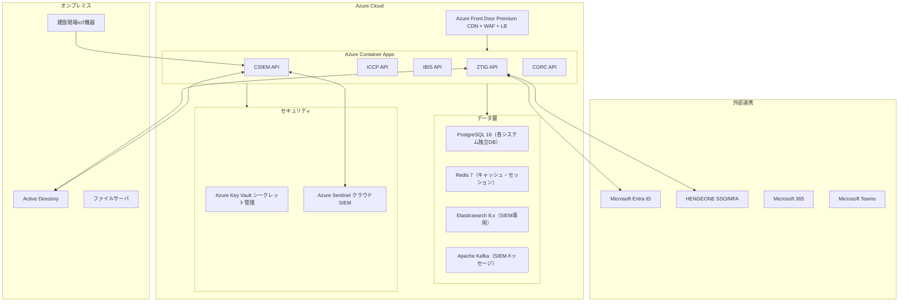

# Construction-DX-One-System 詳細仕様書

| 項目 | 内容 |
|------|------|
| **文書番号** | SPEC-CDOS-001 |
| **バージョン** | 1.0.0 |
| **作成日** | 2026-04-15 |
| **対象システム群** | Construction-DX-One-System（5サブシステム） |
| **対象組織** | みらい建設工業 IT部門 |

---

## 1. システム群アーキテクチャ詳細

### 1.1 全体構成

```
Construction-DX-One-System/
├── ZeroTrust-ID-Governance/       # ゼロトラスト統合ID管理
│   ├── backend/                   # FastAPI (Python 3.11)
│   ├── frontend/                  # Next.js 14
│   ├── docs/                      # 詳細ドキュメント（12カテゴリ）
│   └── helm/                      # Kubernetesデプロイ
├── IT-Change-CAB-Platform/        # IT変更管理・CAB自動化
│   ├── backend/                   # Express/Node.js 20
│   ├── frontend/                  # React 18
│   └── docs/                      # ドキュメント（42ファイル）
├── IT-BCP-ITSCM-System/           # BCP/IT事業継続管理
│   ├── backend/                   # FastAPI (Python)
│   ├── frontend/                  # Next.js (PWA)
│   └── infrastructure/            # Terraform (Azure)
├── Construction-SIEM-Platform/    # 建設現場SIEM
│   ├── api/                       # FastAPI (Python 3.12)
│   ├── processing/                # ルールエンジン・ML
│   ├── collectors/                # ログ収集エージェント
│   ├── storage/                   # Elasticsearch設定
│   └── dashboard/                 # Grafana/Kibana
└── Construction-GRC-System/       # 統合GRC管理
    ├── backend/                   # Django 5.x (Python 3.12)
    ├── frontend/                  # Vue.js 3 + Vuetify
    └── infrastructure/            # Docker / Kubernetes
```

### 1.2 共通インフラアーキテクチャ



---

## 2. ZeroTrust-ID-Governance（ZTIG）詳細仕様

### 2.1 APIエンドポイント仕様

#### 認証API（/api/v1/auth）

| メソッド | エンドポイント | 概要 | 認証 |
|---------|--------------|------|------|
| POST | /login | ログイン（JWT発行） | 不要 |
| POST | /refresh | トークンリフレッシュ | リフレッシュトークン |
| POST | /logout | ログアウト（トークン無効化） | Bearer |
| POST | /mfa/verify | MFA検証（HENGEONE連携） | Bearer |

#### ユーザー管理API（/api/v1/users）

| メソッド | エンドポイント | 概要 | 権限 |
|---------|--------------|------|------|
| GET | /users | ユーザー一覧 | user:read |
| POST | /users | ユーザー作成（プロビジョニング） | user:create |
| GET | /users/{id} | ユーザー詳細 | user:read |
| PUT | /users/{id} | ユーザー更新（ロール変更） | user:update |
| DELETE | /users/{id} | ユーザー削除（デプロビジョニング） | user:delete |
| POST | /users/{id}/suspend | アカウント停止 | user:suspend |

#### ロール管理API（/api/v1/roles）

| メソッド | エンドポイント | 概要 | 権限 |
|---------|--------------|------|------|
| GET | /roles | ロール一覧 | role:read |
| POST | /roles | ロール作成 | role:create |
| POST | /roles/{id}/assign | ロール割当 | role:assign |
| DELETE | /roles/{id}/revoke/{userId} | ロール剥奪 | role:revoke |

#### アクセス申請API（/api/v1/access-requests）

| メソッド | エンドポイント | 概要 |
|---------|--------------|------|
| POST | /access-requests | アクセス申請起票 |
| GET | /access-requests | 申請一覧（自分の申請・承認待ち） |
| PUT | /access-requests/{id}/approve | 承認 |
| PUT | /access-requests/{id}/reject | 却下 |

### 2.2 データベース設計（主要テーブル）

```sql
-- ユーザーテーブル
CREATE TABLE users (
    id UUID PRIMARY KEY DEFAULT gen_random_uuid(),
    employee_id VARCHAR(20) UNIQUE NOT NULL,
    username VARCHAR(100) UNIQUE NOT NULL,
    email VARCHAR(255) UNIQUE NOT NULL,
    display_name VARCHAR(200) NOT NULL,
    department VARCHAR(100),
    user_type VARCHAR(20) NOT NULL,  -- 'regular' | 'external' | 'admin'
    status VARCHAR(20) NOT NULL DEFAULT 'active',
    ad_object_id VARCHAR(100),
    entra_object_id VARCHAR(100),
    hengeone_user_id VARCHAR(100),
    last_login_at TIMESTAMP,
    account_expiry_date DATE,
    created_at TIMESTAMP DEFAULT NOW(),
    updated_at TIMESTAMP DEFAULT NOW()
);

-- ロールテーブル
CREATE TABLE roles (
    id UUID PRIMARY KEY DEFAULT gen_random_uuid(),
    name VARCHAR(100) UNIQUE NOT NULL,
    description TEXT,
    permissions JSONB NOT NULL DEFAULT '[]',
    is_privileged BOOLEAN DEFAULT FALSE,
    created_at TIMESTAMP DEFAULT NOW()
);

-- ユーザーロール割当
CREATE TABLE user_roles (
    user_id UUID REFERENCES users(id) ON DELETE CASCADE,
    role_id UUID REFERENCES roles(id) ON DELETE CASCADE,
    granted_by UUID REFERENCES users(id),
    granted_at TIMESTAMP DEFAULT NOW(),
    expires_at TIMESTAMP,
    PRIMARY KEY (user_id, role_id)
);

-- 監査ログテーブル（改ざん防止ハッシュチェーン）
CREATE TABLE audit_logs (
    id BIGSERIAL PRIMARY KEY,
    action VARCHAR(100) NOT NULL,
    actor_id UUID REFERENCES users(id),
    actor_ip INET,
    target_type VARCHAR(100),
    target_id VARCHAR(200),
    payload JSONB,
    result VARCHAR(20),
    prev_hash VARCHAR(64),
    hash VARCHAR(64) NOT NULL,
    created_at TIMESTAMP DEFAULT NOW()
);

-- アクセス申請テーブル
CREATE TABLE access_requests (
    id UUID PRIMARY KEY DEFAULT gen_random_uuid(),
    requester_id UUID REFERENCES users(id),
    target_resource VARCHAR(200) NOT NULL,
    justification TEXT NOT NULL,
    requested_role_id UUID REFERENCES roles(id),
    status VARCHAR(20) DEFAULT 'pending',
    approver_id UUID REFERENCES users(id),
    reviewed_at TIMESTAMP,
    expires_at TIMESTAMP,
    created_at TIMESTAMP DEFAULT NOW()
);
```

### 2.3 外部システム連携仕様

#### Entra ID連携（Microsoft Graph API）

```python
class EntraIDSync:
    async def sync_user_create(self, user: User) -> str:
        payload = {
            "accountEnabled": True,
            "displayName": user.display_name,
            "mailNickname": user.username,
            "userPrincipalName": f"{user.username}@miraikensetu.co.jp",
            "passwordProfile": {"forceChangePasswordNextSignIn": True}
        }
        return await self.graph_client.post("/users", payload)

    async def sync_user_disable(self, entra_object_id: str):
        await self.graph_client.patch(f"/users/{entra_object_id}",
                                      {"accountEnabled": False})
```

#### HENGEONE連携（SCIM 2.0）

- プロトコル: SCIM 2.0 over HTTPS
- 対応操作: Create / Update / Disable / Delete
- グループ同期: 部署・ロール単位でのグループ管理

#### Active Directory連携（LDAP）

- プロトコル: LDAP over SSL（LDAPS）
- 同期方式: ZeroTrust→AD一方向プロビジョニング
- 同期間隔: リアルタイム（イベントドリブン）

---

## 3. IT-Change-CAB-Platform（ICCP）詳細仕様

### 3.1 APIエンドポイント仕様（18ルーター）

| ルーター | ベースパス | 主要機能 |
|---------|-----------|---------|
| auth | /api/auth | JWT認証・EntraID SSO |
| users | /api/users | ユーザー・ロール管理（9ロール） |
| rfcs | /api/rfcs | RFC起票・検索・一覧 |
| rfc-workflow | /api/rfcs/:id/workflow | ステータス遷移・承認 |
| cab | /api/cab | CABセッション管理 |
| cab-members | /api/cab/members | CABメンバー管理 |
| impact-analysis | /api/rfcs/:id/impact | 影響分析エンジン |
| conflict-detection | /api/changes/conflicts | 変更衝突検知 |
| execution | /api/rfcs/:id/execution | 実施チェックリスト |
| rollback | /api/rfcs/:id/rollback | ロールバック計画 |
| pir | /api/rfcs/:id/pir | PIR事後レビュー |
| calendar | /api/calendar | 変更カレンダー |
| freeze | /api/freeze-periods | フリーズ期間管理 |
| notifications | /api/notifications | 通知管理 |
| kpi | /api/kpi | KPI・SLAメトリクス |
| reports | /api/reports | レポート生成 |
| audit | /api/audit | 監査ログ |
| system | /api/system | ヘルスチェック・設定 |

### 3.2 データベース設計（Prisma 11モデル）

```prisma
model RFC {
  id              String      @id @default(cuid())
  title           String
  description     String
  changeType      ChangeType  // STANDARD | NORMAL | MAJOR | EMERGENCY
  status          RFCStatus   // DRAFT | SUBMITTED | CAB_REVIEW | APPROVED | etc.
  priority        Priority    // LOW | MEDIUM | HIGH | CRITICAL
  requesterId     String
  requester       User        @relation(fields: [requesterId], references: [id])
  affectedSystems String[]
  impactLevel     ImpactLevel
  dependencyMap   Json?
  plannedStartAt  DateTime?
  plannedEndAt    DateTime?
  rollbackPlan    String?
  cabSessionId    String?
  pirId           String?
  createdAt       DateTime    @default(now())
  updatedAt       DateTime    @updatedAt
}

model CABSession {
  id            String      @id @default(cuid())
  sessionDate   DateTime
  status        String      // SCHEDULED | IN_PROGRESS | COMPLETED
  minutes       String?     // 自動生成議事録
  rfcs          RFC[]
  members       CABMember[]
}

model AuditLog {
  id          String    @id @default(cuid())
  action      String
  actorId     String
  targetType  String
  targetId    String
  changes     Json?
  ipAddress   String?
  createdAt   DateTime  @default(now())
}
```

### 3.3 変更管理ワークフロー詳細

```
RFC起票（Draft）→ 提出（Submitted）
    ├─→ [標準変更] 自動承認（AutoApproved）
    └─→ [通常/重大変更] CAB審議（CABReview）
            ├─→ 承認（Approved）
            ├─→ 却下（Rejected）
            └─→ 差戻（Deferred）→ 再提出

実施中（InProgress）
    ├─→ 成功完了（Completed）→ PIRレビュー → 完了クローズ
    └─→ ロールバック（RolledBack）→ PIRレビュー → 完了クローズ
```

### 3.4 KPIメトリクス仕様

| KPI名 | 計算式 | 目標値 | アラート閾値 |
|------|--------|--------|------------|
| 変更成功率 | 成功完了/全実施 × 100 | 95%以上 | 90%未満 |
| CAB承認リードタイム | 提出→承認の営業日数平均 | 5日以内 | 7日超 |
| ロールバック率 | ロールバック/全実施 × 100 | 5%以下 | 10%超 |
| 緊急変更比率 | 緊急/全RFC × 100 | 10%以下 | 20%超 |
| PIR完了率 | PIR完了/完了RFC × 100 | 100% | 90%未満 |

---

## 4. IT-BCP-ITSCM-System（IBIS）詳細仕様

### 4.1 フェイルオーバーアーキテクチャ

```
Primary Region (East Japan)          Standby Region (West Japan)
┌─────────────────────────┐          ┌─────────────────────────┐
│ Azure Container Apps x3  │◄────────►│ Azure Container Apps x2  │
│ PostgreSQL Primary        │  Geo    │ PostgreSQL Replica        │
│ Redis Primary             │  Sync   │ Redis Replica             │
└─────────────────────────┘          └─────────────────────────┘
           ▲                                     ▲
           └──────────── Azure Front Door ───────┘
                         自動フェイルオーバー 90秒以内
```

### 4.2 APIエンドポイント仕様

#### BCP計画管理

| メソッド | エンドポイント | 概要 |
|---------|--------------|------|
| GET | /api/v1/plans | 復旧計画一覧 |
| POST | /api/v1/plans | 復旧計画作成 |
| GET | /api/v1/plans/{id} | 計画詳細 |
| PUT | /api/v1/plans/{id} | 計画更新 |
| GET | /api/v1/systems/rto-rpo | システム別RTO/RPO一覧 |
| PUT | /api/v1/systems/{id}/rto-rpo | RTO/RPO更新 |
| GET | /api/v1/contacts/emergency | 緊急連絡網取得 |

#### BCP訓練管理

| メソッド | エンドポイント | 概要 |
|---------|--------------|------|
| GET | /api/v1/drills | 訓練一覧 |
| POST | /api/v1/drills | 訓練作成 |
| POST | /api/v1/drills/{id}/start | 訓練開始 |
| POST | /api/v1/drills/{id}/complete | 訓練完了 |
| POST | /api/v1/drills/{id}/results | 結果記録 |

#### インシデント対応

| メソッド | エンドポイント | 概要 |
|---------|--------------|------|
| POST | /api/v1/incidents | 緊急インシデント宣言 |
| GET | /api/v1/incidents/{id}/dashboard | RTOダッシュボード |
| POST | /api/v1/incidents/{id}/tasks | 復旧タスク登録 |
| PUT | /api/v1/incidents/{id}/tasks/{tid} | タスク進捗更新 |
| POST | /api/v1/incidents/{id}/report | 状況報告送信 |

### 4.3 データベース設計（主要テーブル）

```sql
CREATE TABLE recovery_plans (
    id UUID PRIMARY KEY,
    system_name VARCHAR(200) NOT NULL,
    scenario VARCHAR(100) NOT NULL,
    rto_target_hours INTEGER NOT NULL,
    rpo_target_hours INTEGER NOT NULL,
    priority INTEGER NOT NULL,
    recovery_steps JSONB NOT NULL,
    fallback_procedure TEXT,
    emergency_contacts JSONB,
    version INTEGER DEFAULT 1,
    approved_by UUID,
    approved_at TIMESTAMP,
    created_at TIMESTAMP DEFAULT NOW()
);

CREATE TABLE drills (
    id UUID PRIMARY KEY,
    drill_type VARCHAR(50) NOT NULL,  -- 'tabletop' | 'functional' | 'full_scale'
    scenario_id UUID,
    planned_date DATE NOT NULL,
    actual_start TIMESTAMP,
    actual_end TIMESTAMP,
    achieved_rto_hours DECIMAL(5,2),
    status VARCHAR(20) DEFAULT 'planned',
    findings JSONB,
    improvement_actions JSONB,
    created_at TIMESTAMP DEFAULT NOW()
);

CREATE TABLE incidents (
    id UUID PRIMARY KEY,
    incident_type VARCHAR(50) NOT NULL,
    declared_at TIMESTAMP NOT NULL,
    incident_commander_id UUID,
    affected_systems JSONB NOT NULL,
    current_status VARCHAR(50),
    resolved_at TIMESTAMP,
    actual_rto_hours DECIMAL(5,2),
    post_incident_report TEXT,
    created_at TIMESTAMP DEFAULT NOW()
);
```

### 4.4 PWA（Progressive Web App）仕様

| 機能 | オフライン対応 | キャッシュ戦略 |
|------|-------------|-------------|
| 復旧計画閲覧 | 必須 | Cache First |
| 緊急連絡網 | 必須 | Cache First |
| インシデント対応チェックリスト | 必須 | Cache First |
| RTOダッシュボード | 推奨 | Network First |
| データ入力フォーム | 推奨 | Background Sync（IndexedDB queue） |

---

## 5. Construction-SIEM-Platform（CSIEM）詳細仕様

### 5.1 システムアーキテクチャ（データフロー）

```
[ログソース群]
    AD / Entra ID / HENGEONE / Exchange / ファイルサーバ
    建設現場IoT / CAD/BIM端末 / NW機器 / クラウド(Azure)
         │ Syslog / Windows Event / API / SNMP
         ▼
[Collectors層]
    現場IoT軽量エージェント（オフラインバッファ対応）
    Windows Event Forwarder
    API Collector（Graph API / HENGEONE API）
         │ Apache Kafka（メッセージブローカー）
         ▼
[Processing層]
    ログ正規化（CEF標準フォーマット変換）
    ルールエンジン（Sigma / YARA ルール）
    ML異常検知エンジン（Isolation Forest / UEBA）
    建設業特有ルール（CAD/BIMファイル大量送信、IoT異常接続）
    脅威インテリジェンス照合（Microsoft TI / 外部TIフィード）
         ▼
[Storage層] Elasticsearch 8.x
    ├── hot index: 過去90日（即時検索）
    └── cold index: 91日〜3年（コンプライアンス保管）
         ▼
[API層] FastAPI → Kibana / Grafana / Azure Sentinel
```

### 5.2 APIエンドポイント仕様（42エンドポイント）

#### アラートAPI

| メソッド | エンドポイント | 概要 |
|---------|--------------|------|
| GET | /api/v1/alerts | アラート一覧（フィルタ・ページング） |
| GET | /api/v1/alerts/{id} | アラート詳細 |
| PUT | /api/v1/alerts/{id}/acknowledge | アラート確認 |
| PUT | /api/v1/alerts/{id}/resolve | アラート解決 |
| GET | /api/v1/alerts/stats | アラート統計 |

#### インシデントAPI

| メソッド | エンドポイント | 概要 |
|---------|--------------|------|
| POST | /api/v1/incidents | インシデント起票 |
| GET | /api/v1/incidents | インシデント一覧 |
| GET | /api/v1/incidents/{id} | インシデント詳細 |
| PUT | /api/v1/incidents/{id}/assign | 担当者割当 |
| POST | /api/v1/incidents/{id}/playbook | プレイブック実行 |
| POST | /api/v1/incidents/{id}/evidence | 証跡収集 |
| GET | /api/v1/incidents/{id}/timeline | タイムライン |

### 5.3 検知ルール仕様

#### 建設業特有検知ルール

| ルールID | ルール名 | 検知条件 | 重大度 |
|---------|---------|---------|--------|
| CST-001 | CAD/BIMファイル大量エクスポート | 30分以内に100MB以上のCADファイル転送 | High |
| CST-002 | 現場外デバイス接続 | 未登録MACアドレスの現場NW接続 | Medium |
| CST-003 | IoTデバイス異常通信 | 既知ポート以外へのIoT機器通信 | High |
| CST-004 | ランサムウェア兆候 | ファイル大量暗号化＋シャドーコピー削除 | Critical |
| CST-005 | BIMサーバ不審アクセス | 業務時間外のBIMサーバへの大量アクセス | High |
| CST-006 | 設計図外部送信疑い | 大容量ファイルの外部メール添付 | High |

#### 汎用検知ルール（Sigma互換）

| ルールID | ルール名 | 重大度 |
|---------|---------|--------|
| GEN-001 | ブルートフォース攻撃 | High |
| GEN-002 | 特権エスカレーション | Critical |
| GEN-003 | 横展開（ラテラルムーブメント） | Critical |
| GEN-004 | PowerShell悪用 | High |
| GEN-005 | 業務時間外の特権操作 | Medium |

### 5.4 ML異常検知仕様

| モデル | 対象 | アルゴリズム | 学習データ |
|-------|------|------------|---------|
| UEBA | ユーザー行動 | Isolation Forest + LSTM | 過去90日の行動ログ |
| NetFlow異常 | ネットワーク通信 | Autoencoder | 正常通信パターン |
| IoT異常 | IoTデバイス | One-Class SVM | デバイス正常稼働ログ |

---

## 6. Construction-GRC-System（CGRC）詳細仕様

### 6.1 APIエンドポイント仕様

#### リスク管理API

| メソッド | エンドポイント | 概要 |
|---------|--------------|------|
| GET | /api/v1/risks | リスク一覧 |
| POST | /api/v1/risks | リスク登録 |
| GET | /api/v1/risks/{id} | リスク詳細 |
| PUT | /api/v1/risks/{id} | リスク更新 |
| GET | /api/v1/risks/heatmap | リスクヒートマップデータ |
| POST | /api/v1/risks/{id}/treatments | 対応策登録 |

#### コンプライアンスAPI

| メソッド | エンドポイント | 概要 |
|---------|--------------|------|
| GET | /api/v1/compliance/controls | 管理策一覧（ISO27001全93） |
| PUT | /api/v1/compliance/controls/{id} | 管理策ステータス更新 |
| GET | /api/v1/compliance/soa | 適用宣言書（SoA）生成 |
| GET | /api/v1/compliance/frameworks | フレームワーク別準拠率 |
| GET | /api/v1/compliance/nist-csf | NIST CSF 2.0マッピング |

#### 監査管理API

| メソッド | エンドポイント | 概要 |
|---------|--------------|------|
| GET | /api/v1/audits | 監査計画一覧 |
| POST | /api/v1/audits | 監査計画作成 |
| PUT | /api/v1/audits/{id}/status | ステータス更新（5段階遷移） |
| POST | /api/v1/audits/{id}/findings | 監査所見登録 |
| GET | /api/v1/audits/{id}/report | 監査レポート生成（Excel/PDF） |

### 6.2 データベース設計（主要テーブル）

```sql
CREATE TABLE risks (
    id UUID PRIMARY KEY,
    title VARCHAR(300) NOT NULL,
    description TEXT,
    category VARCHAR(100),
    likelihood INTEGER CHECK (likelihood BETWEEN 1 AND 5),
    impact INTEGER CHECK (impact BETWEEN 1 AND 5),
    risk_score INTEGER GENERATED ALWAYS AS (likelihood * impact) STORED,
    risk_level VARCHAR(20),
    owner_id UUID,
    status VARCHAR(20) DEFAULT 'identified',
    treatment_plan TEXT,
    residual_likelihood INTEGER,
    residual_impact INTEGER,
    next_review_date DATE,
    created_at TIMESTAMP DEFAULT NOW()
);

CREATE TABLE controls (
    id UUID PRIMARY KEY,
    control_id VARCHAR(20) NOT NULL,  -- 例: 'A.5.1', 'A.8.15'
    domain VARCHAR(10) NOT NULL,      -- 'A.5' | 'A.6' | 'A.7' | 'A.8'
    title VARCHAR(300) NOT NULL,
    description TEXT,
    applicability VARCHAR(20),
    justification TEXT,
    implementation_status VARCHAR(30),
    implementation_evidence TEXT,
    owner_id UUID,
    last_reviewed_at TIMESTAMP,
    framework_mappings JSONB
);

CREATE TABLE audits (
    id UUID PRIMARY KEY,
    audit_type VARCHAR(30),
    title VARCHAR(300) NOT NULL,
    scope TEXT,
    audit_period_start DATE,
    audit_period_end DATE,
    status VARCHAR(30) DEFAULT 'planning',  -- 5段階遷移
    lead_auditor_id UUID,
    findings_count INTEGER DEFAULT 0,
    report_url TEXT,
    created_at TIMESTAMP DEFAULT NOW()
);
```

### 6.3 Celery定期タスク仕様（6タスク）

| タスク名 | 実行間隔 | 処理内容 |
|---------|---------|---------|
| calculate_compliance_rate | 毎日 02:00 | 全フレームワーク準拠率再計算 |
| update_risk_scores | 毎日 03:00 | 定期レビュー期限切れリスク通知 |
| send_audit_reminders | 毎営業日 09:00 | 監査期限リマインダー送信 |
| generate_weekly_kpi | 月曜 08:00 | 週次KPIレポート生成 |
| cleanup_expired_sessions | 毎時 | 期限切れセッション削除 |
| sync_siem_security_events | 15分ごと | SIEM連携セキュリティKPI取得 |

### 6.4 RBAC設計（6ロール）

| ロール | 概要 | 主要権限 |
|-------|------|---------|
| grc_admin | GRC管理者 | 全機能フルアクセス |
| risk_owner | リスクオーナー | 自身担当リスクの更新・対応策管理 |
| auditor | 監査員 | 監査計画・実施・所見登録 |
| compliance_officer | コンプライアンス担当 | 管理策ステータス更新・SoA管理 |
| executive | 経営層 | ダッシュボード・レポート閲覧のみ |
| viewer | 一般閲覧者 | 読み取り専用 |

---

## 7. CI/CDパイプライン仕様（全プロジェクト共通）

### 7.1 GitHub Actions ワークフロー

```yaml
jobs:
  lint:
    # Python: Ruff + Black + mypy strict
    # TypeScript: ESLint + Prettier
    # セキュリティ: Bandit + pip-audit + npm audit

  test:
    # 単体テスト: pytest / Jest / Vitest
    # カバレッジゲート: 80%以上（ZTIGは90%以上）

  build:
    # Dockerイメージビルド（マルチステージ）

  security-scan:
    # Trivy（コンテナ脆弱性スキャン）
    # OWASP ZAP（APIセキュリティスキャン）

  e2e:
    # Playwright E2Eテスト（Chromium / Firefox / Safari）

  deploy:
    # staging: PRマージ時に自動デプロイ
    # production: タグpush時に手動承認後デプロイ
```

### 7.2 ブランチ戦略（全プロジェクト共通）

| ブランチ | 用途 | 保護設定 |
|---------|------|---------|
| main | 本番リリース | 直接push禁止・PR必須・レビュー承認必要 |
| develop | 開発統合ブランチ | PR推奨 |
| feature/* | 機能開発 | - |
| hotfix/* | 緊急バグ修正 | - |

---

## 8. セキュリティ設計詳細

### 8.1 認証・認可フロー

```
クライアント
    │ POST /auth/login (username + password + MFA)
    ▼
API Gateway → HENGEONE SAML/OIDC検証
    │ 認証成功
    ├─ Access Token（JWT, 15分有効）
    └─ Refresh Token（Redisに保存, 24時間有効）

アクセス時:
    Bearer Token → ミドルウェア検証
               → Redisブラックリスト確認
               → RBAC権限チェック
               → ビジネスロジック
```

### 8.2 データ暗号化

| 対象 | 暗号化方式 | 鍵管理 |
|------|----------|--------|
| 通信 | TLS 1.3 | Azure App Service証明書 |
| DB保管データ | AES-256 | Azure Key Vault |
| 監査ログ | SHA-256ハッシュチェーン | DB内 |
| JWT署名 | RS256（非対称） | Azure Key Vault |
| パスワード | bcrypt（work factor: 12） | - |

### 8.3 OWASP Top 10 対応方針

| リスク | 対応策 |
|--------|--------|
| Injection | ORMパラメータバインディング・入力バリデーション |
| Broken Authentication | JWT短期有効期限・MFA必須・ブルートフォース対策 |
| Sensitive Data Exposure | TLS必須・データ暗号化・ログマスキング |
| Broken Access Control | RBAC・最小権限原則・直接オブジェクト参照防止 |
| Security Misconfiguration | セキュアデフォルト・CIS Benchmark |
| XSS | CSPヘッダー・入力サニタイズ・出力エスケープ |
| Known Vulnerabilities | Dependabot・pip-audit・npm audit自動更新 |
| Insufficient Logging | 全操作監査ログ・改ざん防止・SIEM転送 |

---

## 9. 開発ロードマップ

| フェーズ | 期間 | 内容 |
|---------|------|------|
| Phase 1 | 2026年Q1-Q2 | ZTIG・CSIEM 基盤構築 |
| Phase 2 | 2026年Q2-Q3 | CGRC・IBIS コア機能実装 |
| Phase 3 | 2026年Q3-Q4 | システム間連携・ICCP拡張 |
| Phase 4 | 2027年Q1 | 統合テスト・パフォーマンスチューニング |
| Phase 5 | 2027年Q2 | 本番リリース・運用移行 |

### Claude Code開発ガイドライン

各プロジェクトのルートにある `CLAUDE.md` を Claude Code に読み込ませて開発を開始してください。

```bash
# 推奨コマンド
/plan <実装タスク>       # 実装計画作成
/tdd <機能>             # TDD実装（テストファースト）
/code-review            # コードレビュー
/security-review        # セキュリティ審査
/e2e                    # E2Eテスト実行
/build-fix              # ビルドエラー修正
```

---

*文書管理：本文書はConstruction-DX-One-System全体の詳細仕様書。各サブシステムの詳細はリポジトリ内docs/を参照。*
