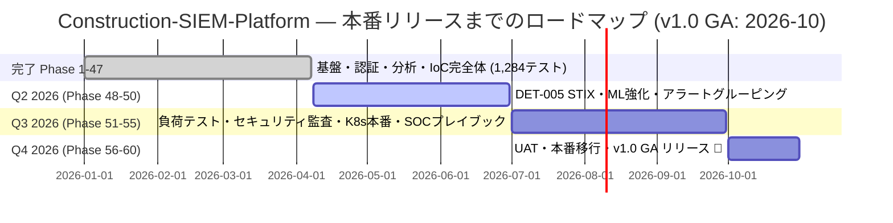
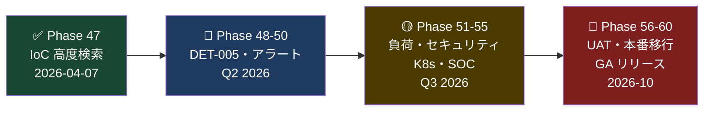
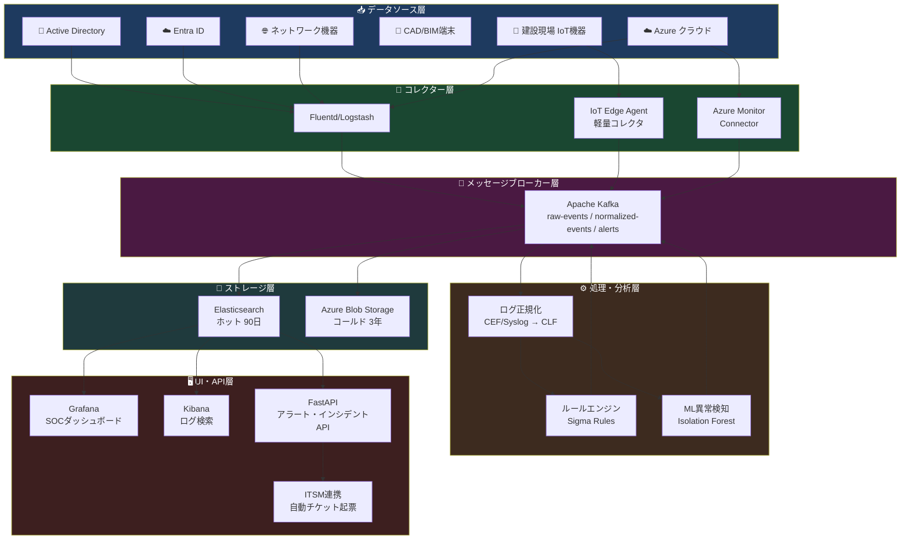
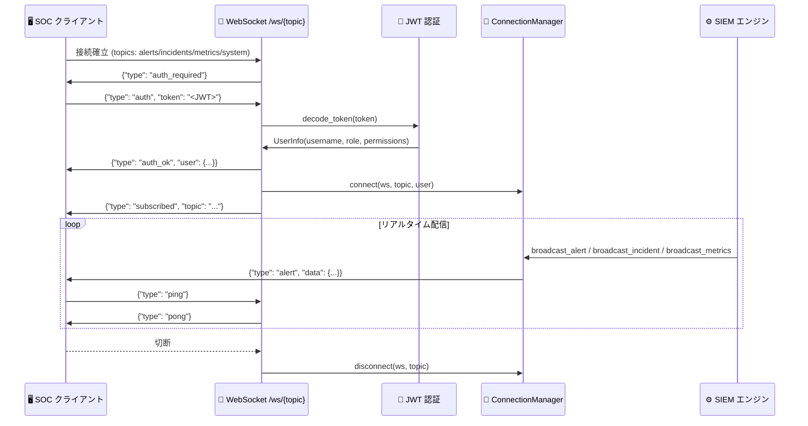
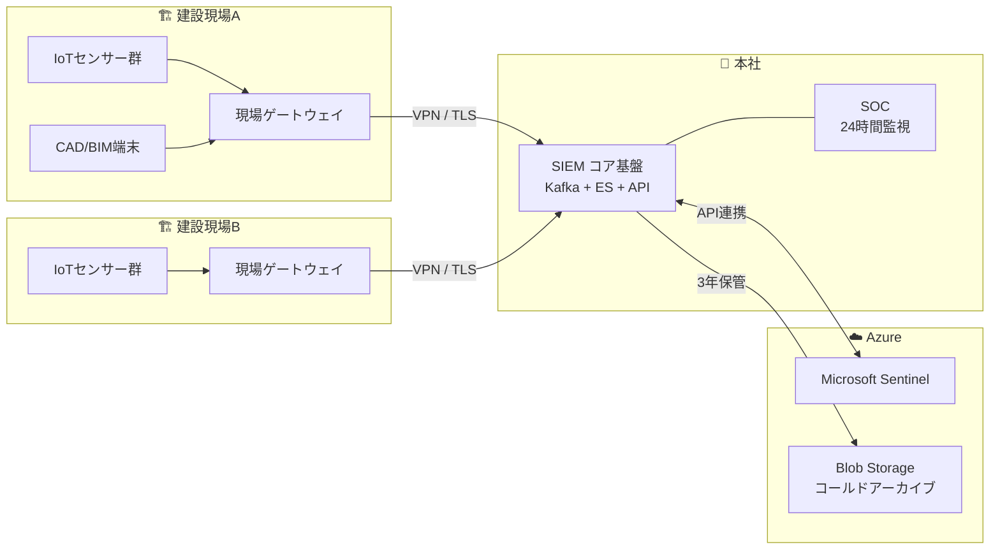
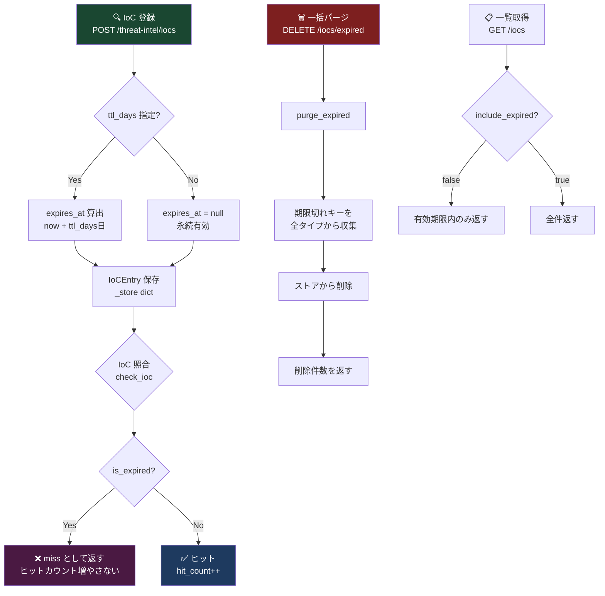
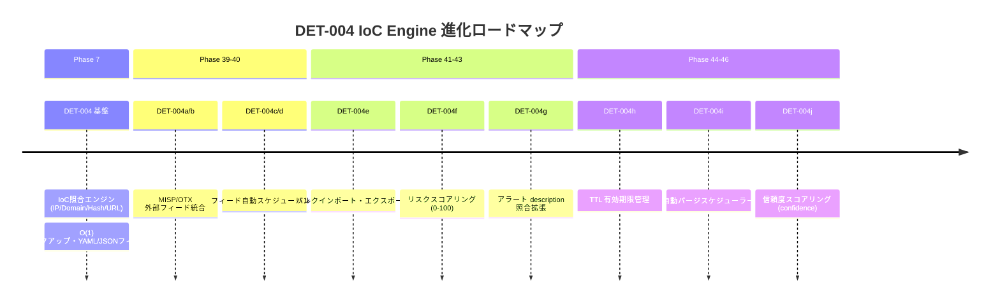
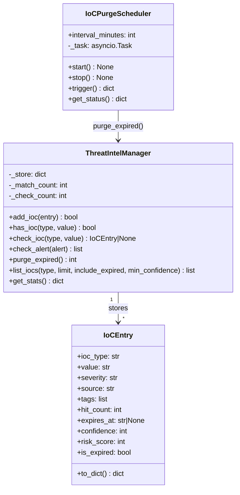
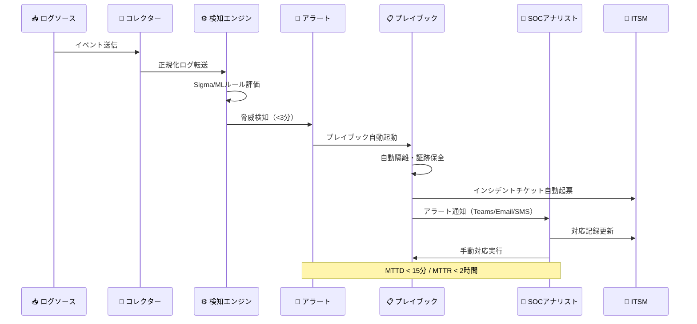
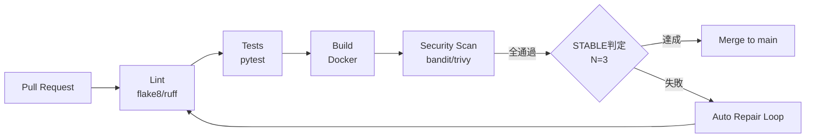

# 🛡️ Construction-SIEM-Platform

> **建設現場 サイバーセキュリティ監視・SIEM統合システム**
> 現場IoT機器・CAD/BIM環境のセキュリティイベント集約・異常検知プラットフォーム

[](https://github.com/Kensan196948G/Construction-SIEM-Platform/actions)
[](https://python.org)
[](https://fastapi.tiangolo.com)
[](#開発状況)
[](LICENSE)
[](#準拠規格)
[](#準拠規格)

---

## 📋 目次

- [概要](#概要)
- [開発状況](#開発状況)
- [準拠規格](#準拠規格)
- [アーキテクチャ](#アーキテクチャ)
- [機能一覧](#機能一覧)
- [KPI・成功指標](#kpi成功指標)
- [ディレクトリ構成](#ディレクトリ構成)
- [クイックスタート](#クイックスタート)
- [攻撃検知シナリオ](#攻撃検知シナリオ)
- [API リファレンス](#api-リファレンス)
- [プレイブック](#プレイブック)
- [開発・CI/CD](#開発cicd)
- [変更履歴](#変更履歴)

---

## 概要

建設業界では BIM・CAD・IoTセンサー・ドローンなど多様なデジタル機器が現場に導入されており、セキュリティリスクが急増しています。本システムは**本社・支店・建設現場を跨ぐセキュリティイベントを一元収集・分析し、リアルタイムで脅威を検知・対応する SIEM（Security Information and Event Management）基盤**です。

| 項目 | 内容 |
|------|------|
| 🎯 **プロジェクト名** | Construction-SIEM-Platform |
| 🏢 **運営組織** | みらい建設工業 IT部門 |
| 📅 **バージョン** | 1.0.0 |
| 🔗 **リポジトリ** | [Kensan196948G/Construction-SIEM-Platform](https://github.com/Kensan196948G/Construction-SIEM-Platform) |
| ⏱️ **MTTD目標** | 15分以内 |
| ⏱️ **MTTR目標** | 2時間以内 |
| 📊 **処理能力** | 10,000 EPS（イベント/秒）以上 |

---

## 開発状況

> 最終更新: 2026-04-07 JST — Phase 47 完了 ✅: IoC 高度検索・複合フィルタ (DET-004k) — テスト 1284件・STABLE

### 現在のフェーズ



### 🏁 マイルストーン

| # | マイルストーン | 目標日 | 状態 |
|:-:|-------------|:------:|:----:|
| M1 | PoC 完成 | 2026-03-31 | ✅ 達成 |
| M2 | エンタープライズ機能完成 | 2026-04-07 | ✅ **達成 (Phase 47完了)** |
| M3 | DET-005 脅威インテリジェンス次世代 | 2026-06-30 | 🔵 計画中 |
| M4 | 本番品質達成 (10k EPS・監査合格) | 2026-09-30 | 📅 予定 |
| M5 | **🚀 v1.0 GA リリース** | **2026-10-31** | 📅 予定 |

| 指標 | 状態 | 詳細 |
|------|------|------|
| 📊 現在フェーズ | **Phase 47 完了** ✅ | IoC 高度検索・複合フィルタ (DET-004k) — Issue #103 |
| ✅ CI | [](https://github.com/Kensan196948G/Construction-SIEM-Platform/actions) | **STABLE N=3/3** 🏆 (Phase 47 完全達成・main GREEN) |
| 🧪 テスト | **1284件** 全パス | pytest (Phase 47 完了・test_phase47_ioc_search.py 26件追加) |
| 📈 テストカバレッジ | **90%+** | 目標90%達成維持 |
| 🔍 Lint | **0** エラー | flake8 / isort / black 全クリア |
| 🔐 Security | **0** 脆弱性 | bandit -ll / safety scan |
| ⬛ Format | ✅ 準拠 | black + isort |
| 📋 Open Issues | **0件** | クリーン状態 |
| 🔀 Open PRs | **0件** | クリーン状態 |
| 🌿 技術負債 | **0件** | TODO/FIXME/HACK マーカーなし |

### 完了フェーズ一覧

| Phase | 名称 | 主要成果物 | テスト数 |
|:-----:|------|-----------|:-------:|
| 1 | 初期実装 | FastAPI基盤・Docker Compose | 22 |
| 2 | Elasticsearch連携 | ESインデックス・ダッシュボード | +7 |
| 3 | ILM・アラート | ライフサイクル管理・E2Eテスト | +8 |
| 4-5 | 認証・ES統合 | JWT/RBAC・ESクライアント | +15 |
| 6 | KPI・Kafka・監査 | MTTD/MTTR計算・監査ログ | +18 |
| 7 | 脅威インテリジェンス | IoC照合エンジン | +16 |
| 8 | Webhook・ヘルス | 通知チャネル・詳細ヘルスチェック | +11 |
| 9 | レート制限・OpenAPI | DDoS防御・API仕様書v2 | +6 |
| 10 | ドキュメント整備 | README全面改訂 | — |
| 11 | オフラインバッファ | バッチインジェスト・データ検証 | +11 |
| 12 | Prometheusメトリクス | /metrics エンドポイント | +9 |
| 13 | コンプライアンス | ISO27001/NIST CSF自動チェック | +9 |
| 14 | イベント相関分析 | MITRE ATT&CK キルチェーン | +9 |
| 15 | 包括ドキュメント | 10カテゴリ43ファイル | — |
| 16 | LDAP/Entra ID認証 | Strategy パターン・マルチプロバイダー | +43 |
| 17 | Azure Blobアーカイブ | コールドストレージ・gzip圧縮 JSONL | +26 |
| 18 | WebSocketリアルタイム | JWT認証ハンドシェイク・4トピック配信 | +21 |
| 19 | テストカバレッジ90% | cold_storage/kafka_consumer/cef_normalizer等のテスト強化 | +155 |
| 20 | パフォーマンスベンチマーク | EPSMeter/LatencyTracker/BenchmarkRunner・5 REST APIエンドポイント | +40 |
| 21 ✅ | Kubernetes対応 | k8s/YAML 7ファイル・Helm Chart 8ファイル・HPA v2・TLS Ingress | +30 |
| 22 ✅ | CI 近代化 | GitHub Actions v6・Node.js 24対応・safety scan更新 | — |
| 23 ✅ | ドキュメント自動生成 | mkdocs-material・全45ファイルnav・docs/index.md・docs/api-reference.md・CI docs-build | +27 |
| 24 ✅ | GitHub Pages デプロイ | mkdocs gh-deploy・CI pages-deploy ジョブ・GitHub Pages 自動公開 | +3 |
| 25 ✅ | Prometheus/Grafana監視統合 | prometheus-rules.yaml・Grafana dashboard・docker-compose.override.yml・/metrics/alerts | +49 |
| 26 ✅ | Alertmanager統合 | alertmanager.yml・Slack/メール通知・サイレンス管理・/alerts/notify・/alerts/silences | +46 |
| 27 ✅ | Grafanaダッシュボード高度化 | security-events・siem-kpi・alertmanager-overview の3ダッシュボード・Unified Alertingプロビジョニング | +51 |
| 28 ✅ | リアルタイム脅威フィード統合 | STIX 2.1/TAXII 2.1 フィード管理・indicator/attack-pattern パーサー・SHA256重複排除・5エンドポイント | +49 |
| 29 ✅ | Sigma/MITRE統合基盤 | Sigma ルール管理・MITRE ATT&CK Navigator マトリクス・13エンドポイント | +60 |
| 30 ✅ | UEBA ユーザー行動分析 | ベースライン・リスクスコアリング (0-100)・異常検知・7エンドポイント | +38 |
| 31 ✅ | SOAR 自動対応 | インシデント自動エスカレーション・プレイブック自動実行・UEBA統合 | +35 |
| 32 ✅ | SOAR 強化 | SOAR自動化エンドポイント拡張・プレイブック統合 | +19 |
| 33 ✅ | SOCレポーティング | 週次・月次レポート自動生成・エクスポート | +27 |
| 34 ✅ | APIキー管理 | 生成・検証・無効化・ローテーション・SHA-256保存 | +33 |
| 35 ✅ | APIキー認証 | Dependency認証・スコープ検証・Webhook HMAC-SHA256 | +19 |
| 36 ✅ | APIキー別レート制限 | 固定ウィンドウ方式・429+Retry-After+X-Key-RateLimit-* | +16 |
| 37 ✅ | レート制限ストア保護 | 自動クリーンアップ・DoS保護・サイズ上限制御・管理エンドポイント | +17 |
| 38 ✅ | APIキー有効期限延長・一括無効化 | extend エンドポイント・bulk-revoke・スコープ制御 | +22 |
| 39 ✅ | MISP/OTX 外部フィード統合 | ExternalFeedClient Adapter・FeedManager・モックフォールバック | +24 |
| 40 ✅ | 外部フィード自動スケジューリング | FeedScheduler asyncio タスク・設定 API・環境変数制御 | +24 |
| 41 ✅ | IoC バルクインポート・エクスポート | POST /bulk (207 Multi-Status)・GET /export (JSON/CSV) | +22 |
| 42 ✅ | IoC リスクスコアリング + アラート自動 IoC 紐付け | risk_score (severity+source+hit)・check_alert()・ioc_matches フィールド | +21 |
| 43 ✅ | アラート詳細 IoC 照合拡張 | _check_description() — SHA-256/MD5・ドメイン・URL 抽出・重複排除 | +15 |
| 44 ✅ | **IoC TTL (有効期限) 管理** | expires_at/ttl_days/is_expired・purge_expired()・include_expired フィルタ | +36 |
| 45 ✅ | **IoC 自動パージスケジューラー** | IoCPurgeScheduler・asyncio・scheduler/status・scheduler/trigger・TTL統計 | +28 |
| 46 ✅ | **IoC 信頼度スコアリング** | confidence フィールド・ソース別デフォルト・risk_score統合・min_confidence フィルタ | +33 |
| 47 ✅ | **IoC 高度検索・複合フィルタ** | search_iocs・キーワード/タグ/ソート/ページネーション・GET /iocs/search | +26 |

### 🚀 6か月リリース計画 (Phase 48〜60 / 2026-10 GA)



| フェーズ群 | 内容 | 期間 | テスト目標 |
|-----------|------|:----:|:---------:|
| **Phase 48-50** | DET-005 STIX・ML 強化・アラートグルーピング | Q2 2026 | 1,380件+ |
| **Phase 51-55** | 10k EPS 負荷テスト・セキュリティ監査・K8s 本番・SOC プレイブック | Q3 2026 | 1,450件+ |
| **Phase 56-60** | UAT・本番移行・ドキュメント確定・**v1.0 GA** 🚀 | Q4 2026 | 1,500件+ |


---

## 準拠規格

| 🏛️ 規格 | 📌 対象条項 | 📝 概要 |
|---------|------------|---------|
| **ISO 27001:2022** | A.8.15 ログ記録 | セキュリティログの収集・保管・保護 |
| **ISO 27001:2022** | A.8.16 監視活動 | ネットワーク・システムの継続的監視 |
| **NIST CSF 2.0** | DETECT DE.CM | 継続的なセキュリティ監視 |
| **ISO 20000-1:2018** | インシデント管理 | セキュリティインシデント対応プロセス |
| **ITIL v4** | インシデント管理 | ITサービスマネジメント |

---

## アーキテクチャ

### システム全体図



### WebSocket リアルタイム配信フロー



### ネットワーク構成図




### 🕐 IoC TTL (有効期限) 管理フロー



### 🔑 IoC エントリ データモデル

| フィールド | 型 | 説明 | Phase |
|-----------|-----|------|-------|
| `ioc_type` | str | `ip` / `domain` / `hash` / `url` | Phase 7 |
| `value` | str | IoC 値（小文字正規化） | Phase 7 |
| `severity` | str | `critical` / `high` / `medium` / `low` | Phase 7 |
| `source` | str | 登録元（manual/misp/otx） | Phase 7 |
| `added_at` | ISO str | 登録日時 | Phase 7 |
| `hit_count` | int | 照合ヒット数 | Phase 7 |
| `risk_score` | int (0-100) | 複合リスクスコア (severity+source+hit) | Phase 42 |
| `tags` | list[str] | 任意タグ | Phase 41 |
| `expires_at` | ISO str / null | TTL 期限日時 | 🆕 Phase 44 |
| `is_expired` | bool | 現時刻 > expires_at | 🆕 Phase 44 |


### 🧬 DET-004 脅威インテリジェンス シリーズ 進化マップ



### 📐 DET-004 コンポーネント関係図



### インシデント対応フロー



---

## 機能一覧

### 📥 ログ収集・集約

| 要件ID | 機能名 | 優先度 | 状態 |
|--------|--------|--------|------|
| COL-001 | マルチソースログ収集 | 🔴 必須 | ✅ 実装済 |
| COL-002 | ログ正規化（CEF/Syslog） | 🔴 必須 | ✅ 実装済 |
| COL-003 | 現場IoT専用エージェント | 🔴 必須 | ✅ 実装済 |
| COL-004 | オフライン現場対応 | 🟡 推奨 | ✅ 実装済 |
| COL-005 | ログ圧縮・効率転送 | 🔴 必須 | ✅ 実装済 |

### 🔍 リアルタイム脅威検知

| 要件ID | 機能名 | 優先度 | 状態 |
|--------|--------|--------|------|
| DET-001 | ルールベース検知（Sigma/YARA） | 🔴 必須 | ✅ 実装済 |
| DET-002 | AI/ML 異常検知 | 🔴 必須 | ✅ 実装済 |
| DET-003 | 建設業特有ルール | 🔴 必須 | ✅ 実装済 |
| DET-004 | 脅威インテリジェンス連携 | 🟡 推奨 | ✅ 実装済 |
| DET-005 | ランサムウェア早期検知 | 🔴 必須 | ✅ 実装済 |

### 🚨 アラート・通知

| 要件ID | 機能名 | 優先度 | 状態 |
|--------|--------|--------|------|
| ALT-001 | 重大度別アラート（Critical/High/Medium/Low） | 🔴 必須 | ✅ 実装済 |
| ALT-002 | 多チャネル通知（メール/Teams/SMS） | 🔴 必須 | ✅ 実装済 |
| ALT-003 | アラート重複排除 | 🔴 必須 | ✅ 実装済 |
| ALT-004 | 24時間オンコール対応 | 🔴 必須 | ✅ 実装済 |
| ALT-005 | ITSM連携自動チケット | 🔴 必須 | ✅ 実装済 |

### 📋 インシデント対応

| 要件ID | 機能名 | 優先度 | 状態 |
|--------|--------|--------|------|
| INC-001 | インシデントケース管理 | 🔴 必須 | ✅ 実装済 |
| INC-002 | プレイブック自動実行 | 🔴 必須 | ✅ 実装済 |
| INC-003 | 証跡収集・保全 | 🔴 必須 | ✅ 実装済 |
| INC-004 | 影響範囲分析 | 🔴 必須 | ✅ 実装済 |
| INC-005 | 事後報告書自動生成 | 🟡 推奨 | ✅ 実装済 |

### 🔐 認証・アクセス制御

| 要件ID | 機能名 | 優先度 | 状態 |
|--------|--------|--------|------|
| AUTH-001 | JWT認証（HS256） | 🔴 必須 | ✅ 実装済 |
| AUTH-002 | RBAC（admin/analyst/viewer） | 🔴 必須 | ✅ 実装済 |
| AUTH-003 | API エンドポイント保護 | 🔴 必須 | ✅ 実装済 |
| AUTH-004 | LDAP/Entra ID 連携 | 🟡 推奨 | ✅ 実装済 |

### 📊 KPI・監査・パイプライン

| 要件ID | 機能名 | 優先度 | 状態 |
|--------|--------|--------|------|
| VIS-004 | KPI自動計算（MTTD/MTTR/SLA） | 🔴 必須 | ✅ 実装済 |
| AUD-001 | 全API操作監査ログ | 🔴 必須 | ✅ 実装済 |
| PIPE-001 | Kafkaコンシューマー（clf-events→siem-alerts） | 🔴 必須 | ✅ 実装済 |
| PIPE-002 | Elasticsearch クライアント統合 | 🔴 必須 | ✅ 実装済 |

### 🔎 脅威インテリジェンス

| 要件ID | 機能名 | 優先度 | 状態 |
|--------|--------|--------|------|
| DET-004 | IoC照合エンジン（IP/Domain/Hash/URL） | 🟡 推奨 | ✅ 実装済 |
| DET-004a | YAML/JSONフィードローダー | 🟡 推奨 | ✅ 実装済 |
| DET-004b | CLFイベント自動照合 | 🟡 推奨 | ✅ 実装済 |
| DET-004c | MISP/OTX 外部フィード統合 | 🟡 推奨 | ✅ 実装済 (Phase 39) |
| DET-004d | 外部フィード自動スケジューリング | 🟡 推奨 | ✅ 実装済 (Phase 40) |
| DET-004e | IoC バルクインポート・エクスポート | 🟡 推奨 | ✅ 実装済 (Phase 41) |
| DET-004f | IoC リスクスコアリング + アラート自動 IoC 紐付け | 🟡 推奨 | ✅ 完了 (Phase 42) |
| DET-004g | アラート詳細 IoC 照合拡張 (description スキャン) | 🟡 推奨 | ✅ 完了 (Phase 43) |
| DET-004h | **IoC TTL (有効期限) 管理・自動制御** | 🟡 推奨 | ✅ 完了 (Phase 44) |
| DET-004i | **IoC 自動パージスケジューラー + TTL統計強化** | 🟡 推奨 | ✅ 完了 (Phase 45) |
| DET-004j | **IoC フィード信頼度スコアリング (confidence)** | 🟡 推奨 | ✅ 完了 (Phase 46) |
| DET-004k | **IoC 高度検索・複合フィルタ API** | 🟡 推奨 | ✅ 完了 (Phase 47) |

### 🔔 通知・運用

| 要件ID | 機能名 | 優先度 | 状態 |
|--------|--------|--------|------|
| ALT-002a | Webhook通知（Teams/Slack/汎用） | 🔴 必須 | ✅ 実装済 |
| OPS-001 | 詳細ヘルスチェック（コンポーネント別） | 🔴 必須 | ✅ 実装済 |
| SEC-001 | IPベースレート制限（DDoS防御） | 🔴 必須 | ✅ 実装済 |
| SEC-002 | OpenAPI仕様書 v2.0.0 | 🔴 必須 | ✅ 実装済 |

### 🔗 高度分析・コンプライアンス

| 要件ID | 機能名 | 優先度 | 状態 |
|--------|--------|--------|------|
| COL-004 | オフラインバッファリング（バッチインジェスト） | 🟡 推奨 | ✅ 実装済 |
| OPS-002 | Prometheusメトリクス | 🔴 必須 | ✅ 実装済 |
| COMP-001 | ISO27001/NIST CSF 自動コンプライアンスチェック | 🔴 必須 | ✅ 実装済 |
| DET-005a | MITRE ATT&CK キルチェーン相関分析 | 🟡 推奨 | ✅ 実装済 |
| DET-005b | 攻撃チェーン自動検出（4ルール） | 🟡 推奨 | ✅ 実装済 |

---

## API エンドポイント一覧（v2.0.0）

| カテゴリ | メソッド | パス | 権限 |
|---------|---------|------|------|
| **認証** | POST | `/api/v1/auth/token` | 公開 |
| | GET | `/api/v1/auth/me` | read |
| | GET | `/api/v1/auth/roles` | admin |
| | GET | `/api/v1/auth/providers` | 公開 |
| | POST | `/api/v1/auth/provider-login` | 公開 |
| **アラート** | GET | `/api/v1/alerts` | read |
| | GET | `/api/v1/alerts/{id}` | read |
| | PATCH | `/api/v1/alerts/{id}/acknowledge` | write |
| | GET | `/api/v1/alerts/summary/by-severity` | read |
| | POST | `/api/v1/alerts/ingest` | write |
| **インシデント** | GET | `/api/v1/incidents` | read |
| | POST | `/api/v1/incidents` | write |
| | GET | `/api/v1/incidents/{id}` | read |
| | PATCH | `/api/v1/incidents/{id}` | write |
| | GET | `/api/v1/incidents/stats/summary` | read |
| **プレイブック** | GET | `/api/v1/playbooks` | read |
| | POST | `/api/v1/playbooks/execute` | execute_playbook |
| | GET | `/api/v1/playbooks/executions/{id}` | read |
| **レポート** | GET | `/api/v1/reports/kpi` | read |
| | GET | `/api/v1/reports/compliance` | read |
| | GET | `/api/v1/reports/incident/{id}` | read |
| **KPI** | GET | `/api/v1/kpi/dashboard` | read |
| **脅威インテリジェンス** | GET | `/api/v1/threat-intel/iocs` | read |
| | POST | `/api/v1/threat-intel/iocs` | write |
| | POST | `/api/v1/threat-intel/check` | read |
| | POST | `/api/v1/threat-intel/check-event` | read |
| | DELETE | `/api/v1/threat-intel/iocs/{type}/{value}` | admin |
| | DELETE | `/api/v1/threat-intel/iocs/expired` | admin |
| | GET | `/api/v1/threat-intel/scheduler/status` 🆕 | read |
| | POST | `/api/v1/threat-intel/scheduler/trigger` 🆕 | admin |
| | GET | `/api/v1/threat-intel/iocs?min_confidence=N` 🆕 | read |
| | GET | `/api/v1/threat-intel/iocs/search` 🆕 | read |
| | GET | `/api/v1/threat-intel/iocs/bulk` | write |
| | POST | `/api/v1/threat-intel/iocs/bulk` | write |
| | GET | `/api/v1/threat-intel/iocs/export` | read |
| | GET | `/api/v1/threat-intel/stats` | read |
| **通知** | POST | `/api/v1/notifications/send` | write |
| | GET | `/api/v1/notifications/log` | read |
| | GET | `/api/v1/notifications/channels` | read |
| **データ検証** | POST | `/api/v1/data/validate` | read |
| | POST | `/api/v1/data/batch-ingest` | write |
| | GET | `/api/v1/data/validation-stats` | read |
| **相関分析** | POST | `/api/v1/correlation/analyze` | read |
| | GET | `/api/v1/correlation/stats` | read |
| **コンプライアンス** | GET | `/api/v1/compliance/check` | read |
| **監査** | GET | `/api/v1/audit/logs` | admin |
| | GET | `/api/v1/audit/stats` | admin |
| **メトリクス** | GET | `/metrics` | 公開 |
| | GET | `/metrics/json` | 公開 |
| **システム** | GET | `/health` | 公開 |
| | GET | `/health/detailed` | 公開 |
| | GET | `/api/v1/stats` | 公開 |

---

## KPI・成功指標

| 📊 KPI | 🎯 目標値 | 📐 測定方法 |
|--------|----------|------------|
| **MTTD** 平均脅威検知時間 | **15分以内** | 発生〜アラート時刻の差分 |
| **MTTR** 平均インシデント対応時間 | **2時間以内** | アラート〜クローズ時刻の差分 |
| **False Positive率** 誤検知率 | **5%以下** | 誤検知数 / 全アラート数 |
| **ログ収集カバレッジ** | **100%** | 収集済システム / 対象システム |
| **Critical対応率** | **15分以内 99%以上** | SLA遵守率 |
| **システム稼働率** | **99.9%以上** | 年間稼働時間 |
| **処理能力** | **10,000 EPS以上** | ログ処理イベント/秒 |

---

## ディレクトリ構成

```
Construction-SIEM-Platform/
├── 📡 collectors/                    # ログ収集コンポーネント
│   ├── fluentd/
│   │   ├── fluent.conf               # Fluentd統合設定
│   │   └── parsers/                  # ログパーサー定義
│   ├── iot_edge/
│   │   ├── edge_agent.py             # IoT Edge軽量エージェント
│   │   └── buffer/                   # オフラインバッファ
│   └── azure_connector/
│       └── sentinel_connector.py     # Microsoft Sentinel連携
│
├── ⚙️ processing/                    # 処理・分析コンポーネント
│   ├── normalizer/
│   │   ├── cef_normalizer.py         # CEFフォーマット正規化
│   │   └── syslog_normalizer.py      # Syslog正規化
│   ├── rules/
│   │   ├── sigma/                    # Sigma汎用ルール
│   │   └── construction_rules/       # 建設業特有検知ルール
│   │       ├── cad_mass_export.yml   # CAD大量エクスポート検知
│   │       ├── ransomware_early.yml  # ランサムウェア早期検知
│   │       ├── iot_anomaly.yml       # IoT異常接続検知
│   │       └── rule_engine.py        # Sigmaルールエンジン
│   ├── ml/
│   │   ├── anomaly_detector.py       # IsolationForestベース異常検知
│   │   └── baseline_trainer.py       # ベースライン学習
│   ├── kafka_consumer.py             # Kafkaコンシューマー（リアルタイムパイプライン）
│   ├── threat_intel.py              # 脅威インテリジェンス IoC照合エンジン
│   └── event_correlator.py          # MITRE ATT&CK キルチェーン相関分析
│
├── 💾 storage/
│   ├── elasticsearch/
│   │   └── index_templates/          # ESインデックステンプレート
│   └── archiver/
│       └── cold_storage.py           # Azure Blob Storageアーカイブ
│
├── 🔌 api/                           # FastAPI バックエンド
│   ├── main.py                       # エントリポイント（監査ミドルウェア統合）
│   ├── auth/                          # 認証パッケージ（マルチプロバイダー）
│   │   ├── _legacy.py                # JWT認証・RBAC モジュール（後方互換）
│   │   ├── provider.py               # 認証プロバイダー抽象基底クラス
│   │   ├── local_provider.py         # ローカル認証プロバイダー
│   │   ├── entra_id.py               # Microsoft Entra ID認証プロバイダー
│   │   ├── ldap_provider.py          # LDAP/Active Directory認証プロバイダー
│   │   └── router.py                 # プロバイダーAPIルーター
│   ├── alerts.py                     # アラートAPI（RBAC保護）
│   ├── incidents.py                  # インシデント管理API（RBAC保護）
│   ├── playbooks.py                  # プレイブック実行API（RBAC保護）
│   ├── reports.py                    # レポート・事後報告書生成API
│   ├── kpi.py                        # KPI自動計算エンジン（MTTD/MTTR/SLA）
│   ├── audit.py                      # 監査ログ（ISO27001 A.8.15）
│   ├── elasticsearch_client.py       # ESクライアント（フォールバック対応）
│   ├── threat_intel.py              # 脅威インテリジェンス API
│   ├── notifications.py             # Webhook通知（Teams/Slack/汎用）
│   ├── rate_limit.py                # IPベースレート制限（DDoS防御）
│   ├── data_validation.py           # CLFスキーマ検証・バッチインジェスト
│   ├── metrics.py                   # Prometheus/JSONメトリクス
│   ├── compliance.py                # ISO27001/NIST CSF自動チェッカー
│   └── correlation.py               # イベント相関分析（MITRE ATT&CK）
│
├── 🖥️ dashboard/
│   ├── grafana/dashboards/           # Grafana SOCダッシュボード
│   └── kibana/saved_objects/         # Kibana検索・可視化
│
├── 📋 playbooks/                     # インシデント対応プレイブック
│   ├── ransomware_response.yaml      # ランサムウェア対応
│   ├── brute_force_response.yaml     # ブルートフォース対応
│   ├── data_exfiltration.yaml        # データ漏洩対応
│   └── iot_anomaly.yaml              # IoT異常対応
│
├── 🧪 tests/                         # テストスイート（279テスト）
│   ├── conftest.py                   # pytest共通設定（レート制限緩和）
│   ├── test_api.py                   # API基本 + 統合テスト (22件)
│   ├── test_auth.py                  # JWT認証・RBACテスト (15件)
│   ├── test_auth_providers.py        # 認証プロバイダーテスト (43件)
│   ├── test_cold_storage.py          # Azure Blobアーカイブテスト (26件)
│   ├── test_kpi.py                   # KPI計算・監査ログ・Kafkaテスト (18件)
│   ├── test_threat_intel.py          # 脅威インテリジェンステスト (16件)
│   ├── test_notifications.py         # 通知・ヘルスチェックテスト (11件)
│   ├── test_rate_limit.py            # レート制限テスト (6件)
│   ├── test_data_validation.py        # データ検証テスト (11件)
│   ├── test_metrics.py               # メトリクステスト (9件)
│   ├── test_compliance.py            # コンプライアンステスト (9件)
│   ├── test_correlation.py           # 相関分析テスト (9件)
│   ├── test_es_client.py             # ESクライアントテスト (7件)
│   ├── test_elasticsearch.py         # ES統合テスト
│   ├── test_integration.py           # E2E統合テスト
│   └── test_sigma_rules.py           # Sigma/MLルールテスト
│
├── 🔧 scripts/                       # 自動化スクリプト
│   ├── project-sync.sh               # GitHub Projects状態同期
│   ├── create-issue.sh               # Issue自動生成
│   └── create-pr.sh                  # PR自動生成
│
├── 🏗️ infrastructure/
│   └── terraform/                    # Azure IaCテンプレート
│
├── 🐳 docker-compose.yml             # 全サービス起動定義
├── 📄 requirements.txt               # Python依存関係
└── 📘 README.md                      # 本ドキュメント
```

---

## クイックスタート

### 前提条件

| ツール | バージョン |
|--------|-----------|
| Docker | 24.0+ |
| Docker Compose | 2.20+ |
| Python | 3.11+ |
| Git | 2.40+ |

### 起動手順

```bash
# 1. リポジトリクローン
git clone https://github.com/Kensan196948G/Construction-SIEM-Platform.git
cd Construction-SIEM-Platform

# 2. 環境変数設定
cp .env.example .env
# .env を編集して各種認証情報を設定

# 3. 全サービス起動
docker compose up -d

# 4. 動作確認
curl http://localhost:8000/api/v1/health    # API ヘルスチェック
open http://localhost:3000                 # Grafana ダッシュボード
open http://localhost:5601                 # Kibana ログ検索

# 5. テスト実行
pip install -r requirements.txt
pytest tests/ -v
```

### サービスポート一覧

| サービス | ポート | 用途 |
|---------|--------|------|
| 🔌 FastAPI | `8000` | REST API |
| 📊 Grafana | `3000` | SOCダッシュボード |
| 🔍 Kibana | `5601` | ログ検索 |
| 🗄️ Elasticsearch | `9200` | 検索エンジン |
| 📨 Kafka | `9092` | メッセージブローカー |
| 📡 Fluentd Syslog | `24224/udp` | Syslog受信 |

---

## 攻撃検知シナリオ

| シナリオID | 🎯 攻撃種別 | 🚨 検知レベル | ⏱️ 許容検知時間 | 自動対応 |
|-----------|------------|--------------|----------------|---------|
| ATK-001 | ブルートフォース攻撃 | 🟠 High | 5分以内 | アカウントロック |
| ATK-002 | 横展開（Lateral Movement） | 🔴 Critical | 10分以内 | セグメント隔離 |
| ATK-003 | ランサムウェア初期動作 | 🔴 Critical | 3分以内 | 即時隔離・通知 |
| ATK-004 | CADファイル大量エクスポート | 🟠 High | 10分以内 | ユーザー一時停止 |
| ATK-005 | 未登録IoTデバイス接続 | 🟡 Medium | 15分以内 | 検疫ネット移動 |
| ATK-006 | 特権アカウント異常使用 | 🟠 High | 5分以内 | MFA再認証要求 |
| ATK-007 | VPN外部接続異常 | 🟡 Medium | 10分以内 | セッション切断 |
| ATK-008 | シャドーコピー削除 | 🔴 Critical | 1分以内 | 即時隔離・経営通知 |
| ATK-009 | 夜間大量ファイルアクセス | 🟠 High | 15分以内 | 通知・ログ保全 |
| ATK-010 | 多地点同時ログイン | 🟠 High | 5分以内 | セッション無効化 |

---

## API リファレンス

### アラート管理

```http
GET    /api/v1/alerts                      # アラート一覧（フィルタ・ページネーション対応）
GET    /api/v1/alerts/{id}                 # アラート詳細
POST   /api/v1/alerts/{id}/acknowledge     # アラート確認
POST   /api/v1/alerts/{id}/escalate        # エスカレーション
```

### インシデント管理

```http
GET    /api/v1/incidents                   # インシデント一覧
POST   /api/v1/incidents                   # インシデント作成
GET    /api/v1/incidents/{id}/timeline     # タイムライン取得
PUT    /api/v1/incidents/{id}/status       # ステータス更新
```

### プレイブック実行

```http
POST   /api/v1/playbooks/{name}/execute    # プレイブック実行
GET    /api/v1/playbooks/{id}/status       # 実行状態確認
```

### 統計・KPI

```http
GET    /api/v1/stats/kpi                   # KPI統計（MTTD/MTTR/FP率）
GET    /api/v1/stats/site/{site_id}        # 現場別セキュリティ状況
POST   /api/v1/reports/generate            # レポート生成
GET    /api/v1/health                      # ヘルスチェック
```

---

## プレイブック

| 🎭 プレイブック | トリガー | 自動化ステップ | 対応時間目標 |
|--------------|---------|-------------|------------|
| `ransomware_response` | シャドーコピー削除・大量暗号化 | 隔離→証跡保全→影響調査→起票→経営通知 | 3分以内 |
| `brute_force_response` | 認証失敗閾値超過 | アカウントロック→ログ収集→通知 | 5分以内 |
| `data_exfiltration` | CAD大量送信・外部アップロード | 通信遮断→ユーザー一時停止→ログ保全 | 10分以内 |
| `iot_anomaly` | 未登録デバイス・ファームウェア異常 | 検疫ネット移動→デバイス調査 | 15分以内 |

---

## 開発・CI/CD

### ブランチ戦略

```
main ←── feature/* (PR必須, CI通過後merge)
         ↑ STABLE N=3 判定後のみ
```

### CI パイプライン



### ClaudeOS ループ

| ループ | 間隔 | 目的 |
|--------|------|------|
| 🔍 Monitor | 1時間毎 | 状態監視・進捗確認 |
| 🔨 Development | 2時間毎 | 実装・修正 |
| ✅ Verify | 2時間毎 | テスト・CI確認 |
| 🔄 Improvement | 3時間毎 | 改善・最適化 |

---

## ライセンス

MIT License - 詳細は [LICENSE](LICENSE) を参照。

---

## 変更履歴

> 📅 **6か月リリース計画**: Phase 48-60 → 2026年10月 v1.0 GA。詳細は[ロードマップ](docs/10_計画・ロードマップ(planning)/03_ロードマップ(roadmap).md)参照。


### Phase 47 — IoC 高度検索・複合フィルタ (2026-04-07) 🆕

| 変更種別 | 内容 |
|---------|------|
| ✨ **新機能** | `ThreatIntelManager.search_iocs()` — 高度検索エンジン |
| ✨ **新機能** | `GET /iocs/search?q=keyword` — value/description 部分一致検索 |
| ✨ **新機能** | `GET /iocs/search?tags=apt,c2` — タグ全一致フィルタ |
| ✨ **新機能** | `GET /iocs/search?sort_by=risk_score&order=desc` — ソート |
| ✨ **新機能** | `GET /iocs/search?page=1&per_page=50` — ページネーション |
| ✅ **後方互換** | `list_iocs()` / `GET /iocs` は変更なし |
| 🧪 **テスト** | `test_phase47_ioc_search.py` — 26件追加 (計1284件) |

### Phase 46 — IoC 信頼度スコアリング (2026-04-07) 🆕

| 変更種別 | 内容 |
|---------|------|
| ✨ **新機能** | `IoCEntry.confidence` (0-100) フィールド追加 |
| ✨ **新機能** | ソース別デフォルト信頼度: misp=90, otx=85, その他=50 |
| ✨ **強化** | `risk_score` に confidence ボーナス統合 (>=80:+10, >=60:+5) |
| ✨ **新機能** | `GET /iocs?min_confidence=N` — 最低信頼度フィルタ |
| ✨ **強化** | `get_stats()` に `confidence_stats` (avg/min/max/分布) 追加 |
| ✨ **強化** | POST に `confidence` パラメータ追加 (0〜100) |
| 🧪 **テスト** | `test_phase46_ioc_confidence.py` — 33件追加 (計1258件) |

### Phase 45 — IoC 自動パージスケジューラー + TTL統計強化 (2026-04-07) 🆕

| 変更種別 | 内容 |
|---------|------|
| ✨ **新機能** | `IoCPurgeScheduler` — asyncio バックグラウンドスケジューラー |
| ✨ **新機能** | `GET /threat-intel/scheduler/status` — スケジューラー状態確認 |
| ✨ **新機能** | `POST /threat-intel/scheduler/trigger` — 手動トリガー (admin) |
| ✨ **強化** | `GET /threat-intel/stats` に `ttl_stats` + `scheduler` フィールド追加 |
| ✨ **強化** | `ThreatIntelManager.get_stats()` に TTL統計 (with_ttl/expired/without_ttl) |
| ✨ **強化** | `api/main.py` lifespan で `IoCPurgeScheduler` 自動起動 |
| 🧪 **テスト** | `test_phase45_ioc_purge_scheduler.py` — 28件追加 (計1225件) |

### Phase 44 — IoC TTL (有効期限) 管理 (2026-04-07) 🆕

| 変更種別 | 内容 |
|---------|------|
| ✨ **新機能** | `IoCEntry.expires_at` / `ttl_days` / `is_expired` — TTL サポート |
| ✨ **新機能** | `ThreatIntelManager.purge_expired()` — 期限切れ一括削除 |
| ✨ **新機能** | `list_iocs(include_expired=False)` — 有効期限フィルタリング |
| ✨ **新機能** | `DELETE /threat-intel/iocs/expired` — API経由パージ (admin) |
| ✨ **新機能** | バルクインポートに `ttl_days` パラメータ追加 |
| 🧪 **テスト** | `test_phase44_ioc_ttl.py` — 36件追加 (計1197件) |
| 📦 **CSV** | エクスポートに `expires_at` / `is_expired` フィールド追加 |


| 日付 | セッション | 主な変更 |
|------|-----------|---------|
| 2026-03-31 | Improvement 🔧 | 技術負債解消: pytest 28警告→0(filterwarnings追加)・mypy型アノテーション(audit.py/ueba.py)・conftest.py共通フィクスチャ(api_client/clean_rate_store/make_api_key)・.env.example WEBHOOK_SECRET補完・API仕様docs更新・Phase 35-37実装記録追記 |
| 2026-03-31 | Phase 35 完了 🏆 | APIキー認証 Dependency(Bearer Token+スコープ階層) + Webhook HMAC-SHA256署名検証・21テスト新規・995テスト全パス・STABLE N=3/3・PR #77 mainマージ済・Issue #76 クローズ |
| 2026-03-31 | **8時間セッション終了 🛑** | CI 5連続success・STABLE N=5+達成・1028テスト全パス・Phase 38(APIキー有効期限延長・bulk-revoke)次回セッションへ継続 |
| 2026-03-31 | Improvement 🔧 (2回目) | conftest.py共通フィクスチャ(api_client/clean_rate_store/make_api_key)・API仕様docs更新・Phase 35-37実装記録追記・セキュリティ設計ドキュメント7層防御拡充・STABLE N=3+ |
| 2026-03-31 | Phase 37 完了 🏆 | レート制限ストア自動クリーンアップ+DoS保護(確率的GC p=0.01・LRU近似上限10000・管理API stats/cleanup)・17テスト新規・1028テスト全パス・STABLE N=3/3・PR #82 squash マージ済・Issue #80 クローズ |
| 2026-03-31 | Phase 36 完了 🏆 | APIキー別レート制限(固定ウィンドウ60req/min)・429+Retry-After+X-Key-RateLimit-*・16テスト新規・1011テスト全パス・STABLE N=3/3・PR #79 squash マージ済・Issue #78 クローズ |
| 2026-03-31 | Phase 34 完了 🏆 | APIキー管理: POST/GET/DELETE /api-keys + /rotate + /verify・33テスト新規・974テスト全パス・SHA-256ハッシュ保存・論理削除・スコープ制御(read/write/admin)・STABLE N=3/3・PR #75 mainマージ済・Issue #74 クローズ |
| 2026-03-31 | Phase 33 完了 🏆 | SOCレポーティングAPI: GET /reports/incident-summary・weekly・monthly・soc-dashboard・32テスト新規・941テスト全パス・STABLE N=3/3・PR #73 mainマージ済・Issue #72 クローズ |
| 2026-03-31 | Phase 32 完了 🏆 | SOAR連携: POST /ueba/escalate・POST /ueba/auto-respond・GET /ueba/dashboard・28テスト新規・909テスト全パス・STABLE N=3/3・PR #71 mainマージ済・Issue #70 クローズ |
| 2026-03-31 | Phase 31 完了 🏆 | UEBA ユーザー・エンティティ行動分析: 7エンドポイント・リスクスコアリング・MITRE ATT&CK マッピング・38テスト新規・881テスト全パス・STABLE N=3達成・PR #69 mainマージ |
| 2026-03-31 | Phase 30 完了 🏆 | MITRE ATT&CK Navigator連携 + Sigmaルール管理API: 13エンドポイント (MITRE 6 + Sigma 7)・60テスト新規・843テスト全パス・STABLE N=3達成・PR #67 mainマージ |
| 2026-03-31 | Phase 28 完了 | リアルタイム脅威フィード統合: STIX 2.1/TAXII 2.1 フィード管理・indicator/attack-pattern パーサー・5エンドポイント・49テスト新規・750テスト全パス・STABLE N=3 |
| 2026-03-31 | Phase 27 完了 | Grafanaダッシュボード高度化: security-events/siem-kpi/alertmanager-overview の3ダッシュボード・Unified Alertingプロビジョニング・51テスト新規・701テスト全パス・STABLE N=3 |
| 2026-03-31 | Phase 26 完了 | Alertmanager統合・Slack/メール通知・サイレンス管理・46テスト・650テスト全パス・STABLE N=3 |
| 2026-03-31 | Phase 22 完了 | GitHub Actions v6・Node.js 24対応・safety scan更新・STABLE N=3達成 |
| 2026-03-31 | Phase 21 完了 | Kubernetes/Helm Chart (k8s/ 7ファイル, helm/ 8ファイル)、HPA v2・TLS Ingress・30テスト・STABLE達成 |
| 2026-03-31 | Improvement完了 | mypy型修正 (api/auth/_legacy.py)、pytest asyncio_default_fixture_loop_scope警告解消、技術負債ゼロ確認、ブランチ整理 |
| 2026-03-31 | Phase 20完了 | パフォーマンスベンチマーク、EPSMeter/LatencyTracker/BenchmarkRunner、REST API 5本、495テスト全パス、main マージ済み |
| 2026-03-31 | Phase 19完了 | テストカバレッジ90%達成、455テスト全パス、cold_storage/kafka_consumer/cef_normalizer等大幅カバレッジ向上 |
| 2026-03-31 | Phase 18完了 | WebSocket リアルタイムダッシュボード、JWT ハンドシェイク認証、4トピック配信、300テスト |
| 2026-03-31 | Phase 17完了 | Azure Blob コールドストレージ (ISO27001 A.8.15)、4エンドポイント、279テスト |
| 2026-03-31 | Phase 16完了 | LDAP/Entra ID認証 (Strategy パターン)、43テスト、PR #40 マージ |
| 2026-03-31 | ClaudeOS v4 Session | Phase 16計画策定、ブランチクリーンアップ(17本削除)、.gitignore整理、README開発状況セクション追加 |
| 2026-03-25 | Phase 15完了 | 包括ドキュメント体系 — 10カテゴリ43ファイル |
| 2026-03-25 | Phase 14完了 | MITRE ATT&CK イベント相関分析エンジン |
| 2026-03-25 | Phase 13完了 | ISO27001/NIST CSF コンプライアンス自動チェッカー |
| 2026-03-25 | Phase 12完了 | Prometheusメトリクス・JSONメトリクス |

---

<div align="center">

**🛡️ Construction-SIEM-Platform**
*建設現場のサイバーセキュリティを守る*

ISO 27001 | NIST CSF | ISO 20000 | ITIL v4

</div>
