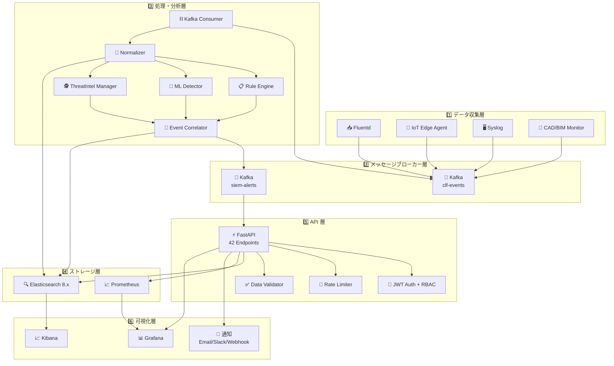
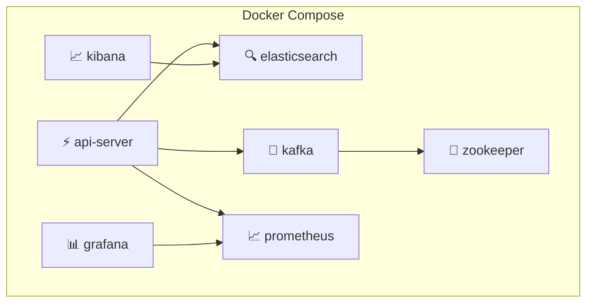

# 🏗 システムアーキテクチャ設計書

> Construction-SIEM-Platform の全体アーキテクチャを定義する

---

## 📊 アーキテクチャ概要

本システムは **6層構成** のレイヤードアーキテクチャを採用し、各層が独立してスケーリング可能な設計となっている。

| 層 | 名称 | 主要コンポーネント |
|:--:|------|-------------------|
| 1️⃣ | 📥 データ収集層 | Fluentd, IoT Edge Agent, Syslog |
| 2️⃣ | 📨 メッセージブローカー層 | Apache Kafka |
| 3️⃣ | ⚙️ 処理・分析層 | Normalizer, Rule Engine, ML, Correlator |
| 4️⃣ | 💾 ストレージ層 | Elasticsearch, Prometheus |
| 5️⃣ | 🔌 API 層 | FastAPI (42 エンドポイント) |
| 6️⃣ | 📊 可視化層 | Grafana, Kibana |

---

## 🗺 システム全体図



---

## 📋 各層の詳細設計

### 1️⃣ データ収集層

| コンポーネント | 説明 | プロトコル |
|---------------|------|-----------|
| 📥 **Fluentd** | 汎用ログ収集エージェント。各種ログソースから収集し Kafka へ転送 | TCP/UDP, HTTP |
| 📡 **IoT Edge Agent** | 建設現場 IoT デバイスからのイベント収集。オフラインバッファ対応 | MQTT, HTTP |
| 🖥 **Syslog** | ネットワーク機器・サーバーからの Syslog 受信 | UDP 514, TCP 514 |
| 📐 **CAD/BIM Monitor** | CAD/BIM ファイルサーバーのアクセスログ監視 | ファイルシステム監視 |

**特徴:**
- ✅ マルチソース対応
- ✅ オフラインバッファリング（IoT Edge）
- ✅ データ欠損防止（at-least-once 配信）

---

### 2️⃣ メッセージブローカー層

| トピック | 用途 | パーティション |
|---------|------|:--------------:|
| `clf-events` | 正規化済みセキュリティイベント | 拡張可能 |
| `siem-alerts` | 生成されたアラート | 拡張可能 |

**特徴:**
- ✅ 高スループット（10,000+ EPS）
- ✅ メッセージ永続化
- ✅ コンシューマーグループによる並列処理
- ✅ パーティション拡張によるスケーリング

---

### 3️⃣ 処理・分析層

| コンポーネント | 説明 | 入力 | 出力 |
|---------------|------|------|------|
| 🔄 **Normalizer** | 多様なログ形式を CLF に正規化 | 生ログ | CLF イベント |
| 📋 **Rule Engine** | ルールベースの脅威検知 | CLF イベント | アラート候補 |
| 🤖 **ML Detector** | Isolation Forest による異常検知 | CLF イベント | 異常スコア |
| 🕵️ **ThreatIntel Manager** | IoC データベースとの照合 | CLF イベント | IoC マッチ結果 |
| 🔗 **Event Correlator** | イベント相関分析・キルチェーン検出 | 検知結果群 | 相関アラート |
| ⛓ **Kafka Consumer** | Kafka からのイベント消費・パイプライン制御 | Kafka メッセージ | 処理チェーン起動 |

**処理フロー:**
```
Kafka Consumer → Normalizer → [Rule Engine + ML + ThreatIntel] → Event Correlator → Alert / Storage
```

---

### 4️⃣ ストレージ層

| コンポーネント | 用途 | データ保持 |
|---------------|------|-----------|
| 🔍 **Elasticsearch 8.x** | セキュリティイベント・アラートの保存・検索 | ILM ポリシー適用 |
| 📈 **Prometheus** | システムメトリクスの時系列保存 | 15日間 |

**Elasticsearch インデックス:**
- `siem-events-YYYY.MM.DD` — CLF 正規化イベント
- `siem-alerts` — アラートデータ

> 詳細は [データベース設計](./03_データベース設計(database-design).md) を参照

---

### 5️⃣ API 層

| コンポーネント | 説明 |
|---------------|------|
| ⚡ **FastAPI** | 非同期 REST API フレームワーク。42 エンドポイントを提供 |
| 🔐 **JWT Auth** | ステートレスなトークン認証 |
| 🛡 **RBAC** | admin / analyst / viewer の3ロール制御 |
| 🚦 **Rate Limiter** | エンドポイント毎のリクエストレート制限 |
| ✅ **Data Validator** | 入力データのバリデーション |

**API カテゴリ:**

| カテゴリ | エンドポイント数 | 概要 |
|---------|:---------------:|------|
| 🔐 認証 | 4 | ログイン、登録、トークンリフレッシュ |
| 🚨 アラート | 5 | アラート CRUD、統計 |
| 📝 インシデント | 5 | インシデントライフサイクル管理 |
| 📖 プレイブック | 5 | プレイブック CRUD、実行 |
| 📄 レポート | 3 | レポート生成・一覧 |
| 📊 KPI | 2 | KPI ダッシュボード |
| 🔍 監査 | 2 | 監査ログ |
| 🔔 通知 | 3 | 通知設定・送信 |
| 🕵️ 脅威インテリジェンス | 3 | IoC 管理・照合 |
| 🔗 相関分析 | 2 | 相関結果取得 |
| ✅ コンプライアンス | 2 | コンプライアンスチェック |
| ⚙️ システム | 6 | ヘルスチェック、メトリクス |

> 詳細は [認証・認可設計](./04_認証・認可設計(auth-design).md) を参照

---

### 6️⃣ 可視化層

| コンポーネント | 対象者 | 用途 |
|---------------|--------|------|
| 📊 **Grafana** | SOC アナリスト、IT 管理者 | リアルタイムメトリクス・KPI ダッシュボード |
| 📈 **Kibana** | SOC アナリスト | ログ検索・詳細分析・カスタムダッシュボード |
| 🔔 **通知** | 全ステークホルダー | メール、Slack、Webhook によるアラート通知 |

---

## 🐳 デプロイメントアーキテクチャ



### コンテナ構成

| コンテナ | イメージ | ポート | 説明 |
|---------|---------|:------:|------|
| api-server | Python 3.12 + FastAPI | 8000 | API サーバー |
| elasticsearch | elasticsearch:8.x | 9200 | 検索エンジン |
| kafka | confluentinc/kafka | 9092 | メッセージブローカー |
| zookeeper | confluentinc/zookeeper | 2181 | Kafka 管理 |
| grafana | grafana/grafana | 3000 | ダッシュボード |
| kibana | elastic/kibana:8.x | 5601 | ログ分析 |
| prometheus | prom/prometheus | 9090 | メトリクス |

---

## 🔒 セキュリティアーキテクチャ

| レイヤー | セキュリティ対策 |
|---------|----------------|
| 🌐 ネットワーク | TLS 暗号化、ファイアウォール |
| 🔐 認証 | JWT トークン、有効期限管理 |
| 🛡 認可 | RBAC（3ロール）、エンドポイント毎の権限制御 |
| 🚦 レート制限 | DDoS / ブルートフォース緩和 |
| ✅ バリデーション | 入力データサニタイズ |
| 📝 監査 | 全操作の監査ログ記録 |

---

## 🔗 関連ドキュメント

- [データフロー設計](./02_データフロー設計(data-flow).md)
- [データベース設計](./03_データベース設計(database-design).md)
- [認証・認可設計](./04_認証・認可設計(auth-design).md)
- [コンポーネント一覧](./05_コンポーネント一覧(component-list).md)
