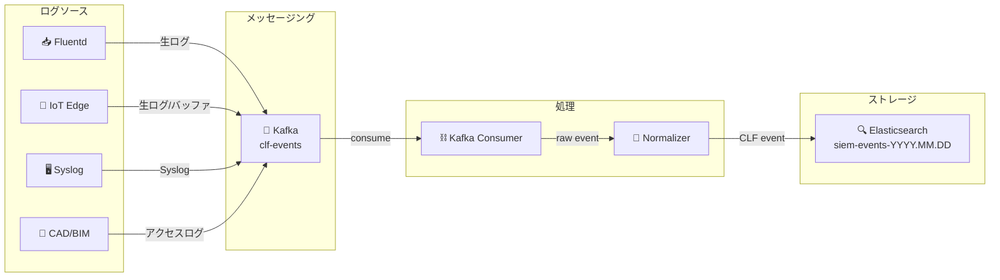
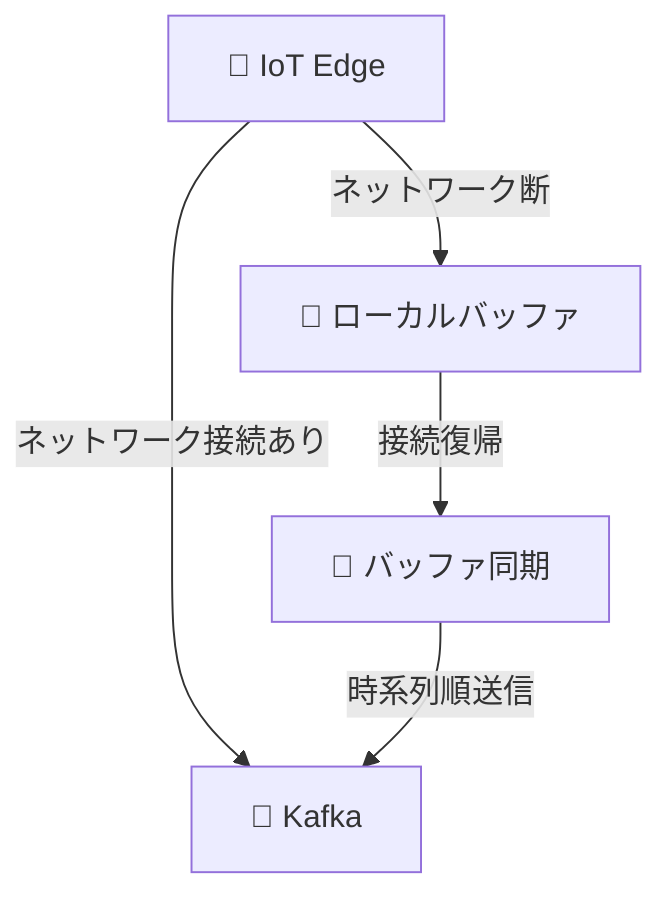
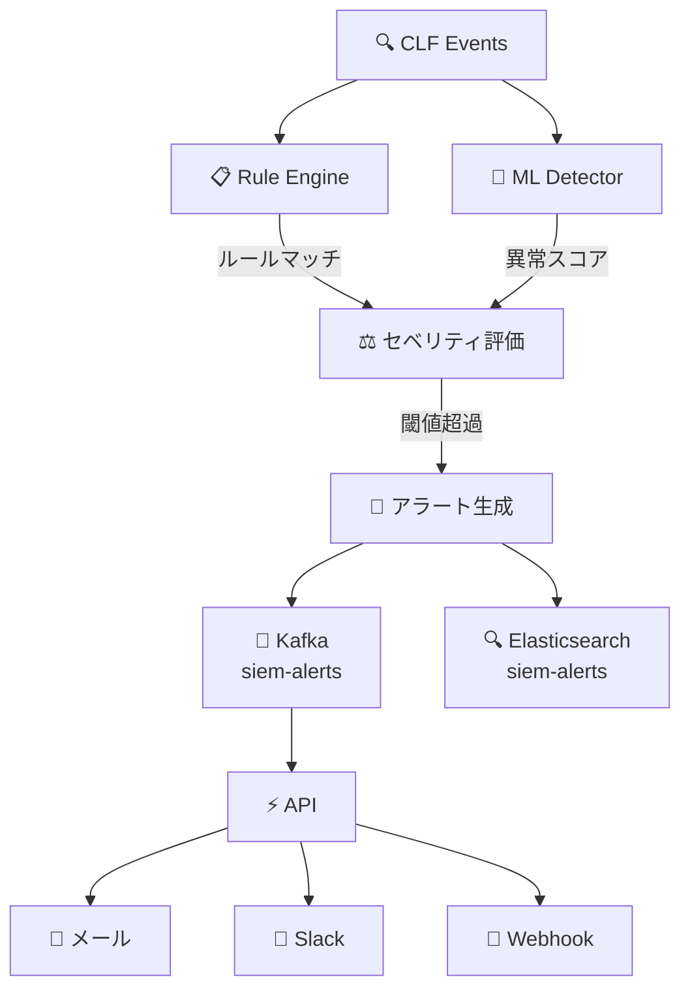
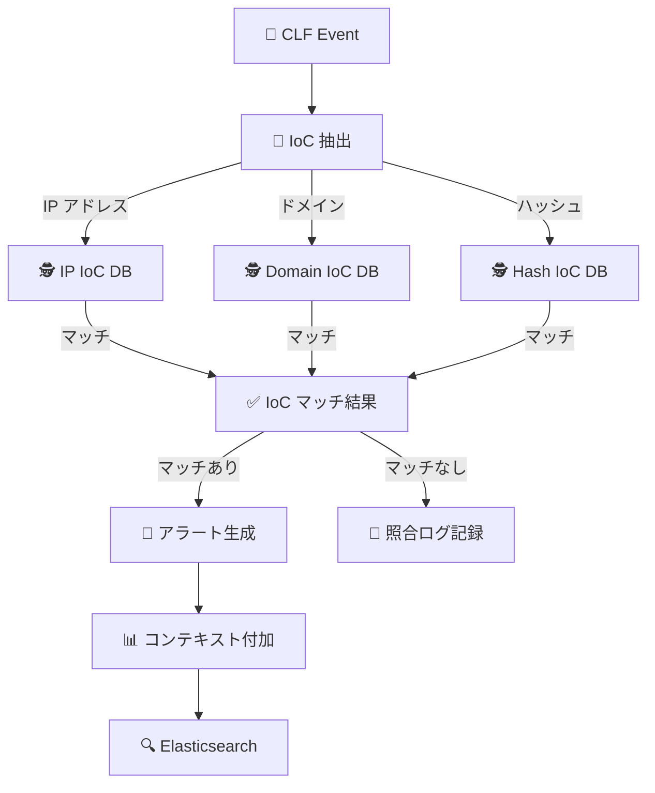
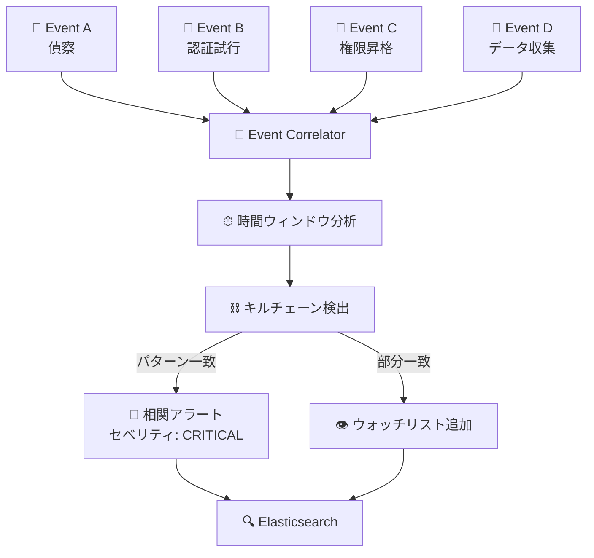

# 🔄 データフロー設計書

> Construction-SIEM-Platform のデータフローを詳細に定義する

---

## 📊 データフロー概要

本システムでは、以下の4つの主要データフローが存在する。

| # | フロー名 | 説明 | 遅延目標 |
|---|---------|------|:--------:|
| 1️⃣ | 📥 ログ収集フロー | ソースからストレージまで | < 30秒 |
| 2️⃣ | 🚨 アラート生成フロー | 検知からアラート生成まで | < 3分 |
| 3️⃣ | 🕵️ IoC 照合フロー | イベントから IoC マッチまで | < 1分 |
| 4️⃣ | 🔗 相関分析フロー | イベント群からキルチェーン検出まで | < 5分 |

---

## 1️⃣ ログ収集フロー

### 概要

ログソースから Elasticsearch への格納までの一連のデータフロー。

### フロー図

### 処理ステップ詳細

| ステップ | コンポーネント | 入力 | 処理 | 出力 |
|:--------:|---------------|------|------|------|
| 1️⃣ | ログソース | 各種ログ | ログ収集・転送 | 生イベント |
| 2️⃣ | Kafka | 生イベント | メッセージキューイング | `clf-events` トピック |
| 3️⃣ | Kafka Consumer | Kafka メッセージ | メッセージ消費・デシリアライズ | 構造化イベント |
| 4️⃣ | Normalizer | 構造化イベント | CLF 正規化 | CLF イベント |
| 5️⃣ | Elasticsearch | CLF イベント | インデックス格納 | 検索可能なドキュメント |

### CLF 正規化の変換内容

| フィールド | 説明 | 例 |
|-----------|------|-----|
| `timestamp` | ISO 8601 タイムスタンプ | `2026-03-24T10:30:00Z` |
| `source_ip` | イベント発生元 IP | `192.168.1.100` |
| `event_type` | イベント種別 | `authentication_failure` |
| `severity` | セベリティ | `high` |
| `device_id` | デバイス識別子 | `iot-sensor-042` |
| `user_id` | ユーザー識別子 | `user@example.com` |
| `action` | 実行されたアクション | `login_attempt` |
| `outcome` | 結果 | `failure` |
| `details` | 詳細情報（JSON） | `{"attempts": 5}` |

### オフラインバッファ処理

| 状態 | 動作 |
|------|------|
| 🟢 オンライン | リアルタイムで Kafka へ送信 |
| 🔴 オフライン | ローカルディスクにバッファリング |
| 🟢 復帰 | バッファ内イベントを時系列順に送信、完了後リアルタイムに復帰 |

---

## 2️⃣ アラート生成フロー

### 概要

CLF イベントからルールエンジン・ML による検知、アラート生成、通知までのフロー。

### フロー図

### 処理ステップ詳細

| ステップ | コンポーネント | 処理 | 遅延 |
|:--------:|---------------|------|:----:|
| 1️⃣ | Rule Engine | 事前定義ルールによるパターンマッチ | < 100ms |
| 2️⃣ | ML Detector | Isolation Forest による異常スコア算出 | < 500ms |
| 3️⃣ | セベリティ評価 | ルールマッチ + 異常スコアの総合評価 | < 50ms |
| 4️⃣ | アラート生成 | アラートオブジェクト生成・格納 | < 200ms |
| 5️⃣ | 通知配信 | マルチチャネル通知 | < 5秒 |

### ルールエンジンの検知ルール例

| ルール名 | 条件 | セベリティ |
|---------|------|:---------:|
| 🦠 ランサムウェア | 大量ファイル暗号化（100+ファイル/分） | 🔴 critical |
| 🔐 ブルートフォース | 認証失敗 10回/5分（同一ソース） | 🟠 high |
| 📐 大量エクスポート | CAD/BIM ファイル 50+ダウンロード/時 | 🟠 high |
| 📡 IoT 異常通信 | 未登録宛先への通信 | 🟡 medium |
| 🔒 権限昇格 | 管理者権限への昇格試行 | 🟠 high |

---

## 3️⃣ IoC 照合フロー

### 概要

イベント内の IP アドレス、ドメイン、ファイルハッシュを脅威インテリジェンスの IoC データベースと照合するフロー。

### フロー図

### 処理ステップ詳細

| ステップ | 処理 | 説明 |
|:--------:|------|------|
| 1️⃣ | IoC 抽出 | イベントから IP、ドメイン、ハッシュ等の IoC 候補を抽出 |
| 2️⃣ | DB 照合 | ThreatIntelManager が各種 IoC データベースと照合 |
| 3️⃣ | マッチ判定 | 一致した IoC の脅威レベル・関連情報を取得 |
| 4️⃣ | コンテキスト付加 | マッチした IoC の詳細情報をアラートに付加 |
| 5️⃣ | アラート生成 | IoC マッチ情報付きアラートを生成 |

### IoC 照合対象

| 種別 | 抽出元フィールド | 照合対象 |
|------|----------------|---------|
| 🌐 IP アドレス | `source_ip`, `dest_ip` | 悪意ある IP リスト |
| 🔗 ドメイン | `hostname`, `url` | 悪意あるドメインリスト |
| #️⃣ ファイルハッシュ | `file_hash` | マルウェアハッシュリスト |
| 📧 メールアドレス | `email` | フィッシング送信元リスト |

---

## 4️⃣ 相関分析フロー

### 概要

複数のイベントを時系列・因果関係で相関分析し、攻撃キルチェーンを検出するフロー。

### フロー図

### キルチェーンステージマッピング

| ステージ | MITRE ATT&CK 戦術 | 検知イベント例 |
|---------|-------------------|---------------|
| 1️⃣ 偵察 | Reconnaissance | ポートスキャン、DNS 列挙 |
| 2️⃣ 武器化 | Resource Development | — （外部で実行） |
| 3️⃣ 配送 | Initial Access | フィッシングメール、悪意あるファイル |
| 4️⃣ 攻撃 | Execution | マルウェア実行、スクリプト実行 |
| 5️⃣ インストール | Persistence | 永続化メカニズム設置 |
| 6️⃣ C2 通信 | Command and Control | 不審な外部通信、ビーコン |
| 7️⃣ 目的達成 | Exfiltration | データエクスポート、暗号化 |

### 相関ルール

| ルール名 | 条件 | 時間ウィンドウ | 出力 |
|---------|------|:-------------:|------|
| 🔗 多段攻撃 | 同一ソースから3ステージ以上 | 24時間 | キルチェーンアラート |
| 🔗 横展開 | 内部ネットワーク間の異常通信連鎖 | 6時間 | ラテラルムーブメントアラート |
| 🔗 認証+データ | 認証成功後の大量データアクセス | 2時間 | データ窃取アラート |
| 🔗 IoT 連鎖 | 複数 IoT デバイスの同時異常 | 1時間 | IoT 一斉攻撃アラート |

---

## 📊 データ量見積もり

### 日次データ量

| データ種別 | イベント数/日 | データサイズ/日 | 保持期間 |
|-----------|:------------:|:--------------:|:--------:|
| 📥 CLF イベント | ~864,000,000 (10K EPS) | ~500 GB | 90日間 |
| 🚨 アラート | ~1,000 | ~10 MB | 365日間 |
| 📝 監査ログ | ~10,000 | ~50 MB | 365日間 |
| 📈 メトリクス | ~8,640,000 | ~1 GB | 15日間 |

### ストレージ容量計画

| 期間 | CLF イベント | アラート | 監査ログ | 合計 |
|------|:----------:|:------:|:------:|:----:|
| 1ヶ月 | 15 TB | 300 MB | 1.5 GB | ~15 TB |
| 3ヶ月（保持上限） | 45 TB | 900 MB | 4.5 GB | ~45 TB |
| 1年間 | — (ILM削除) | 3.6 GB | 18 GB | — |

---

## 🔗 関連ドキュメント

- [システムアーキテクチャ](./01_システムアーキテクチャ(system-architecture).md)
- [データベース設計](./03_データベース設計(database-design).md)
- [コンポーネント一覧](./05_コンポーネント一覧(component-list).md)
- [ユースケース](../02_要件定義(requirements)/03_ユースケース(use-cases).md)
