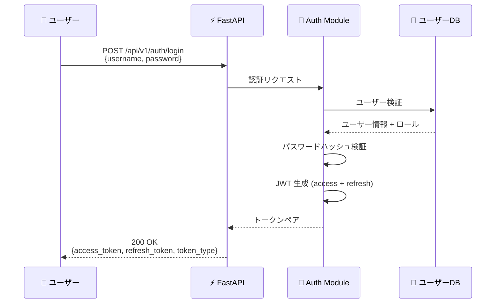
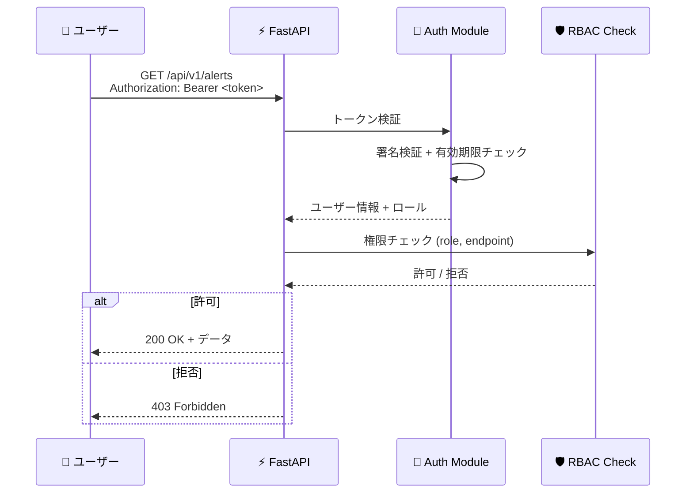
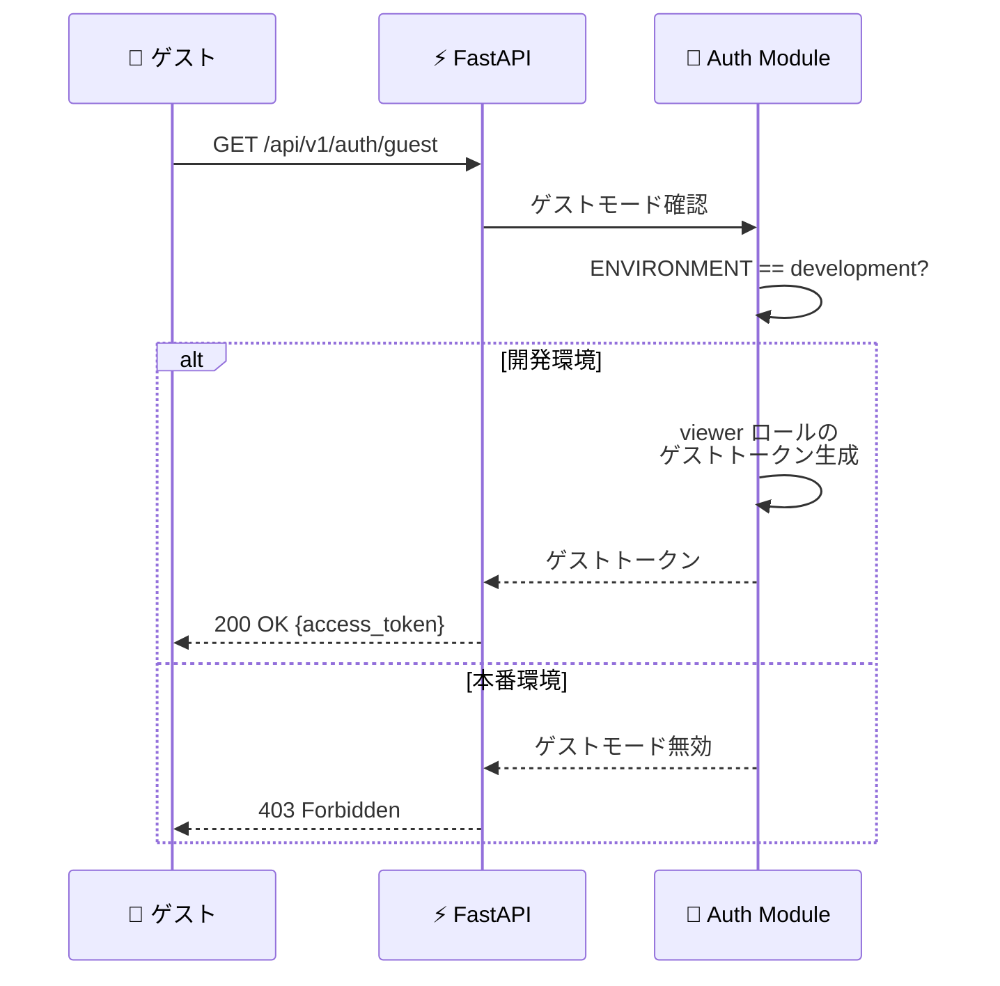

# 🔐 認証・認可設計書

> JWT 認証と RBAC によるアクセス制御設計を定義する

---

## 📊 設計概要

| 項目 | 内容 |
|------|------|
| **認証方式** | JWT (JSON Web Token) |
| **署名アルゴリズム** | HS256 |
| **認可方式** | RBAC (Role-Based Access Control) |
| **ロール数** | 3 (admin / analyst / viewer) |
| **保護エンドポイント数** | 42 |
| **ゲストアクセス** | 開発環境のみ (viewer 権限) |

---

## 🔑 JWT 認証フロー

### トークン発行フロー



### トークン検証フロー



### トークン仕様

| 項目 | アクセストークン | リフレッシュトークン |
|------|:---------------:|:-------------------:|
| 🔹 用途 | API リクエスト認証 | アクセストークン再発行 |
| 🔹 有効期限 | 30分 | 7日 |
| 🔹 ペイロード | user_id, role, exp | user_id, token_type, exp |
| 🔹 署名 | HS256 | HS256 |
| 🔹 送信方法 | Authorization ヘッダー | POST ボディ |

### JWT ペイロード構造

```json
{
  "sub": "user@example.com",
  "role": "analyst",
  "iat": 1711267200,
  "exp": 1711269000,
  "jti": "a1b2c3d4-e5f6-7890-abcd-ef1234567890"
}
```

| フィールド | 説明 |
|-----------|------|
| `sub` | ユーザー識別子 |
| `role` | ユーザーロール |
| `iat` | 発行時刻 |
| `exp` | 有効期限 |
| `jti` | トークン一意識別子 |

---

## 🛡 RBAC 設計

### ロール定義

| ロール | 説明 | 対象者 | 権限レベル |
|--------|------|--------|:---------:|
| 🔴 **admin** | 全権限。システム設定・ユーザー管理を含む | IT 管理者, CISO | ⭐⭐⭐ |
| 🟡 **analyst** | 運用権限。アラート対応・インシデント管理 | SOC アナリスト | ⭐⭐ |
| 🟢 **viewer** | 読取専用。ダッシュボード・レポート閲覧 | 現場管理者, ゲスト | ⭐ |

### 権限の包含関係

```
admin  ⊃  analyst  ⊃  viewer
  │          │          │
  ├─ 全操作   ├─ CRUD    └─ 読取のみ
  ├─ 設定変更  ├─ 実行
  └─ ユーザー管理 └─ 閲覧
```

---

## 📋 全42エンドポイント権限マトリクス

### 🔐 認証 (Authentication)

| # | メソッド | エンドポイント | admin | analyst | viewer | 認証不要 |
|---|---------|---------------|:-----:|:-------:|:------:|:--------:|
| 1 | `POST` | `/api/v1/auth/login` | — | — | — | ✅ |
| 2 | `POST` | `/api/v1/auth/register` | ✅ | ❌ | ❌ | — |
| 3 | `POST` | `/api/v1/auth/refresh` | — | — | — | ✅ |
| 4 | `GET` | `/api/v1/auth/me` | ✅ | ✅ | ✅ | — |

### 🚨 アラート (Alerts)

| # | メソッド | エンドポイント | admin | analyst | viewer | 説明 |
|---|---------|---------------|:-----:|:-------:|:------:|------|
| 5 | `GET` | `/api/v1/alerts` | ✅ | ✅ | ✅ | アラート一覧 |
| 6 | `GET` | `/api/v1/alerts/{id}` | ✅ | ✅ | ✅ | アラート詳細 |
| 7 | `PUT` | `/api/v1/alerts/{id}` | ✅ | ✅ | ❌ | アラート更新 |
| 8 | `GET` | `/api/v1/alerts/statistics` | ✅ | ✅ | ✅ | アラート統計 |
| 9 | `POST` | `/api/v1/alerts` | ✅ | ✅ | ❌ | アラート手動作成 |

### 📝 インシデント (Incidents)

| # | メソッド | エンドポイント | admin | analyst | viewer | 説明 |
|---|---------|---------------|:-----:|:-------:|:------:|------|
| 10 | `GET` | `/api/v1/incidents` | ✅ | ✅ | ✅ | インシデント一覧 |
| 11 | `POST` | `/api/v1/incidents` | ✅ | ✅ | ❌ | インシデント作成 |
| 12 | `GET` | `/api/v1/incidents/{id}` | ✅ | ✅ | ✅ | インシデント詳細 |
| 13 | `PUT` | `/api/v1/incidents/{id}` | ✅ | ✅ | ❌ | インシデント更新 |
| 14 | `GET` | `/api/v1/incidents/statistics` | ✅ | ✅ | ✅ | インシデント統計 |

### 📖 プレイブック (Playbooks)

| # | メソッド | エンドポイント | admin | analyst | viewer | 説明 |
|---|---------|---------------|:-----:|:-------:|:------:|------|
| 15 | `GET` | `/api/v1/playbooks` | ✅ | ✅ | ✅ | プレイブック一覧 |
| 16 | `POST` | `/api/v1/playbooks` | ✅ | ❌ | ❌ | プレイブック作成 |
| 17 | `GET` | `/api/v1/playbooks/{id}` | ✅ | ✅ | ✅ | プレイブック詳細 |
| 18 | `PUT` | `/api/v1/playbooks/{id}` | ✅ | ❌ | ❌ | プレイブック更新 |
| 19 | `POST` | `/api/v1/playbooks/{id}/execute` | ✅ | ✅ | ❌ | プレイブック実行 |

### 📄 レポート (Reports)

| # | メソッド | エンドポイント | admin | analyst | viewer | 説明 |
|---|---------|---------------|:-----:|:-------:|:------:|------|
| 20 | `GET` | `/api/v1/reports` | ✅ | ✅ | ✅ | レポート一覧 |
| 21 | `POST` | `/api/v1/reports/generate` | ✅ | ✅ | ❌ | レポート生成 |
| 22 | `GET` | `/api/v1/reports/{id}` | ✅ | ✅ | ✅ | レポート詳細 |

### 📊 KPI

| # | メソッド | エンドポイント | admin | analyst | viewer | 説明 |
|---|---------|---------------|:-----:|:-------:|:------:|------|
| 23 | `GET` | `/api/v1/kpi/dashboard` | ✅ | ✅ | ✅ | KPI ダッシュボード |
| 24 | `GET` | `/api/v1/kpi/trends` | ✅ | ✅ | ✅ | KPI トレンド |

### 🔍 監査 (Audit)

| # | メソッド | エンドポイント | admin | analyst | viewer | 説明 |
|---|---------|---------------|:-----:|:-------:|:------:|------|
| 25 | `GET` | `/api/v1/audit/logs` | ✅ | ❌ | ❌ | 監査ログ一覧 |
| 26 | `GET` | `/api/v1/audit/logs/{id}` | ✅ | ❌ | ❌ | 監査ログ詳細 |

### 🔔 通知 (Notifications)

| # | メソッド | エンドポイント | admin | analyst | viewer | 説明 |
|---|---------|---------------|:-----:|:-------:|:------:|------|
| 27 | `GET` | `/api/v1/notifications/config` | ✅ | ✅ | ❌ | 通知設定取得 |
| 28 | `POST` | `/api/v1/notifications/config` | ✅ | ❌ | ❌ | 通知設定更新 |
| 29 | `POST` | `/api/v1/notifications/test` | ✅ | ✅ | ❌ | テスト通知送信 |

### 🕵️ 脅威インテリジェンス (Threat Intelligence)

| # | メソッド | エンドポイント | admin | analyst | viewer | 説明 |
|---|---------|---------------|:-----:|:-------:|:------:|------|
| 30 | `GET` | `/api/v1/threat-intel/ioc` | ✅ | ✅ | ✅ | IoC 一覧 |
| 31 | `POST` | `/api/v1/threat-intel/ioc` | ✅ | ✅ | ❌ | IoC 登録 |
| 32 | `POST` | `/api/v1/threat-intel/lookup` | ✅ | ✅ | ❌ | IoC 照合実行 |

### 🔗 相関分析 (Correlation)

| # | メソッド | エンドポイント | admin | analyst | viewer | 説明 |
|---|---------|---------------|:-----:|:-------:|:------:|------|
| 33 | `GET` | `/api/v1/correlation/results` | ✅ | ✅ | ✅ | 相関分析結果 |
| 34 | `GET` | `/api/v1/correlation/killchain` | ✅ | ✅ | ✅ | キルチェーン分析 |

### ✅ コンプライアンス (Compliance)

| # | メソッド | エンドポイント | admin | analyst | viewer | 説明 |
|---|---------|---------------|:-----:|:-------:|:------:|------|
| 35 | `GET` | `/api/v1/compliance/check` | ✅ | ✅ | ✅ | コンプライアンスチェック |
| 36 | `GET` | `/api/v1/compliance/report` | ✅ | ✅ | ✅ | コンプライアンスレポート |

### 🔍 イベント (Events)

| # | メソッド | エンドポイント | admin | analyst | viewer | 説明 |
|---|---------|---------------|:-----:|:-------:|:------:|------|
| 37 | `GET` | `/api/v1/events/search` | ✅ | ✅ | ✅ | イベント検索 |
| 38 | `GET` | `/api/v1/events/{id}` | ✅ | ✅ | ✅ | イベント詳細 |

### ⚙️ システム (System)

| # | メソッド | エンドポイント | admin | analyst | viewer | 認証不要 | 説明 |
|---|---------|---------------|:-----:|:-------:|:------:|:--------:|------|
| 39 | `GET` | `/api/v1/health` | — | — | — | ✅ | ヘルスチェック |
| 40 | `GET` | `/api/v1/metrics` | ✅ | ✅ | ❌ | — | Prometheus メトリクス |
| 41 | `GET` | `/api/v1/elasticsearch/health` | ✅ | ❌ | ❌ | — | ES ヘルス |
| 42 | `GET` | `/api/v1/elasticsearch/indices` | ✅ | ❌ | ❌ | — | ES インデックス情報 |

---

## 🛡 権限サマリ

| 権限種別 | admin | analyst | viewer |
|---------|:-----:|:-------:|:------:|
| 🔍 読取（GET） | 42/42 | 34/42 | 28/42 |
| ✏️ 作成（POST） | 12/42 | 8/42 | 0/42 |
| 🔄 更新（PUT） | 4/42 | 3/42 | 0/42 |
| 🗑 削除（DELETE） | 0/42 | 0/42 | 0/42 |
| 🔓 認証不要 | 3 | 3 | 3 |

---

## 🏗 開発環境ゲストアクセス

### 概要

開発環境でのデモ・評価目的でゲストアクセスモードを提供する。

| 項目 | 内容 |
|------|------|
| **有効条件** | 環境変数 `ENVIRONMENT=development` |
| **付与ロール** | viewer |
| **認証** | 不要（自動ゲストトークン発行） |
| **制限** | 読取操作のみ、レート制限強化 |

### ゲストアクセスフロー



---

## 🔒 セキュリティ考慮事項

| 項目 | 対策 |
|------|------|
| 🔹 トークン漏洩 | 短い有効期限（30分）、HTTPS 必須 |
| 🔹 ブルートフォース | ログイン試行のレート制限 |
| 🔹 権限昇格 | サーバーサイドでのロール検証、トークン改ざん検知 |
| 🔹 トークン再利用 | JTI によるトークン一意性管理 |
| 🔹 リフレッシュトークン | リフレッシュ時にトークンローテーション |
| 🔹 監査証跡 | 全認証イベントの監査ログ記録 |

---

## 🔗 関連ドキュメント

- [システムアーキテクチャ](./01_システムアーキテクチャ(system-architecture).md)
- [ステークホルダー一覧](../01_プロジェクト概要(project-overview)/03_ステークホルダー一覧(stakeholders).md)
- [機能要件 AUTH-001〜004](../02_要件定義(requirements)/01_機能要件(functional-requirements).md)
