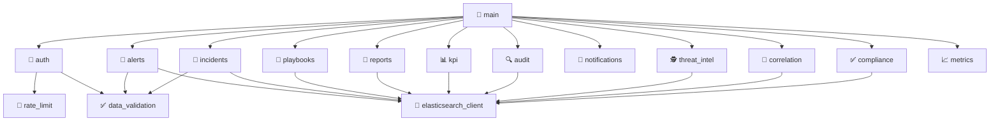
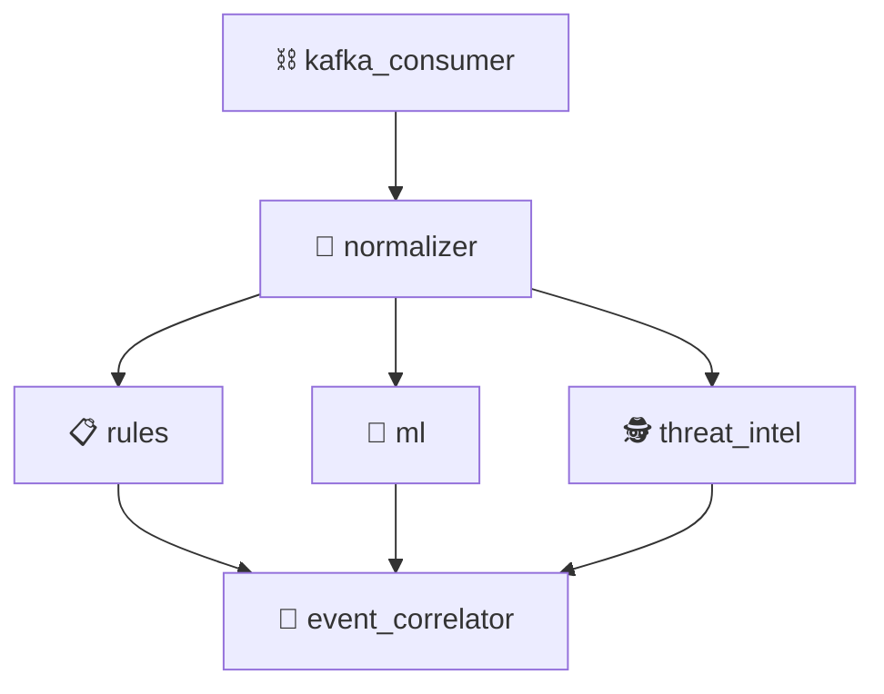

# 📦 コンポーネント一覧

> 全22モジュールの責務・依存関係・テスト対応を定義する

---

## 📊 コンポーネント概要

| パッケージ | モジュール数 | 説明 |
|-----------|:----------:|------|
| 📁 `api/` | 16 | FastAPI アプリケーション（REST API） |
| 📁 `processing/` | 6 | ログ処理・分析エンジン |
| **合計** | **22** | |

---

## 📁 API パッケージ (`api/`)

### 🗺 モジュール依存関係図

---

### 1️⃣ main — アプリケーションエントリーポイント

| 項目 | 内容 |
|------|------|
| **モジュール** | `api/main.py` |
| **責務** | FastAPI アプリケーションの初期化、ルーティング設定、ミドルウェア登録 |
| **依存先** | 全 API モジュール |
| **テスト** | ✅ 統合テスト |

**主な機能:**
- FastAPI アプリケーションインスタンス生成
- 全ルーターの登録
- CORS / 認証 / レート制限ミドルウェアの設定
- ヘルスチェックエンドポイント

---

### 2️⃣ auth — 認証・認可

| 項目 | 内容 |
|------|------|
| **モジュール** | `api/auth.py` |
| **責務** | JWT 認証、ユーザー管理、RBAC、ゲストアクセス |
| **依存先** | `rate_limit`, `data_validation` |
| **テスト** | ✅ ユニット + 統合テスト |

**主な機能:**
- `POST /api/v1/auth/login` — ログイン・トークン発行
- `POST /api/v1/auth/register` — ユーザー登録
- `POST /api/v1/auth/refresh` — トークンリフレッシュ
- `GET /api/v1/auth/me` — 認証済みユーザー情報取得
- パスワードハッシュ化（bcrypt）
- ロール検証デコレータ

---

### 3️⃣ alerts — アラート管理

| 項目 | 内容 |
|------|------|
| **モジュール** | `api/alerts.py` |
| **責務** | アラートの CRUD、統計、フィルタリング |
| **依存先** | `elasticsearch_client`, `data_validation` |
| **テスト** | ✅ ユニット + 統合テスト |

**主な機能:**
- アラート一覧取得（ページネーション、フィルタリング）
- アラート詳細取得
- アラートステータス更新 (open → acknowledged → resolved)
- アラート統計（セベリティ別・時系列）
- アラート手動作成

---

### 4️⃣ incidents — インシデント管理

| 項目 | 内容 |
|------|------|
| **モジュール** | `api/incidents.py` |
| **責務** | インシデントライフサイクル管理 |
| **依存先** | `elasticsearch_client`, `data_validation` |
| **テスト** | ✅ ユニット + 統合テスト |

**主な機能:**
- インシデント CRUD
- ステータス遷移管理
- アラート紐付け
- インシデント統計
- 優先度管理 (P1-P4)

---

### 5️⃣ playbooks — プレイブック管理

| 項目 | 内容 |
|------|------|
| **モジュール** | `api/playbooks.py` |
| **責務** | 対応プレイブックの管理・実行 |
| **依存先** | `elasticsearch_client` |
| **テスト** | ✅ ユニット + 統合テスト |

**主な機能:**
- プレイブック CRUD
- プレイブック実行
- 実行履歴管理
- ステップ定義・実行制御

---

### 6️⃣ reports — レポート管理

| 項目 | 内容 |
|------|------|
| **モジュール** | `api/reports.py` |
| **責務** | セキュリティレポート・インシデント報告書の生成 |
| **依存先** | `elasticsearch_client` |
| **テスト** | ✅ ユニット + 統合テスト |

**主な機能:**
- レポート一覧取得
- レポート自動生成（日次/週次/月次）
- インシデント事後報告書生成
- レポート詳細取得

---

### 7️⃣ kpi — KPI ダッシュボード

| 項目 | 内容 |
|------|------|
| **モジュール** | `api/kpi.py` |
| **責務** | KPI メトリクスの算出・提供 |
| **依存先** | `elasticsearch_client` |
| **テスト** | ✅ ユニット + 統合テスト |

**主な機能:**
- MTTD / MTTR 算出
- 検知率・誤検知率算出
- KPI ダッシュボードデータ提供
- トレンド分析

---

### 8️⃣ audit — 監査ログ

| 項目 | 内容 |
|------|------|
| **モジュール** | `api/audit.py` |
| **責務** | 全操作の監査ログ記録・閲覧 |
| **依存先** | `elasticsearch_client` |
| **テスト** | ✅ ユニット + 統合テスト |

**主な機能:**
- 監査ログ記録（操作者、操作内容、タイムスタンプ、IP）
- 監査ログ検索・フィルタリング
- 監査ログ詳細取得

---

### 9️⃣ notifications — 通知管理

| 項目 | 内容 |
|------|------|
| **モジュール** | `api/notifications.py` |
| **責務** | マルチチャネル通知の設定・配信 |
| **依存先** | — |
| **テスト** | ✅ ユニット + 統合テスト |

**主な機能:**
- 通知設定管理（メール、Slack、Webhook）
- アラート通知配信
- テスト通知送信
- 通知ルール設定

---

### 🔟 threat_intel — 脅威インテリジェンス API

| 項目 | 内容 |
|------|------|
| **モジュール** | `api/threat_intel.py` |
| **責務** | IoC データの管理・照合 API |
| **依存先** | `elasticsearch_client` |
| **テスト** | ✅ ユニット + 統合テスト |

**主な機能:**
- IoC 一覧取得
- IoC 登録（IP、ドメイン、ハッシュ）
- リアルタイム IoC 照合

---

### 1️⃣1️⃣ rate_limit — レート制限

| 項目 | 内容 |
|------|------|
| **モジュール** | `api/rate_limit.py` |
| **責務** | API リクエストのレート制限 |
| **依存先** | — |
| **テスト** | ✅ ユニットテスト |

**主な機能:**
- エンドポイント毎のレート制限設定
- スライディングウィンドウカウンタ
- 429 Too Many Requests レスポンス

---

### 1️⃣2️⃣ data_validation — データバリデーション

| 項目 | 内容 |
|------|------|
| **モジュール** | `api/data_validation.py` |
| **責務** | 入力データのバリデーション・サニタイズ |
| **依存先** | — |
| **テスト** | ✅ ユニットテスト |

**主な機能:**
- Pydantic モデルによるスキーマバリデーション
- 入力サニタイズ
- カスタムバリデータ

---

### 1️⃣3️⃣ metrics — Prometheus メトリクス

| 項目 | 内容 |
|------|------|
| **モジュール** | `api/metrics.py` |
| **責務** | システムメトリクスの収集・エクスポート |
| **依存先** | — |
| **テスト** | ✅ ユニットテスト |

**主な機能:**
- リクエスト数カウンタ
- レスポンスタイムヒストグラム
- アクティブコネクション数ゲージ
- Prometheus 形式エクスポート

---

### 1️⃣4️⃣ compliance — コンプライアンスチェック

| 項目 | 内容 |
|------|------|
| **モジュール** | `api/compliance.py` |
| **責務** | 規格準拠チェック・レポート生成 |
| **依存先** | `elasticsearch_client` |
| **テスト** | ✅ ユニット + 統合テスト |

**主な機能:**
- ISO 27001 準拠チェック
- NIST CSF 2.0 準拠チェック
- コンプライアンスレポート生成

---

### 1️⃣5️⃣ correlation — 相関分析 API

| 項目 | 内容 |
|------|------|
| **モジュール** | `api/correlation.py` |
| **責務** | 相関分析結果の提供 |
| **依存先** | `elasticsearch_client` |
| **テスト** | ✅ ユニット + 統合テスト |

**主な機能:**
- 相関分析結果取得
- キルチェーン分析結果取得

---

### 1️⃣6️⃣ elasticsearch_client — Elasticsearch クライアント

| 項目 | 内容 |
|------|------|
| **モジュール** | `api/elasticsearch_client.py` |
| **責務** | Elasticsearch との通信を抽象化 |
| **依存先** | — (外部: Elasticsearch 8.x) |
| **テスト** | ✅ ユニット + 統合テスト |

**主な機能:**
- コネクション管理
- インデックス CRUD
- ドキュメント検索・格納
- ヘルスチェック
- ILM 管理

---

## 📁 Processing パッケージ (`processing/`)

### 🗺 モジュール依存関係図

---

### 1️⃣7️⃣ normalizer — ログ正規化

| 項目 | 内容 |
|------|------|
| **モジュール** | `processing/normalizer.py` |
| **責務** | 多様なログ形式を CLF (Common Log Format) に正規化 |
| **依存先** | — |
| **テスト** | ✅ ユニットテスト |

**主な機能:**
- Syslog → CLF 変換
- JSON ログ → CLF 変換
- CEF → CLF 変換
- フィールドマッピング
- タイムスタンプ正規化

---

### 1️⃣8️⃣ rules — ルールエンジン

| 項目 | 内容 |
|------|------|
| **モジュール** | `processing/rules.py` |
| **責務** | ルールベースの脅威検知 |
| **依存先** | — |
| **テスト** | ✅ ユニットテスト |

**主な機能:**
- ルール定義・管理
- パターンマッチング
- 閾値ベース検知
- セベリティ判定
- ルール: ブルートフォース、ランサムウェア、権限昇格、異常通信等

---

### 1️⃣9️⃣ ml — 機械学習検知

| 項目 | 内容 |
|------|------|
| **モジュール** | `processing/ml.py` |
| **責務** | ML ベースの異常検知 |
| **依存先** | — (外部: scikit-learn) |
| **テスト** | ✅ ユニットテスト |

**主な機能:**
- Isolation Forest モデル
- 異常スコア算出
- モデルの学習・更新
- 特徴量エンジニアリング

---

### 2️⃣0️⃣ kafka_consumer — Kafka コンシューマー

| 項目 | 内容 |
|------|------|
| **モジュール** | `processing/kafka_consumer.py` |
| **責務** | Kafka からのイベント消費・パイプライン制御 |
| **依存先** | `normalizer` (外部: kafka-python) |
| **テスト** | ✅ ユニット + 統合テスト |

**主な機能:**
- `clf-events` トピックの消費
- メッセージデシリアライズ
- 処理パイプラインへのディスパッチ
- コンシューマーグループ管理
- オフセットコミット

---

### 2️⃣1️⃣ threat_intel (processing) — 脅威インテリジェンスエンジン

| 項目 | 内容 |
|------|------|
| **モジュール** | `processing/threat_intel.py` |
| **責務** | IoC データベース管理・リアルタイム照合 |
| **依存先** | — |
| **テスト** | ✅ ユニットテスト |

**主な機能:**
- ThreatIntelManager クラス
- IoC データベース（IP、ドメイン、ハッシュ）
- リアルタイム照合
- IoC フィード更新
- マッチ結果のコンテキスト付加

---

### 2️⃣2️⃣ event_correlator — イベント相関分析

| 項目 | 内容 |
|------|------|
| **モジュール** | `processing/event_correlator.py` |
| **責務** | イベント相関分析・キルチェーン検出 |
| **依存先** | — |
| **テスト** | ✅ ユニットテスト |

**主な機能:**
- EventCorrelator クラス
- 時間ウィンドウベースの相関
- キルチェーンステージマッピング
- 多段攻撃検出
- ラテラルムーブメント検出
- 相関ルール管理

---

## 📊 テスト対応状況サマリ

| パッケージ | モジュール数 | テスト済み | カバレッジ |
|-----------|:----------:|:---------:|:---------:|
| 📁 api/ | 16 | ✅ 16/16 | ~83% |
| 📁 processing/ | 6 | ✅ 6/6 | ~83% |
| **合計** | **22** | **22/22** | **83%** |

### テスト種別

| テスト種別 | テスト数 | 対象 |
|-----------|:-------:|------|
| ✅ ユニットテスト | ~150 | 個別モジュールの関数・クラス |
| 🔗 統合テスト | ~40 | API エンドポイント、ES 連携 |
| 🔄 E2E テスト | ~20 | エンドツーエンドフロー |
| **合計** | **~210** | |

---

## 📋 技術的依存関係

### 外部ライブラリ

| ライブラリ | バージョン | 使用モジュール | 用途 |
|-----------|-----------|---------------|------|
| FastAPI | 最新 | api/* | Web フレームワーク |
| Pydantic | v2 | api/* | データバリデーション |
| python-jose | 最新 | api/auth | JWT 処理 |
| passlib | 最新 | api/auth | パスワードハッシュ |
| elasticsearch-py | 8.x | api/elasticsearch_client | ES クライアント |
| kafka-python | 最新 | processing/kafka_consumer | Kafka クライアント |
| scikit-learn | 最新 | processing/ml | 機械学習 |
| prometheus-client | 最新 | api/metrics | メトリクス |

### 外部サービス

| サービス | モジュール | 通信 |
|---------|-----------|------|
| 🔍 Elasticsearch 8.x | elasticsearch_client | HTTP (9200) |
| 📨 Apache Kafka | kafka_consumer | TCP (9092) |
| 📈 Prometheus | metrics | HTTP (9090) |

---

## 🔗 関連ドキュメント

- [システムアーキテクチャ](./01_システムアーキテクチャ(system-architecture).md)
- [データフロー設計](./02_データフロー設計(data-flow).md)
- [認証・認可設計](./04_認証・認可設計(auth-design).md)
- [機能要件](../02_要件定義(requirements)/01_機能要件(functional-requirements).md)
