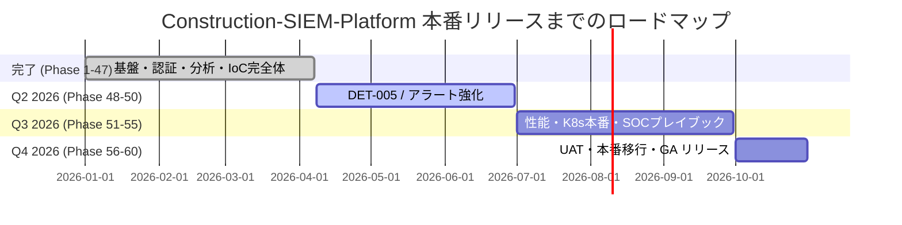

# 🗺 ロードマップ — Construction SIEM Platform

> **本番リリース目標: 2026年10月 (v1.0 GA)**
> 最終更新: 2026-04-07 (Phase 47完了・テスト1284件)

---

## 📋 目次

1. [全体ロードマップ](#全体ロードマップ)
2. [マイルストーン一覧](#マイルストーン)
3. [Q2 2026 計画](#q2-2026)
4. [Q3 2026 計画](#q3-2026)
5. [Q4 2026 計画](#q4-2026)
6. [リスクと対策](#リスクと対策)
7. [本番リリース判定基準](#本番リリース判定基準)

---

## 🎯 全体ロードマップ



### 現在地

```
Phase 1 ─────────────────────────────────── Phase 47 ─────── Phase 60 (GA)
|              完了 ✅                      |     残り 13フェーズ     |
Jan 2026                               Apr 2026                Oct 2026
```

---

## 🏁 マイルストーン {#マイルストーン}

| # | マイルストーン | 目標日 | 状態 | 達成基準 |
|:-:|-------------|:------:|:----:|---------|
| M1 | PoC 完成 | 2026-03-31 | ✅ **達成** | Phase 1-15 完了・基本機能動作 |
| M2 | エンタープライズ機能完成 | 2026-04-07 | ✅ **達成** | Phase 47 完了・テスト 1,284件 |
| M3 | 脅威インテリジェンス次世代 | 2026-06-30 | 🔵 **計画中** | DET-005 完了・IoC 完全体 |
| M4 | 本番品質達成 | 2026-09-30 | 📅 予定 | 10k EPS・セキュリティ監査合格 |
| M5 | **v1.0 GA リリース** 🚀 | **2026-10-31** | 📅 予定 | UAT 合格・本番稼働開始 |

---

## 🔵 Q2 2026: DET-005 脅威インテリジェンス次世代 (Phase 48-50) {#q2-2026}

### 期間: 2026年4月〜6月

| Phase | 名称 | 内容 | 優先度 | 見積 |
|:-----:|------|------|:------:|:----:|
| 48 | IoC STIX 2.1 エクスポート | STIX Bundle 形式出力・TAXII 連携 (DET-005a) | 🔴 高 | 1週 |
| 49 | ML 脅威スコアリング強化 | 異常 IoC 自動検出・IsolationForest 拡張 (DET-005b) | 🟡 中 | 2週 |
| 50 | アラート重複排除・グルーピング | インテリジェント重複排除・関連アラート自動紐付け | 🔴 高 | 1週 |

### Q2 成果目標

| 指標 | 現在 (Phase 47) | Q2 目標 |
|------|:--------------:|:-------:|
| テスト数 | **1,284件** | 1,380件以上 |
| エンドポイント数 | 85+ | 95+ |
| IoC 機能完成度 | DET-004k | DET-005b |
| MTTD | < 15分 | < 10分 |

---

## 🟡 Q3 2026: 本番品質・パフォーマンス (Phase 51-55) {#q3-2026}

### 期間: 2026年7月〜9月

| Phase | 名称 | 内容 | 優先度 | 見積 |
|:-----:|------|------|:------:|:----:|
| 51 | インシデント自動エスカレーション高度化 | P1 自動通知・エスカレーションルール強化 | 🔴 高 | 2週 |
| 52 | 10,000 EPS 負荷テスト | ボトルネック解消・Kafka チューニング | 🔴 高 | 3週 |
| 53 | セキュリティ監査対応 | ペネトレーションテスト・OWASP Top10 全対策 | 🔴 高 | 3週 |
| 54 | Kubernetes 本番設定最適化 | HPA 自動スケーリング・PDB・本番 Helm values | 🟡 中 | 2週 |
| 55 | SOC 運用プレイブック完全整備 | 24時間対応手順書・インシデント対応訓練 | 🔴 高 | 2週 |

### Q3 品質ゲート (全クリアで Q4 移行)

```
[ ] 10,000 EPS 処理: 連続1時間 0 エラー
[ ] P1 インシデント MTTD: < 5分
[ ] OWASP Top10: 全項目クリア
[ ] テストカバレッジ: 95%以上 (現在 90%+)
[ ] SLA 99.9%: 30日連続達成シミュレーション
```

---

## 🚀 Q4 2026: UAT・本番移行・GA リリース (Phase 56-60) {#q4-2026}

### 期間: 2026年10月

| Phase | 名称 | 内容 | 優先度 | 見積 |
|:-----:|------|------|:------:|:----:|
| 56 | UAT (受入テスト) | みらい建設工業 IT 部門による受入テスト | 🔴 高 | 2週 |
| 57 | 本番環境構築・データ移行 | 本番 K8s クラスタ・データ移行手順実行 | 🔴 高 | 2週 |
| 58 | 監視・アラート本番チューニング | 誤検知率 < 5%・閾値最終調整 | 🔴 高 | 1週 |
| 59 | ドキュメント最終確定・引き渡し | 運用マニュアル・SOC 教育資料完成 | 🔴 高 | 1週 |
| 60 | **v1.0 GA リリース** 🚀 | 本番稼働開始・カットオーバー | 🔴 高 | 1日 |

---

## ⚠️ リスクと対策 {#リスクと対策}

| リスク | 確率 | 影響 | 対策 |
|--------|:----:|:----:|------|
| Kafka 本番スループット不足 | 中 | 高 | Phase 52 で事前負荷検証・パーティション拡張 |
| K8s 本番設定漏れ | 低 | 高 | Helm values を staging/production 分離管理 |
| UAT でのユーザビリティ指摘 | 中 | 中 | Phase 56 前に Grafana ダッシュボード反復改善 |
| セキュリティ監査での重大発見 | 低 | 高 | Phase 53 事前ペネトレーションテスト実施 |
| 建設現場 IoT 機器特有の問題 | 中 | 中 | 現場エージェントの実機テスト (Phase 51 以降) |

---

## 🏆 本番リリース判定基準 {#本番リリース判定基準}

### STABLE Gate (v1.0 GA)

```
必須条件 (全て ✅ でリリース可):
  [ ] テスト 1,400件以上 全パス
  [ ] テストカバレッジ 95%以上
  [ ] CI GREEN 連続 10回
  [ ] セキュリティ監査合格 (OWASP Top10 全クリア)
  [ ] ペネトレーションテスト 合格
  [ ] 10,000 EPS 負荷テスト合格 (1時間連続・0エラー)
  [ ] UAT 合格 (みらい建設工業 IT 部門承認)
  [ ] SLA 99.9% 30日連続達成実績
  [ ] MTTD < 15分 実績データあり
  [ ] MTTR < 2時間 実績データあり
```

### 変更規模別 STABLE 判定回数

| 変更規模 | 必要回数 | 適用例 |
|---------|:-------:|--------|
| 小規模 | N=2 | コメント修正・軽微バグ |
| 通常 | N=3 | 機能追加・バグ修正 |
| 重要 | N=5 | 認証・セキュリティ・DB |
| **本番リリース** | **N=10** | v1.0 GA カットオーバー |
