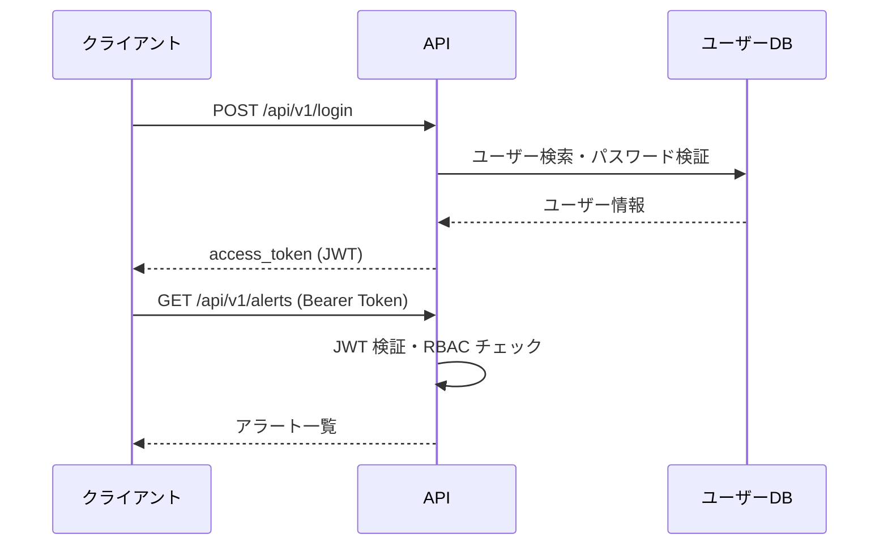

# API リファレンス

> Construction-SIEM-Platform API — 全 42 エンドポイント一覧

## 概要

| 項目 | 値 |
|------|-----|
| ベース URL | `http://localhost:8000` |
| API プレフィックス | `/api/v1` |
| 認証方式 | Bearer Token (JWT HS256) |
| ドキュメント (Swagger) | `/api/docs` |
| ドキュメント (ReDoc) | `/api/redoc` |
| OpenAPI スキーマ | `/api/openapi.json` |
| バージョン | 2.0.0 |

## 認証フロー

## エンドポイント一覧

### システム

| メソッド | パス | 説明 | 認証 |
|---------|------|------|:----:|
| `GET` | `/health` | ヘルスチェック | 不要 |
| `GET` | `/health/detailed` | 詳細ヘルスチェック | 不要 |
| `GET` | `/metrics` | Prometheus メトリクス | 不要 |
| `GET` | `/metrics/json` | JSON メトリクス | 不要 |

### 認証 (`/api/v1`)

| メソッド | パス | 説明 | ロール |
|---------|------|------|-------|
| `POST` | `/login` | ログイン・JWT取得 | — |
| `POST` | `/logout` | ログアウト | 全員 |
| `GET` | `/me` | 現在のユーザー情報 | 全員 |
| `POST` | `/users` | ユーザー作成 | admin |
| `PUT` | `/users/{user_id}` | ユーザー更新 | admin |

### 認証プロバイダー (`/api/v1`)

| メソッド | パス | 説明 |
|---------|------|------|
| `GET` | `/auth/provider` | 現在の認証プロバイダー取得 |
| `POST` | `/auth/provider/switch` | 認証プロバイダー切り替え |

### アラート (`/api/v1`)

| メソッド | パス | 説明 | ロール |
|---------|------|------|-------|
| `GET` | `/alerts` | アラート一覧 | 全員 |
| `POST` | `/alerts` | アラート作成 | analyst/admin |
| `GET` | `/alerts/{alert_id}` | アラート詳細 | 全員 |
| `PUT` | `/alerts/{alert_id}` | アラート更新 | analyst/admin |
| `DELETE` | `/alerts/{alert_id}` | アラート削除 | admin |
| `GET` | `/alerts/stats/summary` | 重要度別集計 | 全員 |

### インシデント (`/api/v1`)

| メソッド | パス | 説明 | ロール |
|---------|------|------|-------|
| `GET` | `/incidents` | インシデント一覧 | 全員 |
| `POST` | `/incidents` | インシデント作成 | analyst/admin |
| `GET` | `/incidents/{incident_id}` | インシデント詳細 | 全員 |
| `PUT` | `/incidents/{incident_id}` | インシデント更新 | analyst/admin |
| `POST` | `/incidents/{incident_id}/timeline` | タイムラインイベント追加 | analyst/admin |

### プレイブック (`/api/v1`)

| メソッド | パス | 説明 | ロール |
|---------|------|------|-------|
| `GET` | `/playbooks` | プレイブック一覧 | 全員 |
| `POST` | `/playbooks/{playbook_id}/execute` | プレイブック実行 | analyst/admin |

### KPI (`/api/v1`)

| メソッド | パス | 説明 | ロール |
|---------|------|------|-------|
| `GET` | `/kpi/summary` | KPI サマリー | 全員 |
| `GET` | `/kpi/mttd` | MTTD 実績 | 全員 |
| `GET` | `/kpi/mttr` | MTTR 実績 | 全員 |
| `GET` | `/kpi/sla` | SLA 達成率 | 全員 |

### 監査ログ (`/api/v1`)

| メソッド | パス | 説明 | ロール |
|---------|------|------|-------|
| `GET` | `/audit/logs` | 監査ログ一覧 | admin |
| `GET` | `/audit/logs/{log_id}` | 監査ログ詳細 | admin |

### 脅威インテリジェンス (`/api/v1`)

| メソッド | パス | 説明 | ロール |
|---------|------|------|-------|
| `POST` | `/threat-intel/lookup` | IoC 照合 | analyst/admin |
| `GET` | `/threat-intel/indicators` | IoC 一覧 | analyst/admin |
| `POST` | `/threat-intel/indicators` | IoC 追加 | admin |

### 通知 (`/api/v1`)

| メソッド | パス | 説明 | ロール |
|---------|------|------|-------|
| `POST` | `/notifications/send` | 通知送信 | analyst/admin |
| `GET` | `/notifications/channels` | チャネル一覧 | 全員 |

### レポート (`/api/v1`)

| メソッド | パス | 説明 | ロール |
|---------|------|------|-------|
| `GET` | `/reports` | レポート一覧 | 全員 |
| `POST` | `/reports/generate` | レポート生成 | analyst/admin |

### データバリデーション (`/api/v1`)

| メソッド | パス | 説明 |
|---------|------|------|
| `POST` | `/validate/event` | イベントデータ検証 |

### コンプライアンス (`/api/v1`)

| メソッド | パス | 説明 | ロール |
|---------|------|------|-------|
| `GET` | `/compliance/check` | コンプライアンスチェック実行 | admin |
| `GET` | `/compliance/status` | コンプライアンス状態 | 全員 |

### 相関分析 (`/api/v1`)

| メソッド | パス | 説明 | ロール |
|---------|------|------|-------|
| `POST` | `/correlation/analyze` | イベント相関分析 | analyst/admin |
| `GET` | `/correlation/rules` | Sigma ルール一覧 | 全員 |

### アーカイブ (`/api/v1`)

| メソッド | パス | 説明 | ロール |
|---------|------|------|-------|
| `POST` | `/archive` | イベントアーカイブ | admin |
| `GET` | `/archive/status` | アーカイブ状態 | 全員 |

### WebSocket (`/api/v1`)

| 種別 | パス | 説明 |
|------|------|------|
| WebSocket | `/ws/dashboard` | リアルタイムダッシュボード |

### ベンチマーク (`/api/v1`)

| メソッド | パス | 説明 | ロール |
|---------|------|------|-------|
| `POST` | `/benchmark/run` | ベンチマーク実行 | admin |
| `GET` | `/benchmark/result` | 最新ベンチマーク結果 | 全員 |
| `GET` | `/benchmark/eps` | 現在の EPS | 全員 |

## RBAC ロール定義

| ロール | 権限 |
|--------|------|
| `admin` | 全エンドポイントへのフルアクセス |
| `analyst` | 読み取り + アラート/インシデント操作 |
| `viewer` | 読み取り専用 |

## エラーコード

| HTTP コード | 意味 |
|:-----------:|------|
| `200` | 成功 |
| `201` | 作成成功 |
| `400` | リクエスト不正 |
| `401` | 認証失敗・トークン無効 |
| `403` | 権限不足 |
| `404` | リソース未存在 |
| `422` | バリデーションエラー |
| `429` | レート制限超過 |
| `500` | サーバーエラー |

## インタラクティブドキュメント

起動中の環境では以下で全 API を試せます:

- **Swagger UI**: [http://localhost:8000/api/docs](http://localhost:8000/api/docs)
- **ReDoc**: [http://localhost:8000/api/redoc](http://localhost:8000/api/redoc)
