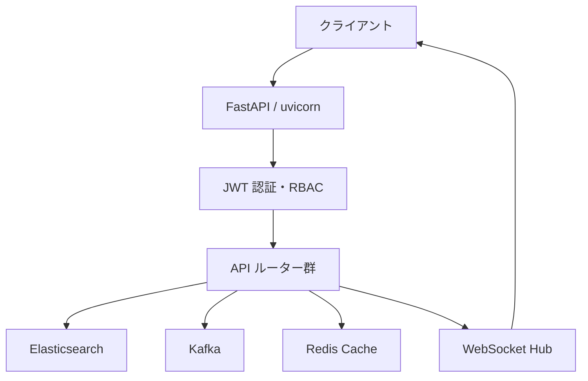

# Construction-SIEM-Platform

> 建設現場サイバーセキュリティ監視・SIEM統合システム

## 概要

Construction-SIEM-Platform は、建設現場のセキュリティイベントをリアルタイムで監視・分析する
エンタープライズ向け SIEM (Security Information and Event Management) システムです。

ISO27001・NIST CSF 2.0・ISO20000 に準拠した設計で、10,000 EPS の高スループット処理を実現します。

## 主要機能

| 機能 | 説明 | フェーズ |
|------|------|:--------:|
| 🔐 認証・RBAC | JWT + ロールベースアクセス制御 | 7 |
| 🚨 アラート管理 | リアルタイムアラート生成・管理 | 3 |
| 📋 インシデント管理 | P1〜P4 SLA + タイムライン | 4 |
| 🧠 AI分析 | 異常検知・MITRE ATT&CK相関 | 14 |
| 📊 KPI ダッシュボード | MTTD/MTTR/SLA実績 | 6 |
| 🔍 脅威インテリジェンス | IoC照合 (IP/Domain/Hash) | 9 |
| ⚡ WebSocket | リアルタイムダッシュボード | 18 |
| 📈 パフォーマンス | 10,000 EPS ベンチマーク | 20 |
| ☸️ Kubernetes | HPA + Helm Chart デプロイ | 21 |

## クイックスタート

```bash
# Docker Compose で起動
docker compose up -d

# ヘルスチェック
curl http://localhost:8000/health

# API ドキュメント (Swagger UI)
open http://localhost:8000/api/docs
```

## アーキテクチャ



## 開発状況

| フェーズ | 内容 | 状態 |
|:--------:|------|:----:|
| 1〜6 | 基盤・API・KPI | ✅ 完了 |
| 7〜12 | 認証・Prometheus・コンプライアンス | ✅ 完了 |
| 13〜18 | 相関分析・脅威インテリジェンス・WebSocket | ✅ 完了 |
| 19〜22 | テスト90%・ベンチマーク・K8s・CI近代化 | ✅ 完了 |
| 23 | ドキュメント自動生成 (本フェーズ) | 🔄 進行中 |

## テスト・品質指標

| 指標 | 値 |
|------|-----|
| テスト件数 | 525件+ |
| テストカバレッジ | 90%+ |
| EPS 処理能力 | 10,000 EPS |
| セキュリティ | bandit 0件・safety 0件 |
| STABLE | N=5 達成 |

## リンク

- [GitHub リポジトリ](https://github.com/Kensan196948G/Construction-SIEM-Platform)
- [API リファレンス](api-reference.md)
- [Swagger UI](http://localhost:8000/api/docs) (起動時のみ)
