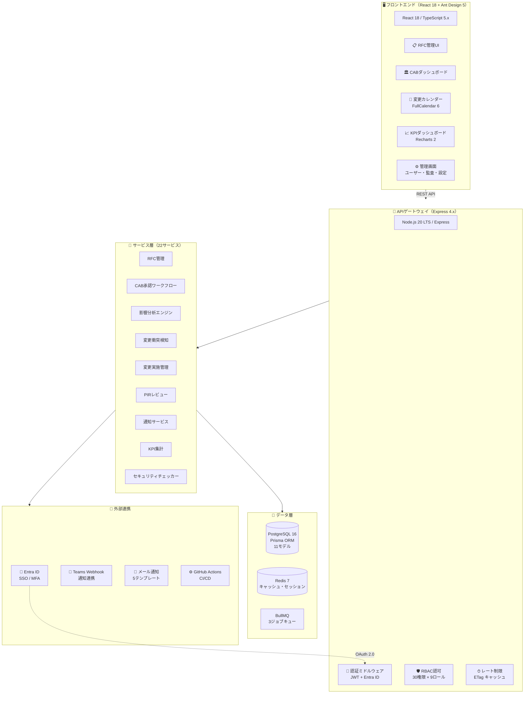
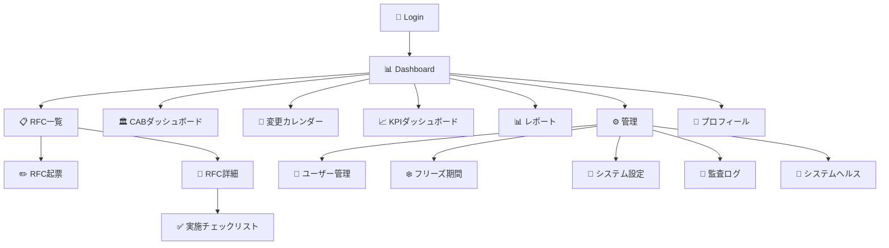
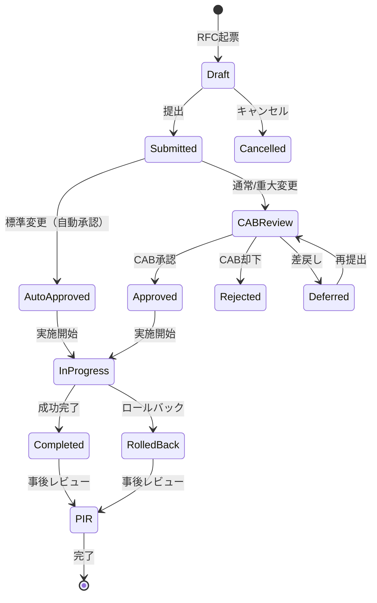
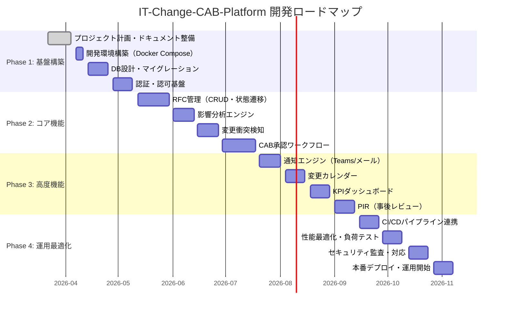
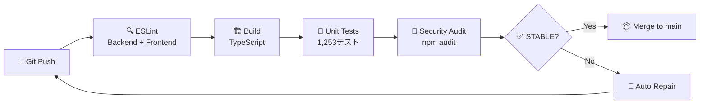
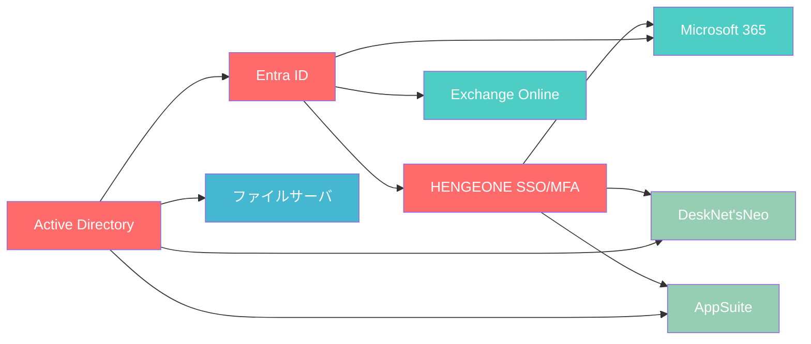
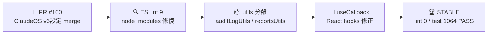
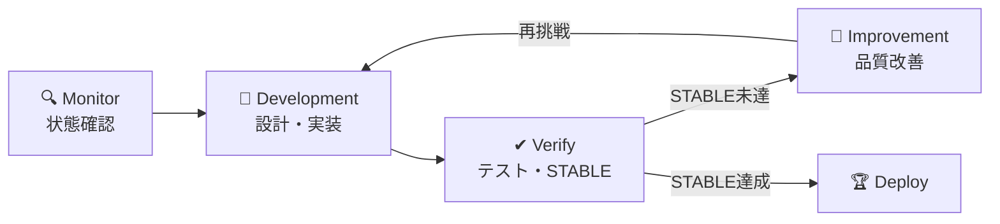

# IT-Change-CAB-Platform

> **IT変更管理・リリース自動化プラットフォーム（CAB管理）**
>
> RFC承認・影響分析・CAB審議・展開・ロールバックの完全自動化ワークフロー

---

| 項目 | 内容 |
|------|------|
| **プロジェクト名** | IT-Change-CAB-Platform |
| **リポジトリ** | `Kensan196948G/IT-Change-CAB-Platform` |
| **準拠規格** | ISO20000（必須）/ ISO27001 A.8.32 / NIST CSF PR.IP |
| **優先度** | Medium |
| **ステータス** | STABLE |
| **テスト** | **1,253テスト全パス**（Backend 738 / Frontend 414 / E2E 101） |
| **テストスイート** | **97スイート**（Backend 57 / Frontend 40） |
| **テストカバレッジ** | 全18 APIルーター + 全17画面 + 全ミドルウェア + 全サービス + 全ユーティリティ（6ファイル）**100%** |
| **画面数** | **17画面** |
| **APIルーター** | **18ルーター** |
| **ジョブキュー** | 3キュー（BullMQ） |
| **メールテンプレート** | 5種（日本語HTML） |
| **PR** | **131件 merged** |
| **E2Eテスト** | Playwright 101シナリオ（16 specファイル、全 PASS） |
| **GitHub Issues** | Phase 5-7 全完了 |
| **バックエンドサービス** | 22サービス |
| **Prisma モデル** | 11モデル |
| **ドキュメント** | 42ファイル（14カテゴリ） |
| **外部連携** | Teams Webhook / Entra ID (Azure AD) / OpenAPI 3.0 |
| **セキュリティ** | RBAC権限マトリクス(30権限×9ロール) / セキュリティチェッカー / ETagキャッシュ |
| **SLA監視** | 承認リードタイム / PIR期限 / 自動承認 / リスクスコアリング |
| **CI** | GitHub Actions 全4ジョブ SUCCESS |
| **総行数** | ~100,000行 |

---

## 📋 目次

- [概要](#-概要)
- [システムアーキテクチャ](#-システムアーキテクチャ)
- [変更管理ワークフロー](#-変更管理ワークフロー)
- [変更種別と承認フロー](#-変更種別と承認フロー)
- [技術スタック](#-技術スタック)
- [APIエンドポイント一覧](#-apiエンドポイント一覧18ルーター)
- [機能一覧](#-機能一覧)
- [プロジェクト構成](#-プロジェクト構成)
- [ドキュメント一覧](#-ドキュメント一覧)
- [開発ロードマップ](#-開発ロードマップ)
- [CI/CDパイプラインフロー](#-cicdパイプラインフロー)
- [セットアップ](#-セットアップ)
- [開発状況](#-開発状況自動更新)
- [準拠規格](#-準拠規格)
- [ライセンス](#-ライセンス)

---

## 🎯 概要

みらい建設工業のハイブリッドIT環境（オンプレミス + Azure/Microsoft 365）における変更管理プロセスを完全自動化するプラットフォームです。

### 解決する課題

| 課題 | 現状 | 本システムでの解決 |
|------|------|-------------------|
| 変更申請の追跡不足 | 口頭・メール・紙での申請 | Web UIでの一元管理・完全追跡 |
| CAB承認の未記録 | 承認プロセス未明文化 | 自動議事録・承認ワークフロー |
| 影響分析の属人化 | 担当者の経験依存 | 依存関係マップによる自動分析 |
| ロールバック未準備 | 事前手順なし | ロールバック計画の必須化・自動実行 |
| ISO20000証跡不足 | 文書化不十分 | 全プロセスの自動証跡生成 |

---

## 🏗 システムアーキテクチャ



### 🖥 フロントエンド画面マップ



---

## 🔄 変更管理ワークフロー



---

## 📊 変更種別と承認フロー

| 変更種別 | 定義 | 承認レベル | 事前通知 | SLA |
|---------|------|-----------|---------|-----|
| 🔴 **緊急変更** | サービス停止・重大インシデント対応 | ECAB（緊急CAB） | 事後報告 | 1時間以内 |
| 🟢 **標準変更** | 事前承認済み定型変更 | 自動承認 | 不要 | 即時 |
| 🟡 **通常変更** | CABが審議・承認する変更 | CAB承認 | 5営業日前 | 5営業日 |
| 🔵 **重大変更** | 基幹システム・全社影響 | 経営層承認 + CAB | 10営業日前 | 10営業日 |

### CAB構成

| 役割 | メンバー | 承認権限 |
|------|---------|---------|
| 👑 CAB議長 | IT部門長 | 全変更種別 |
| 🔧 技術メンバー | IT部門員（3名） | 通常変更 |
| 💼 ビジネスメンバー | 各部門代表 | 重大変更（影響部門） |
| 🔒 セキュリティレビュア | セキュリティ担当 | セキュリティ影響ある変更 |
| 📋 経営承認者 | 経営層 | 重大変更のみ |

---

## 🛠 技術スタック

### フロントエンド

| 技術 | バージョン | 用途 |
|------|-----------|------|
| React | 18.x | UIフレームワーク |
| TypeScript | 5.x | 型安全性 |
| Ant Design | 5.x | UIコンポーネント |
| FullCalendar | 6.x | 変更カレンダー |
| Recharts | 2.x | KPIダッシュボード |

### バックエンド

| 技術 | バージョン | 用途 |
|------|-----------|------|
| Node.js | 20 LTS | ランタイム |
| Express | 4.x | Webフレームワーク |
| PostgreSQL | 16 | メインDB |
| Redis | 7 | キャッシュ・セッション |
| BullMQ | 5.x | ジョブキュー |
| Prisma | 5.x | ORM |

### インフラ

| 技術 | 用途 |
|------|------|
| Docker / Docker Compose | コンテナ化 |
| GitHub Actions | CI/CD |
| Nginx | リバースプロキシ |

### 🔌 APIエンドポイント一覧（18ルーター）

| # | エンドポイント | メソッド | 説明 |
|---|--------------|---------|------|
| 1 | `/api/v1/health` | GET | 🩺 ヘルスチェック |
| 2 | `/api/v1/auth` | POST | 🔐 認証・トークン管理（Entra ID SSO） |
| 3 | `/api/v1/rfcs` | CRUD | 📋 RFC変更申請管理 |
| 4 | `/api/v1/impact` | GET/POST | 💥 影響分析・衝突検知 |
| 5 | `/api/v1/freeze-periods` | CRUD | ❄️ フリーズ期間管理 |
| 6 | `/api/v1/cab` | CRUD | 🏛 CAB審議・承認管理 |
| 7 | `/api/v1/notifications` | GET/PUT | 🔔 通知管理 |
| 8 | `/api/v1/calendar` | GET | 📅 変更カレンダー |
| 9 | `/api/v1/kpi` | GET | 📈 KPIダッシュボード統計 |
| 10 | `/api/v1/execution` | CRUD | ✅ 変更実施チェックリスト |
| 11 | `/api/v1/pir` | CRUD | 📝 PIR（事後実施レビュー） |
| 12 | `/api/v1/users` | CRUD | 👤 ユーザー管理 |
| 13 | `/api/v1/dashboard` | GET | 📊 ダッシュボード統計 |
| 14 | `/api/v1/reports` | GET/POST | 📊 レポート生成 |
| 15 | `/api/v1/comments` | CRUD | 💬 コメント・ディスカッション |
| 16 | `/api/v1/export` | GET | 📥 CSVエクスポート |
| 17 | `/api/v1/docs` | GET | 📄 OpenAPI仕様書（Swagger） |

> 全ルーターにJWT認証ミドルウェア + RBACロールベース認可を適用（`/health`, `/auth`, `/docs` を除く）

---

## 📦 機能一覧

### RFC（変更申請）管理

| 機能ID | 機能名 | 説明 | 優先度 |
|--------|--------|------|--------|
| RFC-001 | RFC起票フォーム | 変更種別・影響分析・ロールバック計画含む | 必須 |
| RFC-002 | 変更種別自動分類 | 変更内容に基づく自動判定 | 必須 |
| RFC-003 | 影響分析テンプレート | 依存システム・リスク評価の標準化 | 必須 |
| RFC-004 | ロールバック計画必須化 | 通常・重大変更は手順記載必須 | 必須 |
| RFC-005 | CMDB自動連携 | 変更対象CIの自動取得 | 推奨 |
| RFC-006 | 変更衝突検知 | 重複変更・フリーズ期間検知 | 必須 |

### CAB（変更諮問委員会）管理

| 機能ID | 機能名 | 説明 | 優先度 |
|--------|--------|------|--------|
| CAB-001 | CAB会議スケジュール管理 | 週次会議の自動スケジュール | 必須 |
| CAB-002 | 審議議題自動生成 | 承認待ちRFCからの議題生成 | 必須 |
| CAB-003 | オンライン承認機能 | メール・Teamsでの審議・承認 | 必須 |
| CAB-004 | 承認条件設定 | 承認人数・承認者役職の設定 | 必須 |
| CAB-005 | CAB議事録自動生成 | 審議結果の議事録自動生成 | 必須 |
| CAB-006 | ECAB対応 | 緊急変更の迅速承認ワークフロー | 必須 |

### 変更実施管理

| 機能ID | 機能名 | 説明 | 優先度 |
|--------|--------|------|--------|
| EXE-001 | 実施チェックリスト | 実施前・中・後の確認リスト | 必須 |
| EXE-002 | 実施記録 | 開始/完了時刻・担当者・内容の記録 | 必須 |
| EXE-003 | フリーズ期間管理 | 変更禁止期間の設定 | 必須 |
| EXE-004 | ロールバック実行 | 失敗時のロールバック記録 | 必須 |
| EXE-005 | 変更完了通知 | 関係者への自動通知 | 必須 |
| EXE-006 | CI/CD連携 | GitHub Actions連携 | 推奨 |

### 事後レビュー・分析

| 機能ID | 機能名 | 説明 | 優先度 |
|--------|--------|------|--------|
| PIR-001 | 事後インシデントレビュー | 変更起因インシデントの検知・記録 | 必須 |
| PIR-002 | KPIダッシュボード | 成功率・ロールバック率等のKPI | 必須 |
| PIR-003 | 変更カレンダー | カレンダービュー・競合確認 | 必須 |
| PIR-004 | トレンド分析 | 変更量・失敗率のトレンド | 推奨 |

---

## 📁 プロジェクト構成

```
IT-Change-CAB-Platform/
├── 📄 README.md
├── 📄 LICENSE
├── 📂 backend/                    # バックエンドAPI
│   └── src/
│       ├── api/                   # APIルート
│       │   ├── rfcs/              # RFC管理
│       │   ├── cab/               # CAB承認
│       │   ├── execution/         # 変更実施
│       │   ├── reviews/           # PIRレビュー
│       │   ├── calendar/          # 変更カレンダー
│       │   └── reports/           # レポート
│       ├── services/              # ビジネスロジック
│       │   ├── impact-analyzer.ts # 影響分析エンジン
│       │   ├── conflict-detector.ts # 変更衝突検知
│       │   ├── cab-workflow.ts    # CAB承認ワークフロー
│       │   ├── notification.ts    # 通知サービス
│       │   ├── teams-webhook.ts   # Teams Webhook通知
│       │   ├── entra-id-auth.ts   # Entra ID認証連携
│       │   └── security-checker.ts # セキュリティ検証
│       ├── jobs/                  # バッチジョブ
│       └── integrations/          # 外部連携
├── 📂 frontend/                   # フロントエンドUI
│   └── src/
│       ├── pages/                 # ページコンポーネント
│       └── components/            # 共通コンポーネント
├── 📂 docs/                       # ドキュメント
│   ├── 01_計画・ロードマップ(planning)/
│   ├── 02_要件定義(requirements)/
│   ├── 03_設計仕様(design)/
│   ├── 04_アーキテクチャ(architecture)/
│   ├── 05_データベース設計(database)/
│   ├── 06_API設計(api-design)/
│   ├── 07_セキュリティ(security)/
│   ├── 08_テスト計画(testing)/
│   ├── 09_運用・保守(operations)/
│   ├── 10_リリース管理(release-management)/
│   ├── 11_コンプライアンス(compliance)/
│   ├── 12_ユーザーガイド(user-guide)/
│   ├── 13_開発ガイド(development-guide)/
│   └── 14_インフラ・環境(infrastructure)/
├── 📂 scripts/                    # 自動化スクリプト
├── 📂 infrastructure/             # インフラ定義
├── 📂 .github/workflows/          # GitHub Actions
└── 📄 docker-compose.yml
```

---

## 📚 ドキュメント一覧

### 01. 計画・ロードマップ

| # | ドキュメント | 説明 |
|---|-------------|------|
| 01 | [プロジェクト計画書](docs/01_計画・ロードマップ(planning)/01_プロジェクト計画書(project-plan).md) | 目的・スコープ・体制・スケジュール |
| 02 | [開発ロードマップ](docs/01_計画・ロードマップ(planning)/02_開発ロードマップ(development-roadmap).md) | Phase 1〜4の開発計画 |
| 03 | [WBS・タスク分解](docs/01_計画・ロードマップ(planning)/03_WBS・タスク分解(wbs).md) | 作業分解構造 |
| 04 | [リスク管理計画](docs/01_計画・ロードマップ(planning)/04_リスク管理計画(risk-management).md) | リスク評価・対応策 |
| 05 | [ステークホルダー管理](docs/01_計画・ロードマップ(planning)/05_ステークホルダー管理(stakeholder-management).md) | 関係者管理 |
| 06 | [品質管理計画](docs/01_計画・ロードマップ(planning)/06_品質管理計画(quality-plan).md) | 品質目標・ゲート |

### 02. 要件定義

| # | ドキュメント | 説明 |
|---|-------------|------|
| 01 | [機能要件一覧](docs/02_要件定義(requirements)/01_機能要件一覧(functional-requirements).md) | 全機能要件の詳細 |
| 02 | [非機能要件](docs/02_要件定義(requirements)/02_非機能要件(non-functional-requirements).md) | 性能・可用性・セキュリティ |
| 03 | [ユースケース定義](docs/02_要件定義(requirements)/03_ユースケース定義(use-cases).md) | アクター別ユースケース |

### 03. 設計仕様

| # | ドキュメント | 説明 |
|---|-------------|------|
| 01 | [システム設計書](docs/03_設計仕様(design)/01_システム設計書(system-design).md) | 全体設計・モジュール分割 |
| 02 | [画面設計書](docs/03_設計仕様(design)/02_画面設計書(ui-design).md) | UI/UX設計 |
| 03 | [ワークフロー設計](docs/03_設計仕様(design)/03_ワークフロー設計(workflow-design).md) | 状態遷移・承認フロー |

### 04. アーキテクチャ

| # | ドキュメント | 説明 |
|---|-------------|------|
| 01 | [アーキテクチャ設計書](docs/04_アーキテクチャ(architecture)/01_アーキテクチャ設計書(architecture-design).md) | システム構成・レイヤー設計 |
| 02 | [技術選定書](docs/04_アーキテクチャ(architecture)/02_技術選定書(technology-selection).md) | 技術スタック選定理由 |

### 05. データベース設計

| # | ドキュメント | 説明 |
|---|-------------|------|
| 01 | [ER図・テーブル定義](docs/05_データベース設計(database)/01_ER図・テーブル定義(er-diagram).md) | 全テーブル定義 |
| 02 | [マイグレーション計画](docs/05_データベース設計(database)/02_マイグレーション計画(migration-plan).md) | DB移行戦略 |

### 06. API設計

| # | ドキュメント | 説明 |
|---|-------------|------|
| 01 | [API仕様書](docs/06_API設計(api-design)/01_API仕様書(api-specification).md) | 全エンドポイント定義 |
| 02 | [外部連携仕様](docs/06_API設計(api-design)/02_外部連携仕様(external-integration).md) | Teams・ITSM・CI/CD連携 |

### 07. セキュリティ

| # | ドキュメント | 説明 |
|---|-------------|------|
| 01 | [セキュリティ設計書](docs/07_セキュリティ(security)/01_セキュリティ設計書(security-design).md) | 認証・認可・暗号化 |
| 02 | [脅威モデル](docs/07_セキュリティ(security)/02_脅威モデル(threat-model).md) | STRIDE分析 |
| 03 | [アクセス制御設計](docs/07_セキュリティ(security)/03_アクセス制御設計(access-control).md) | RBAC・権限マトリクス |

### 08. テスト計画

| # | ドキュメント | 説明 |
|---|-------------|------|
| 01 | [テスト計画書](docs/08_テスト計画(testing)/01_テスト計画書(test-plan).md) | テスト戦略・環境 |
| 02 | [テストケース一覧](docs/08_テスト計画(testing)/02_テストケース一覧(test-cases).md) | 主要テストケース |
| 03 | [性能テスト計画](docs/08_テスト計画(testing)/03_性能テスト計画(performance-test).md) | 負荷テスト |

### 09. 運用・保守

| # | ドキュメント | 説明 |
|---|-------------|------|
| 01 | [運用マニュアル](docs/09_運用・保守(operations)/01_運用マニュアル(operations-manual).md) | 日常運用手順 |
| 02 | [障害対応手順](docs/09_運用・保守(operations)/02_障害対応手順(incident-response).md) | エスカレーション・復旧 |
| 03 | [監視設計](docs/09_運用・保守(operations)/03_監視設計(monitoring-design).md) | メトリクス・アラート |

### 10. リリース管理

| # | ドキュメント | 説明 |
|---|-------------|------|
| 01 | [リリース管理計画](docs/10_リリース管理(release-management)/01_リリース管理計画(release-plan).md) | リリース戦略・バージョニング |
| 02 | [デプロイメント手順](docs/10_リリース管理(release-management)/02_デプロイメント手順(deployment-procedure).md) | デプロイ・ロールバック手順 |
| 03 | [変更管理プロセス](docs/10_リリース管理(release-management)/03_変更管理プロセス(change-management-process).md) | 自己準拠プロセス |

### 11. コンプライアンス

| # | ドキュメント | 説明 |
|---|-------------|------|
| 01 | [ISO20000準拠対応表](docs/11_コンプライアンス(compliance)/01_ISO20000準拠対応表(iso20000-mapping).md) | 変更管理プロセス対応 |
| 02 | [ISO27001準拠対応表](docs/11_コンプライアンス(compliance)/02_ISO27001準拠対応表(iso27001-mapping).md) | A.8.32対応 |
| 03 | [NIST CSF準拠対応表](docs/11_コンプライアンス(compliance)/03_NIST-CSF準拠対応表(nist-csf-mapping).md) | PR.IP対応 |
| 04 | [監査対応ガイド](docs/11_コンプライアンス(compliance)/04_監査対応ガイド(audit-guide).md) | 証跡・監査手順 |

### 12. ユーザーガイド

| # | ドキュメント | 説明 |
|---|-------------|------|
| 01 | [利用者マニュアル](docs/12_ユーザーガイド(user-guide)/01_利用者マニュアル(user-manual).md) | RFC起票・操作手順 |
| 02 | [CABメンバーガイド](docs/12_ユーザーガイド(user-guide)/02_CABメンバーガイド(cab-member-guide).md) | 審議・承認操作 |
| 03 | [管理者ガイド](docs/12_ユーザーガイド(user-guide)/03_管理者ガイド(admin-guide).md) | システム管理 |

### 13. 開発ガイド

| # | ドキュメント | 説明 |
|---|-------------|------|
| 01 | [開発環境構築](docs/13_開発ガイド(development-guide)/01_開発環境構築(development-setup).md) | 環境構築手順 |
| 02 | [コーディング規約](docs/13_開発ガイド(development-guide)/02_コーディング規約(coding-standards).md) | TypeScript/React規約 |
| 03 | [コントリビューションガイド](docs/13_開発ガイド(development-guide)/03_コントリビューションガイド(contribution-guide).md) | PR・レビュー基準 |

### 14. インフラ・環境

| # | ドキュメント | 説明 |
|---|-------------|------|
| 01 | [インフラ設計書](docs/14_インフラ・環境(infrastructure)/01_インフラ設計書(infrastructure-design).md) | Docker Compose構成 |
| 02 | [環境定義](docs/14_インフラ・環境(infrastructure)/02_環境定義(environment-definition).md) | 環境変数・設定 |

---

## 🗺 開発ロードマップ



---

## 🚀 CI/CDパイプラインフロー



| ジョブ | 内容 | 条件 |
|--------|------|------|
| 🔍 Lint | ESLint v9（Flat Config） Backend + Frontend | 全PR |
| 🏗 Build | TypeScript コンパイル | Lint通過後 |
| 🧪 Test | Jest 単体テスト（Backend 738 + Frontend 414） | Build通過後 |
| 🔐 Security | `npm audit` 脆弱性スキャン | Test通過後 |

> GitHub Actions 全4ジョブ SUCCESS で STABLE 判定 → merge 可能

---

## 🎯 対象システム依存関係



> 赤: コアシステム（変更時は高リスク） / 緑・青: 依存システム

---

## ⚡ セットアップ

### 前提条件

- Node.js 20 LTS
- Docker / Docker Compose
- PostgreSQL 16
- Redis 7

### クイックスタート

```bash
# リポジトリクローン
git clone https://github.com/Kensan196948G/IT-Change-CAB-Platform.git
cd IT-Change-CAB-Platform

# Docker Compose で起動
docker-compose up -d

# フロントエンド: http://localhost:3000
# バックエンドAPI: http://localhost:8000
```

---

## 📋 準拠規格

### ISO20000-1:2018 変更管理プロセス

本システムは ISO20000-1:2018 の変更管理プロセス要件に完全準拠します。

| 要件 | 実装 |
|------|------|
| 変更の計画と制御 | RFC起票・影響分析・衝突検知 |
| 変更の承認 | CABワークフロー・ECAB緊急承認 |
| 変更の実施 | チェックリスト・実施記録・ロールバック |
| 変更のレビュー | PIR・KPIダッシュボード・トレンド分析 |
| 変更の記録 | 全操作の監査ログ・完全な証跡 |

### ISO27001:2022 A.8.32

セキュリティを考慮した変更手順の実装（セキュリティレビュー必須化、リスクアセスメント）。

### NIST CSF 2.0 PROTECT PR.IP

情報保護プロセスにおける変更管理の実装（変更ベースラインの管理）。

---

## 📊 KPI目標

| KPI | 目標値 | 説明 |
|-----|--------|------|
| 変更成功率 | 95%以上 | 変更完了 / 変更実施 |
| ロールバック率 | 5%以下 | ロールバック / 変更実施 |
| 承認リードタイム | 5営業日以内 | RFC提出〜CAB承認 |
| 緊急変更率 | 10%以下 | 緊急変更 / 全変更 |
| 変更起因インシデント率 | 5%以下 | 変更起因インシデント / 変更実施 |

---

## 📜 ライセンス

[LICENSE](LICENSE) を参照してください。

---

<div align="center">

**IT-Change-CAB-Platform** — みらい建設工業 IT部門

Powered by ClaudeOS v4

</div>

---

## 📊 開発状況（自動更新）

> 最終更新: 2026-04-08 JST — ClaudeOS v7 Session #72 (Current)

| 項目 | 状態 | 詳細 |
|------|------|------|
| 🧪 Backend テスト | ✅ **738 passed** | 57スイート全通過 🏆 STABLE |
| 🧪 Frontend テスト | ✅ **414 passed** | 40スイート全通過 🏆 STABLE |
| 🎭 E2E テスト | ✅ **101 passed** | 16 specファイル全通過 🏆 STABLE |
| 🏗 Build | ✅ 成功 | Backend / Frontend TypeScript 正常 |
| 🔍 ESLint | ✅ **v9.x (Flat Config)** | Backend 0 warnings / Frontend 0 warnings |
| 🔍 コード品質 | ✅ **react-hooks 警告 0件 / react-refresh 警告 0件** | utils 分離によるクリーン化完了 |
| ⚙️ CI (GitHub Actions) | ✅ ALL GREEN | PR #129 全4ジョブ SUCCESS |
| 🔐 Security Audit | ✅ 0 vulnerabilities | npm audit fix 完了 |
| 📊 GitHub Projects | ✅ [#16](https://github.com/users/Kensan196948G/projects/16) | 運用中 |
| 📋 Open Issues | **0件** | 全クローズ ✅ |
| 🔀 PR | ✅ **#131 merged** | 131PR 全CI通過・STABLE達成 |

### 🧪 テスト品質マトリクス

| カテゴリ | テスト数 | スイート数 | 対象範囲 |
|----------|---------|-----------|---------|
| 🔧 **Backend 単体テスト** | **738** | 57 | 全18 APIルーター + 全サービス + 全ミドルウェア + 全ユーティリティ |
| 🖥 **Frontend 単体テスト** | **414** | 40 | 全17画面 + 全コンポーネント + 全サービス + 全ユーティリティ（6ファイル） |
| 🎭 **E2Eテスト** | **101** | 16 | Playwright — 全17画面カバー（RFC起票/詳細/一覧+CAB+カレンダー+ダッシュボード+管理5画面） |
| **合計** | **1,253** | **97** | **カバレッジ 100%** |

#### 📊 Backend テスト内訳

| 対象レイヤー | テスト数 | 内容 |
|-------------|---------|------|
| APIルーター | ~300 | 全18エンドポイント CRUD + エラーハンドリング |
| サービス層 | ~250 | 22サービスのビジネスロジック |
| ミドルウェア | ~100 | 認証・認可・バリデーション・レート制限 |
| ユーティリティ | ~88 | 共通関数・ヘルパー |

#### 📊 Frontend テスト内訳

| 対象レイヤー | テスト数 | 内容 |
|-------------|---------|------|
| ページ | ~250 | 全17画面のレンダリング + インタラクション |
| コンポーネント | ~80 | 共通コンポーネントの動作検証 |
| サービス | ~50 | API呼び出し・データ変換 |
| ユーティリティ | ~34 | 全6ファイル 100%カバレッジ |

### 🎭 E2Eカバレッジマップ

| ページ | URL | E2E specファイル | テスト深度 | カバー内容 |
|--------|-----|-----------------|-----------|-----------|
| 📊 Dashboard | `/` | dashboard.spec.ts | ★★★ | 統計カード・RFC一覧・変更予定 |
| 🔐 Login | `/login` | login.spec.ts | ★★★ | ログインフォーム・バリデーション・エラー表示 |
| 📋 RFC一覧 | `/rfc` | rfc-list.spec.ts | ★★★ | テーブル・検索・フィルタ・新規作成ボタン |
| ✏️ RFC起票 | `/rfc/create` | rfc-create.spec.ts | ★★★ | フォーム全フィールド・バリデーション・送信/キャンセル |
| 📄 RFC詳細 | `/rfc/:id` | rfc-detail.spec.ts | ★★★ | 基本情報・リスク評価・一覧に戻る |
| 🏛 CABダッシュボード | `/cab` | cab-dashboard.spec.ts | ★★★ | 統計カード4枚・RFC一覧テーブル・決定履歴 |
| 📅 変更カレンダー | `/calendar` | calendar.spec.ts | ★★★ | カレンダー本体・凡例4種・Badge表示 |
| 📈 KPIダッシュボード | `/kpi` | kpi-reports.spec.ts | ★★★ | チャート表示・期間フィルタ・コンテンツ検証 |
| 📊 レポート | `/reports` | reports.spec.ts | ★★★ | タブ切替・統計カード・CAB活動データ |
| ✅ 実施チェックリスト | `/execution/:id` | execution.spec.ts | ★★★ | チェックボックス操作・RFC番号・変更種別 |
| 👤 プロフィール | `/profile` | profile.spec.ts | ★★★ | プロフィール表示・パスワード変更フォーム |
| 👤 ユーザー管理 | `/admin/users` | admin.spec.ts | ★★ | 画面表示確認 |
| ❄️ フリーズ期間 | `/admin/freeze-periods` | admin.spec.ts | ★★★ | テーブル・新規作成モーダル・必須フィールド |
| 🔧 システム設定 | `/admin/settings` | admin.spec.ts | ★★ | 画面表示確認 |
| 📜 監査ログ | `/admin/audit` | admin.spec.ts | ★★ | 画面表示確認 |
| 💚 システムヘルス | `/admin/health` | admin.spec.ts | ★★ | 画面表示確認 |
| ❌ NotFound | `/*` | error-handling.spec.ts | ★★★ | 404表示・深パス・不正ID耐性・ホームボタン |

> ★ = 見出し・表示確認 / ★★ = コンテンツ検証 / ★★★ = インタラクション操作テスト済み

### 🏗 セッション成果サマリー（2026-04-08）



### 🏗 Session #71 成果サマリー（2026-04-08）

| 変更 | 内容 | PR |
|------|------|-----|
| バグ修正 | FreezePeriodManagement.tsx `createdById` ハードコード修正 → localStorage 認証ユーザー ID 使用 | #118 |
| テスト追加 | `App.test.ts`（22テスト）— App.tsx ルーティング設定の完全テスト | #118 |
| テスト総数 | 1,167 → **1,189**（+22） | — |
| スイート数 | 96 → **97**（+1） | — |

| カテゴリ | Before (Session #64-66) | After (Session #67) | 改善 |
|----------|--------|-------|------|
| 🧪 テスト数 | 1,057 | **1,064** | **+7** |
| 🔍 Frontend lint warnings | 9 | **0** | **-9** |
| 🔍 Backend lint warnings | 0 | **0** | 維持 |
| 📦 react-refresh violations | 3 | **0** | **-3** |
| 🔗 react-hooks violations | 6 | **0** | **-6** |
| 🔀 PR | 93 | **101** | **+8** |
| 📋 Open Issues | 1 | **0** | **-1** |

### 🔄 開発ループフロー



### 📋 変更履歴

| 日付 | セッション | 完了内容 |
|------|-----------|---------|
| 2026-03-26 | Session #63 | 1,002テスト達成、81PR、CI全GREEN |
| 2026-04-01 | Session #64-66 | 🔐npm audit 0件 / 🔍ESLint 9移行 / 📝any型+console全解消 / 🧪1,057テスト / 🔀PR #87-97 merged |
| 2026-04-08 | Session #67 | 🔍react-hooks/react-refresh lint 0件 / 📦utils分離 / 🧪1,064テスト / 🔀PR #98-101 merged / 📋Issues 0件 |
| 2026-04-08 | Session #68 | 🎭E2E 22テスト全PASS（strict mode修正）/ 📦Viteチャンク警告解消 / 🔀PR #102-105 merged / 📋Issues 0件 |
| 2026-04-08 | Session #69 | 🧪utils全6ファイルカバレッジ100% / 🔧worker.ts BullMQ単体テスト / 🎭KPI/ReportsページE2Eコンテンツ検証 / 🧪1,145テスト / 🔀PR #106-112 merged |
| 2026-04-08 | Session #70 | 🗺MainLayoutナビゲーションロジックテスト(+22) / ⬆Node.js 22 LTS移行 / 🧪1,167テスト / 🔀PR #113-115 merged |
| 2026-04-08 | Session #71 | 🔐FreezePeriodManagement createdById修正 / 🗺App.tsxルーティングテスト(+22) / 🧪1,189テスト / 🔀PR #116-118 merged |
| 2026-04-08 | Session #72 | 🌿ブランチクリーンアップ(77件) / 🎭E2E拡充 Profile+Admin+Nav(+15シナリオ) / 🧪E2E 52シナリオ / 🔀PR #119-121 |
| 2026-04-08 | Session #73 | 🎭E2E拡充 ExecutionChecklist+Reports(+10シナリオ) / 🧪E2E 62シナリオ(10 spec) / 🔀PR #123 |
| 2026-04-08 | Session #74 | 🎭E2E拡充 CAB+Calendar+Dashboard+error+RFC(+39) / 📊README ダイアグラム6セクション追加 / 🧪E2E **101シナリオ**(16 spec) / 🧪**1,253テスト** / 🔀PR #127-131 |
