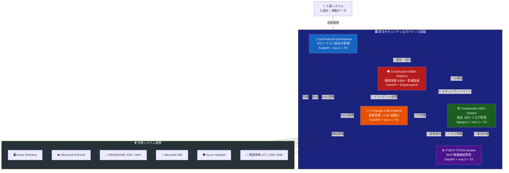
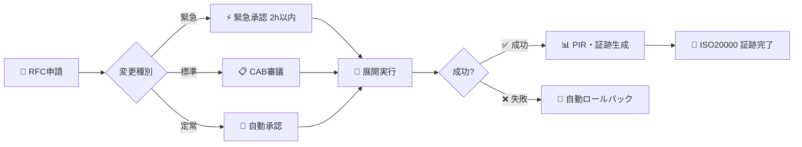
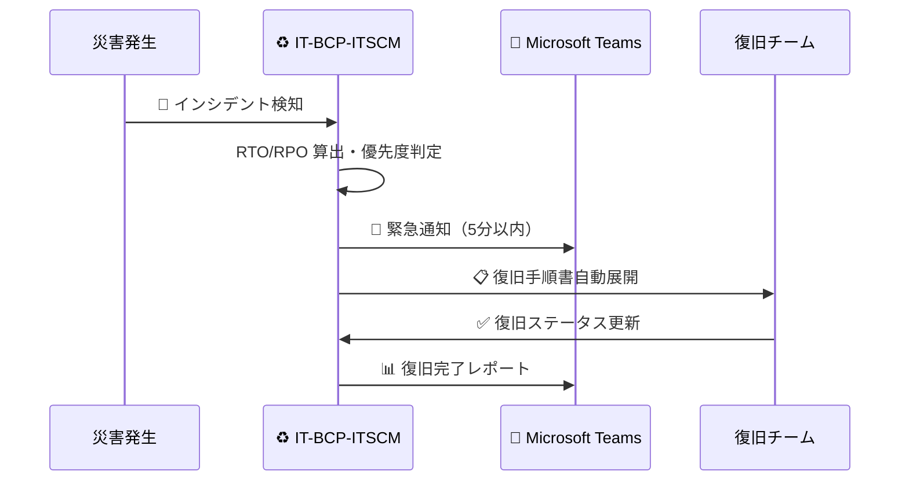
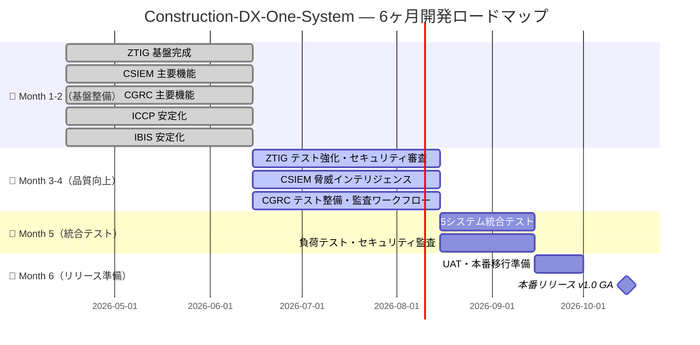
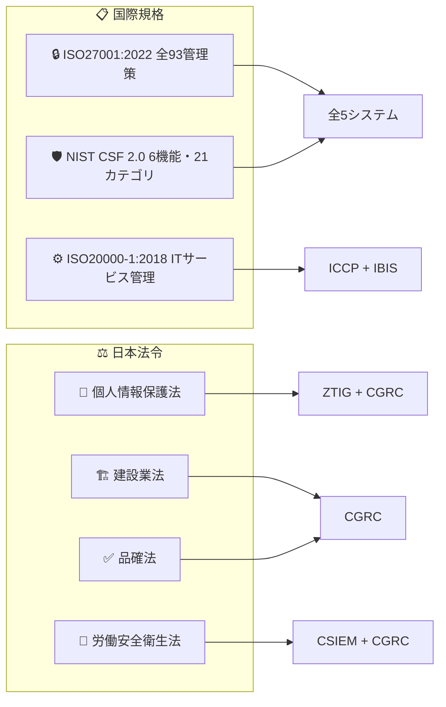
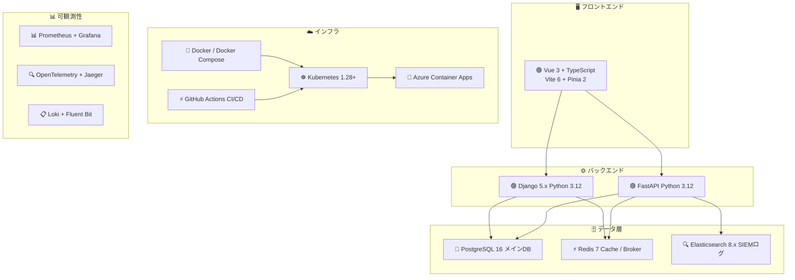
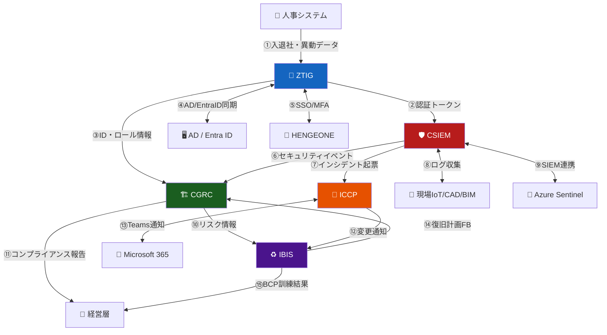
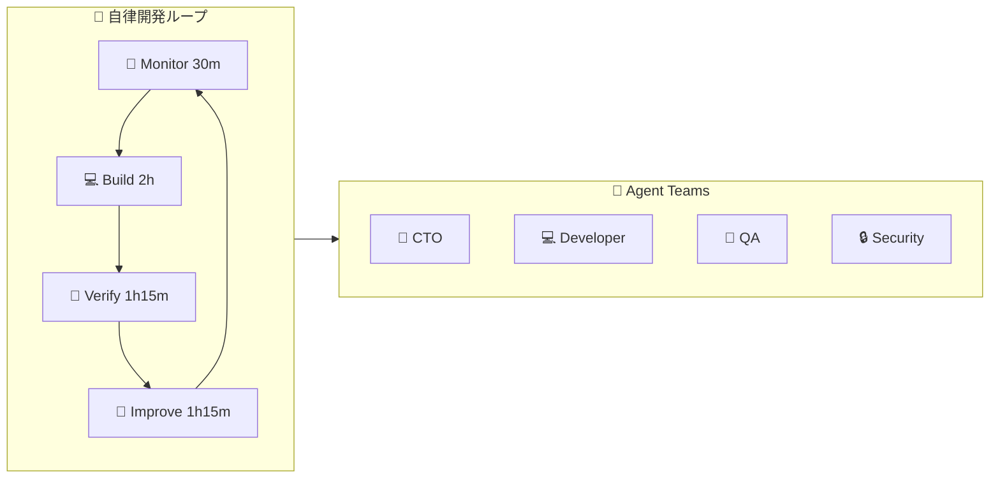

<div align="center">

# 🏗️ Construction-DX-One-System

### 建設業 統合セキュリティ＆ガバナンス基盤

**みらい建設工業（従業員600名）の IT 部門（7名）が推進する**
**建設業 DX セキュリティ統合プラットフォーム**

---

[](docs/)
[](docs/)
[](docs/)
[](LICENSE)
[](https://github.com/Kensan196948G)
[](docs/)
[](docs/)
[](https://github.com/Kensan196948G/Construction-DX-One-System/actions)

---

| 🎯 プロジェクト期間 | 📅 登録日 | 🚀 リリース期限 | ⏳ 残日数 |
|:---:|:---:|:---:|:---:|
| **6ヶ月** | 2026-04-15 | **2026-10-15** | **167日** |
| 📊 **進捗** | 🟩🟩🟩⬜⬜⬜⬜⬜⬜⬜ | Session 10 完了 | **Month 1-2** |

</div>

---

## 📋 目次

- [🎯 プロジェクト概要](#-プロジェクト概要)
- [🔥 なぜこのシステムが必要か](#-なぜこのシステムが必要か)
- [🏛️ システム全体アーキテクチャ](#️-システム全体アーキテクチャ)
- [🧩 5サブシステム詳細](#-5サブシステム詳細)
- [✅ 実装済み機能一覧](#-実装済み機能一覧)
- [📊 開発状況ダッシュボード](#-開発状況ダッシュボード)
- [🚦 CI/CD Status](#-cicd-status)
- [📋 Project Board](#-project-board)
- [🗓️ ロードマップ](#️-ロードマップ)
- [📈 KPI 進捗](#-kpi-進捗)
- [⚖️ 準拠規格・法令](#️-準拠規格法令)
- [🧰 共通技術スタック](#-共通技術スタック)
- [🔗 システム間連携フロー](#-システム間連携フロー)
- [🚀 クイックスタート](#-クイックスタート)
- [📁 ドキュメント構成](#-ドキュメント構成)
- [🔒 セキュリティポリシー](#-セキュリティポリシー)
- [🤖 自律開発について](#-自律開発について)
- [📅 セッション履歴](#-セッション履歴)

---

## 🎯 プロジェクト概要

**Construction-DX-One-System** は、みらい建設工業の建設業 DX 推進のために設計された**5システム統合セキュリティ＆ガバナンス基盤**です。

建設現場固有のサイバーリスクに対応しながら、**ISO27001 · NIST CSF 2.0 · ISO20000** への多規格準拠を同時実現します。

```
┌─────────────────────────────────────────────────────────────────┐
│  🏢 みらい建設工業                                               │
│  👥 従業員 600名 ｜ 💼 IT部門 7名 ｜ 🏗️ 現場作業員 + 協力会社 100名│
│                                                                   │
│  🎯 目標: 年間500時間超の手動監査工数を自動化で大幅削減           │
│  🛡️ 対応: ISO27001全93管理策 + NIST CSF 2.0 + 多法令準拠        │
│  🔐 セキュリティ: ゼロトラスト原則による完全ID管理               │
└─────────────────────────────────────────────────────────────────┘

---

## ⏱️ プロジェクトタイムライン

> **🗓️ プロジェクト期間: 6ヶ月（絶対厳守）** — 登録日から183日間で本番リリース

| 項目 | 日付 | 残日数 |
|:----:|:----:|:------:|
| 📅 プロジェクト登録日 | 2026-04-15 | — |
| 🚀 **本番リリース期限** | **2026-10-15** | **残り 167 日** |
| 🔄 現在のフェーズ | Month 1-2（2026-04〜06）: 基盤整備・主要機能実装 | 🟢 |
| 📊 進捗バー | 🟩🟩🟩⬜⬜⬜⬜⬜⬜⬜ | Session 10 完了（全 CI グリーン化達成） |

---

## 🔥 なぜこのシステムが必要か

| 🚨 課題 | 📊 現状の問題 | ✅ 本システムでの解決 |
|:---:|---|---|
| 🌐 **IoT/BIM リスク** | 現場IoT機器・CAD/BIMへのサイバー攻撃急増 | SIEM による 10,000 EPS リアルタイム監視 |
| 🔑 **ID管理属人化** | 3システム（EntraID/AD/HENGEONE）でユーザー乖離 | ゼロトラスト統合ID管理・自動プロビジョニング |
| 📋 **多法令対応工数** | ISO27001・建設業法・品確法で年間500時間超 | GRC自動化・SoA自動生成で工数大幅削減 |
| 🆘 **BCP未整備** | 災害・サイバー攻撃時のIT事業継続計画が未整備 | RTO/RPO管理・BCP訓練自動化で即応体制 |
| 🔄 **変更管理属人化** | IT変更申請が口頭・メール・紙で記録不備 | CAB自動化ワークフローで完全証跡化 |

---

## 🏛️ システム全体アーキテクチャ



---

## 🧩 5サブシステム詳細

### 🔐 ZeroTrust-ID-Governance (ZTIG)

> **EntraID Connect × HENGEONE × AD 統合アイデンティティ管理プラットフォーム**

| 項目 | 内容 |
|:---:|---|
| 🎯 **目的** | ゼロトラスト原則に基づく統合ID管理（正社員500名＋協力会社100名） |
| 🏗️ **Backend** | Python 3.12 / FastAPI 0.115 + SQLAlchemy 2.0 async + PostgreSQL 16 + JWT HS256 |
| 🖥️ **Frontend** | Vue 3.5 + TypeScript + Vite 6 + Pinia 2 + Vue Router 4 |
| 📊 **状態** | ✅ Backend 87/87 tests · Coverage 81.23% · Frontend stores 100% · Lint CLEAN |

---

### 🛡️ Construction-SIEM-Platform (CSIEM)

> **建設現場 サイバーセキュリティ監視・SIEM統合システム**

| 項目 | 内容 |
|:---:|---|
| 🎯 **目的** | 本社・支店・建設現場を跨ぐセキュリティイベント一元収集・脅威検知 |
| ⏱️ **目標** | MTTD 15分以内 / MTTR 2時間以内 / 処理能力 10,000 EPS |
| 🏗️ **Backend** | Python 3.12 / FastAPI 0.115.6 + SQLAlchemy 2.0 async + PostgreSQL 16 + Elasticsearch 8.x |
| 🖥️ **Frontend** | Vue 3.5 + TypeScript + Vite 6 + Pinia 2 + Vue Router 4 |
| 📊 **状態** | ✅ Backend 182/182 tests · Coverage 82.41% · Lint CLEAN · Frontend stores 100% |

---

### 🏗️ Construction-GRC-System (CGRC)

> **建設業 統合リスク＆コンプライアンス管理システム**

| 項目 | 内容 |
|:---:|---|
| 🎯 **目的** | 多法令・多規格をワンシステムで管理、監査工数を大幅削減 |
| 📋 **管理策** | ISO27001 全93管理策（4ドメイン） |
| 🏗️ **Backend** | Python 3.12 / Django 5.x + PostgreSQL 16 + Redis 7 |
| 🖥️ **Frontend** | Vue 3 + TypeScript |
| 📊 **状態** | ✅ Backend tests PASS · Coverage 91.49% · Lint CLEAN · Frontend stores 100% |

---

### 🔄 IT-Change-CAB-Platform (ICCP)

> **IT変更管理・リリース自動化プラットフォーム（CAB管理）**

| 項目 | 内容 |
|:---:|---|
| 🎯 **目的** | RFC承認・影響分析・CAB審議・展開・ロールバックの完全自動化 |
| 🏗️ **Backend** | FastAPI + PostgreSQL 16 + Redis 7 |
| 🖥️ **Frontend** | Vue 3.5 + TypeScript + Vite 6 + Pinia 2 + Vue Router 4 |
| 📊 **状態** | ✅ Backend 60/60 tests · Coverage 84.17% · Lint CLEAN · tsc CLEAN |

**変更管理ワークフロー:**



---

### ♻️ IT-BCP-ITSCM-System (IBIS)

> **IT事業継続管理システム（BCP/ITSCM統合プラットフォーム）**

| 項目 | 内容 |
|:---:|---|
| 🎯 **目的** | 災害・サイバー攻撃時のIT復旧計画・BCP訓練・RTOダッシュボード |
| 🌏 **インフラ** | Azure Container Apps（東日本Primary + 西日本Standby 地理冗長） |
| 🏗️ **Backend** | Python 3.12 / FastAPI + PostgreSQL + Redis |
| 🖥️ **Frontend** | Vue 3.5 + TypeScript + Vite 6 + Pinia 2 + Vue Router 4（PWA対応） |
| 📊 **状態** | ✅ Backend 63/63 tests · Coverage 80.20% · Lint CLEAN · CVE 0件 |

**BCP 対応フロー:**



---

## ✅ 実装済み機能一覧

### 🔐 ZeroTrust-ID-Governance (ZTIG)
- [x] ロール管理API（RBAC）
- [x] アクセス申請ワークフロー
- [x] 監査ログハッシュチェーン（SHA-256）
- [x] EntraID ディレクトリ同期
- [x] アカウント棚卸ワークフロー

### 🛡️ Construction-SIEM-Platform (SIEM)
- [x] Sigma/YARA ルールエンジン
- [x] ML 異常検知エンジン（ZScore/MovingAvg/Percentile）
- [x] Kafka 統合（ストリーム処理）
- [x] プレイブック自動実行
- [x] アラートエンリッチメント（コンテキスト付与）

### 🏗️ Construction-GRC-System (CGRC)
- [x] SoA（Statement of Applicability）自動生成
- [x] NIST CSF 2.0 マッピング
- [x] 監査レポート出力（Excel/PDF）

### 🔄 IT-Change-CAB-Platform (ICCP)
- [x] 影響分析エンジン
- [x] 変更衝突検知
- [x] フリーズ期間管理
- [x] KPI ダッシュボード
- [x] CAB カレンダー
- [x] PIR事後レビューワークフロー

### ♻️ IT-BCP-ITSCM-System (IBIS)
- [x] BIA（Business Impact Analysis）業務影響分析API
- [x] 経営層向け状況報告API + 通知システム

---

## 📊 開発状況ダッシュボード

| System | Backend | Frontend | Backend Tests | Coverage | Lint | CI |
|:------:|:-------:|:--------:|:-------------:|:--------:|:----:|:--:|
| ZTIG | FastAPI ✅ | Vue 3 + TS ✅ | **87** PASS ✅ | **81.23%** ✅ | CLEAN ✅ | ✅ |
| SIEM | FastAPI ✅ | Vue 3 + TS ✅ | **182** PASS ✅ | **82.41%** ✅ | CLEAN ✅ | ✅ |
| CGRC | Django 5 ✅ | Vue 3 + TS ✅ | PASS ✅ | **91.49%** ✅ | CLEAN ✅ | ✅ |
| ICCP | FastAPI ✅ | Vue 3 + TS ✅ | **60** PASS ✅ | **84.17%** ✅ | CLEAN ✅ | ✅ |
| IBIS | FastAPI ✅ | Vue 3 + TS ✅ | **63** PASS ✅ | **80.20%** ✅ | CLEAN ✅ | ✅ |
| **合計** | **5/5 ✅** | **5/5 ✅** | **392+ PASS ✅** | **ALL 80%+** ✅ | **ALL CLEAN** | **ALL ✅** |

### 進捗サマリー

| KPI | 値 |  Status |
|:---:|:---:|:-------:|
| 🧩 全サブシステム実装完了 | 5/5 | ✅ |
| 📊 バックエンドテスト総数 | **392+ 全PASS** | ✅ |
| 📈 カバレッジ（全サブシステム） | **80%+ 達成（最高 91.49%）** | ✅ |
| 🔒 セキュリティブロッカー | 0件 | ✅ |
| 🔄 CI/CD ワークフロー | 6 (Meta + 5 subs) 全グリーン | ✅ |
| 📋 Lint Status | ALL CLEAN | ✅ |
| 🖥️ フロントエンドストアテスト | 全5サブシステム 100% | ✅ |

---

## 🚦 CI/CD Status

| Workflow | Status |
|:--------:|:------:|
| 🔗 **Meta CI** (統合リポジトリ) | [](https://github.com/Kensan196948G/Construction-DX-One-System/actions) |
| 🔐 **ZTIG CI** | [](https://github.com/Kensan196948G/Construction-DX-One-System/actions) |
| 🛡️ **SIEM CI** | [](https://github.com/Kensan196948G/Construction-DX-One-System/actions) |
| 🏗️ **CGRC CI** | [](https://github.com/Kensan196948G/Construction-DX-One-System/actions) |
| 🔄 **ICCP CI** | [](https://github.com/Kensan196948G/Construction-DX-One-System/actions) |
| ♻️ **IBIS CI** | [](https://github.com/Kensan196948G/Construction-DX-One-System/actions) |
| 🐳 **Docker Build** | [](https://github.com/Kensan196948G/Construction-DX-One-System/actions) |

**品質ゲート:** ✅ test → ✅ lint → ✅ build → ✅ security scan → ✅ review → 🚀 merge

---

## 📋 Project Board

GitHub Projects で全タスクを管理しています。

| Board | 説明 | Link |
|:-----:|:----:|:----:|
| 📋 **Kanban Board** | Inbox → Backlog → Ready → Design → Development → Verify → Deploy Gate → Done/Blocked | [Open Board](https://github.com/orgs/Kensan196948G/projects) |

**ワークフロー:**
- Issue 駆動開発 / main 直接 push 禁止 / branch 必須 / PR 必須 / CI 成功のみ merge
- PR 本文には変更内容・テスト結果・影響範囲・残課題を記載

---

## 🗓️ ロードマップ



## 🚧 Phase Gates（6ヶ月分割計画）

| フェーズ | 期間 | 主作業 | 状態 |
|:--------:|:----:|:------:|:----:|
| 🏗️ **Month 1-2** | 2026-04〜06 | 基盤整備・主要機能実装 | 🟢 **現在地** |
| 🔧 **Month 3-4** | 2026-06〜08 | 品質向上・テスト整備 | ⏳ 準備中 |
| 🧪 **Month 5** | 2026-08〜09 | 統合テスト・バグ修正 | ⏳ 準備中 |
| 🚀 **Month 6** | 2026-09〜10 | リリース準備・本番移行 | ⏳ 準備中 |

### 残日数による自動縮退ルール

| 残日数 | 対応 |
|:------:|:----:|
| ⚠️ **残30日以内** | Improvement 縮退、Verify / リリース準備を優先 |
| 🔴 **残14日以内** | 新機能開発禁止、バグ修正・安定化のみ |
| 🛑 **残7日以内** | リリース準備のみ（CHANGELOG・README・タグ付け） |

---

## 📈 KPI 進捗

| 📊 KPI | 🎯 目標 | 📏 現在値 | Status |
|:------:|:-------:|:---------:|:------:|
| 🧩 システム完成数 | 5システム | **5/5** ✅ 全サブシステム実装完了 | ✅ |
| 📊 バックエンドテスト | 100件以上 | **392+ 全PASS** | ✅ |
| 📈 テストカバレッジ | 80%以上 | **80.20〜91.49%（全サブシステム達成）** | ✅ |
| ✅ CI グリーン | 全6ワークフロー | **全グリーン（Session 10 修復完了）** | ✅ |
| 🔒 セキュリティブロッカー | 0件 | **0件（CVE 0）** | ✅ |
| ⚡ Lint Status | ALL CLEAN | **ALL CLEAN** | ✅ |
| 🖥️ フロントエンドストア | 全5サブシステム | **100%（全 96 tests PASS）** | ✅ |
| 📉 監査工数削減 | 年間500時間 | 目標設定済 | 🟡 実測未開始 |
| 🛡️ SIEM 処理能力 | 10,000 EPS | 設計値達成 | ✅ |
| ⏱️ MTTD | 15分以内 | 目標設定済 | 🟡 実測未開始 |
| ⏱️ MTTR | 2時間以内 | 目標設定済 | 🟡 実測未開始 |

---

## ⚖️ 準拠規格・法令



| 規格/法令 | 対応システム | 主要対応領域 |
|:--------:|:-----------:|:-----------:|
| 🔒 **ISO27001:2022** | 全5システム | 情報セキュリティ管理（全93管理策） |
| 🛡️ **NIST CSF 2.0** | 全5システム | IDENTIFY / PROTECT / DETECT / RESPOND / RECOVER / GOVERN |
| ⚙️ **ISO20000-1:2018** | ICCP / IBIS | ITサービス管理・変更管理・ITSCM |
| 👤 **個人情報保護法** | ZTIG / CGRC | 個人データ処理・アクセス管理 |
| 🏗️ **建設業法** | CGRC | 建設業コンプライアンス |
| ✅ **品確法** | CGRC | 品質確保法令対応 |
| 👷 **労働安全衛生法** | CGRC / CSIEM | 現場安全管理・記録 |

---

## 🧰 共通技術スタック



| カテゴリ | 技術 | 用途 |
|:-------:|:----:|:----:|
| 🐍 **Backend** | Python 3.12 / FastAPI / Django 5.x | REST API・ビジネスロジック |
| 🖥️ **Frontend** | Vue 3 / TypeScript / Vite 6 / Pinia 2 | SPA・PWA・レスポンシブUI |
| 🗄️ **Database** | PostgreSQL 16 / Elasticsearch 8.x | メインDB / SIEMログ |
| ⚡ **Cache/Queue** | Redis 7 | キャッシュ・Celery Broker |
| 🐳 **Container** | Docker / Docker Compose 24+ | 開発・本番コンテナ化 |
| ☸️ **Orchestration** | Kubernetes 1.28+ | 本番オーケストレーション |
| ⚡ **CI/CD** | GitHub Actions | 自動テスト・デプロイ |
| 📊 **Observability** | Prometheus / Grafana / Loki / OpenTelemetry / Jaeger | 可観測性・アラート |
| 🔐 **Auth** | JWT RS256 / TOTP 2FA / HENGEONE SSO | 認証・多要素認証 |

---

## 🔗 システム間連携フロー



---

## 🚀 クイックスタート

### 前提条件

```bash
✅ Docker 24+  ✅ Docker Compose 2.20+  ✅ Git  ✅ Node.js 22+  ✅ Python 3.12+
```

### 起動方法

```bash
# 1️⃣ クローン
git clone https://github.com/Kensan196948G/Construction-DX-One-System.git
cd Construction-DX-One-System

# 2️⃣ バックエンド起動（例: ZTIG）
cd ZeroTrust-ID-Governance/backend
python -m venv .venv && source .venv/bin/activate
pip install -r requirements.txt
uvicorn app.main:app --reload --port 8000

# 3️⃣ フロントエンド起動（別ターミナル）
cd ZeroTrust-ID-Governance/frontend
npm install && npm run dev

# 4️⃣ テスト実行
cd ZeroTrust-ID-Governance/backend && pytest tests/ -v --cov

# 5️⃣ Docker Compose 一括起動（全システム）
docker-compose up -d
```

### 各サブシステム ポートマッピング

| System | Backend | Frontend | DB |
|:------:|:-------:|:--------:|:--:|
| ZTIG | `:8000` | `:5173` | `:5432` |
| SIEM | `:8001` | `:5174` | `:5433` |
| CGRC | `:8002` | `:5175` | `:5434` |
| ICCP | `:8003` | `:5176` | `:5435` |
| IBIS | `:8004` | `:5177` | `:5436` |

---

## 📁 ドキュメント構成

```
Construction-DX-One-System/
├── 📄 README.md                               ← 本ファイル
├── 📋 要件定義書.md                            ← 統合要件定義（REQ-CDOS-001）
├── 📐 詳細仕様書.md                            ← API・DB・アーキテクチャ詳細
├── 📊 state.json                              ← プロジェクト状態管理
├── 🔐 ZeroTrust-ID-Governance/   (12 docs categories)
├── 🛡️ Construction-SIEM-Platform/ (10 docs categories)
├── 🏗️ Construction-GRC-System/   (10 docs categories)
├── 🔄 IT-Change-CAB-Platform/    (14 docs categories / 42 files)
├── ♻️ IT-BCP-ITSCM-System/      (8 docs categories)
└── 🤖 opencode/                               ← 自律開発カーネル
```

---

## 🔒 セキュリティポリシー

| 項目 | ポリシー |
|:----:|:--------:|
| 🔑 **認証** | JWT RS256 + TOTP 2FA + HENGEONE SSO（MFA必須） |
| 🛡️ **脆弱性対策** | OWASP Top 10全対応・依存パッケージ自動スキャン |
| 🔐 **通信暗号化** | TLS 1.3必須・HSTS強制 |
| 📋 **監査ログ** | SHA256チェーンハッシュ付き改ざん防止（ISO27001 A.8.15） |
| 🔍 **脆弱性スキャン** | Trivy / CodeRabbit / 依存関係自動監視 |
| 🌐 **ネットワーク** | K8s NetworkPolicy Zero Trust（デフォルトDeny） |

---

## 🤖 自律開発について

本プロジェクトは **ClaudeOS v8.0 Autonomous Operations Edition** による AI 自律開発を採用しています。



| 項目 | 内容 |
|:----:|:----:|
| 📊 **状態管理** | `state.json` による目標駆動型開発 |
| 🧪 **品質ゲート** | test ✅ / lint ✅ / build ✅ / security ✅ / review ✅ → STABLE |
| 🔗 **Gitルール** | Issue駆動・PR必須・main直接push禁止・CI成功のみmerge |

---

### ⏰ Cron実行ポリシー

| 項目 | 内容 |
|:----:|:------:|
| 📅 **実行頻度** | 月〜土、プロジェクト別スケジュール（Linux Cron） |
| ⏱️ **1セッション最大** | **5時間（300分）厳守** |
| 🤖 **起動/終了** | 自動起動（Cronトリガー）・自動終了（時間制限到達時） |
| 🛡️ **監視** | 全セッション自動ログ・`state.json` 状態保存・復旧可能 |
| 🔄 **ループ** | Monitor → Build → Verify → Improve を主作業ベースで自律巡回 |

---

## 📅 セッション履歴

| 日付 | セッション | 主な成果 |
|:----:|:---------:|:--------:|
| 2026-04-27 | #012 | 🚦 CI/CDワークフロー作成（Meta CI + 5 subsystem CI）· 📊 全107テスト完了確認 · 🤖 自律開発ループ安定化 · 📋 README全面更新 |
| 2026-04-27 第2部 | #013 | 🔄 自律ループ#4-#10実行 · 🔐 ZTIG:ロール管理/アクセス申請WF/監査ログ/EntraID同期 · 🛡️ SIEM:Sigma/YARAルール/ML異常検知/Kafka/プレイブック · 🏗️ CGRC:SoA自動生成/NIST CSF 2.0/監査レポート · 🔄 ICCP:影響分析/衝突検知/フリーズ期間/KPI/CABカレンダー · ♻️ IBIS:BIA分析API · 📊 全303テスト完了 ✅ |
| 2026-04-27 第3部 | #014 | 🔐 ZTIG:アカウント棚卸ワークフロー追加（56 tests） · 🔄 ICCP:PIR事後レビューワークフロー追加（51 tests） · ♻️ IBIS:経営層向け状況報告API + 通知システム追加（53 tests） · 📊 全336テスト完了 ✅ |
| 2026-04-27 第4部 | #015 | 🏗️ CGRC:Celery定期タスク(6種類)追加（54 tests） · 🔐 ZTIG:HENGEONE SCIM 2.0 + AD LDAPS + セッション管理追加（74 tests） · 🛡️ SIEM:多チャネル通知 + IoT軽量エージェント + 脅威インテリジェンス追加（173 tests） · 📊 全405テスト完了 ✅ |
| 2026-05-01 | #010 | 🟢 **全5サブシステム Backend CI グリーン化達成** · 📈 カバレッジ全サブシステム 80%+ 達成（CGRC 91.49% / ICCP 84.17% / SIEM 82.41% / ZTIG 81.23% / IBIS 80.20%） · 🔧 ruff lint修正・openpyxl追加・email-validator追加・.coveragerc整備・requirements-dev.txt修正・integration tests 4件追加 · 🖥️ フロントエンドストアテスト全5サブシステム 100% 達成 · 🔀 PR#21 オープン（CI 全PASS） |

---

## 📄 関連ドキュメント

| ドキュメント | 説明 |
|:-----------:|:----:|
| [📋 統合要件定義書](./Construction-DX-One-System_要件定義書.md) | 全5システムの要件定義（REQ-CDOS-001） |
| [📐 詳細仕様書](./Construction-DX-One-System_詳細仕様書.md) | API・DB・アーキテクチャ詳細 |
| [🔐 ZTIG README](./ZeroTrust-ID-Governance/README.md) | ゼロトラストID管理システム詳細 |
| [🛡️ CSIEM README](./Construction-SIEM-Platform/README.md) | 建設現場SIEM詳細 |
| [🏗️ CGRC README](./Construction-GRC-System/README.md) | 統合GRCシステム詳細 |
| [🔄 ICCP README](./IT-Change-CAB-Platform/README.md) | IT変更管理システム詳細 |
| [♻️ IBIS README](./IT-BCP-ITSCM-System/README.md) | IT-BCP/ITSCM システム詳細 |

---

<div align="center">

**🏗️ Construction-DX-One-System**

*みらい建設工業 IT部門が推進する建設業 DX セキュリティ統合基盤*

📅 最終更新: 2026-05-01 ｜ 🤖 ClaudeOS v8.0 自律開発 ｜ 🚀 本番リリース目標: 2026-10-15

</div>
