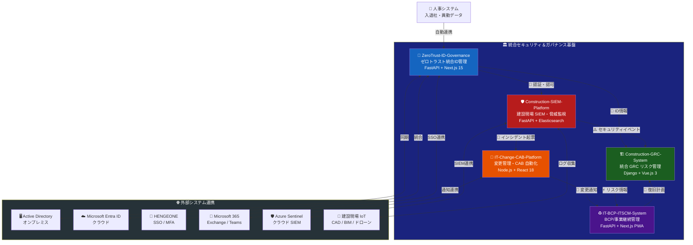
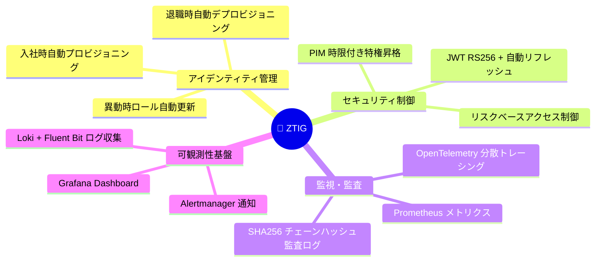
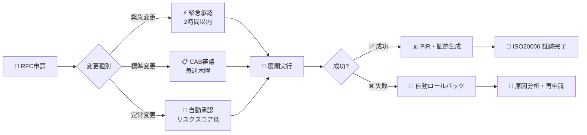
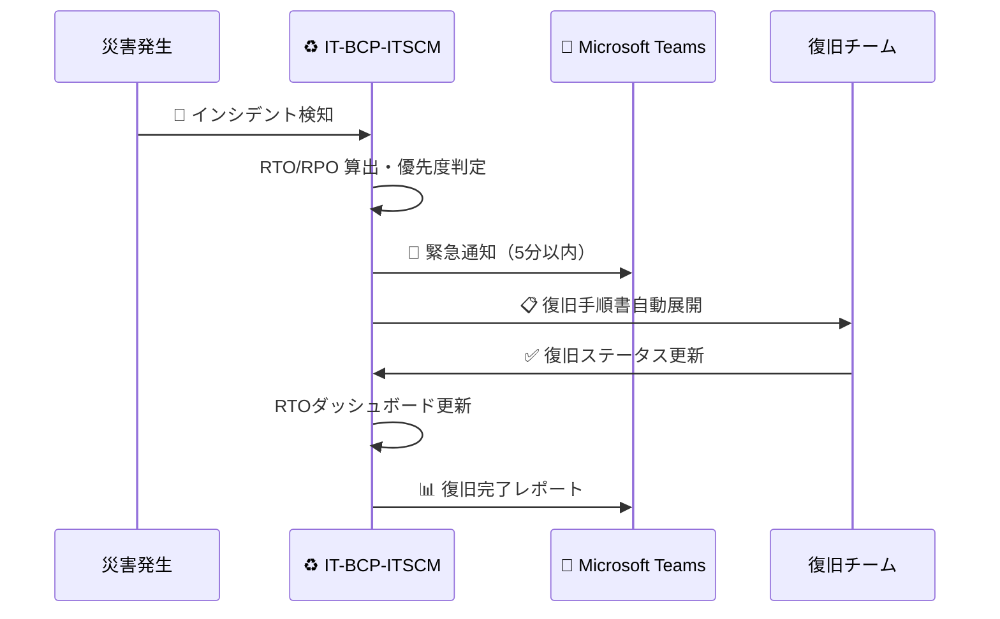
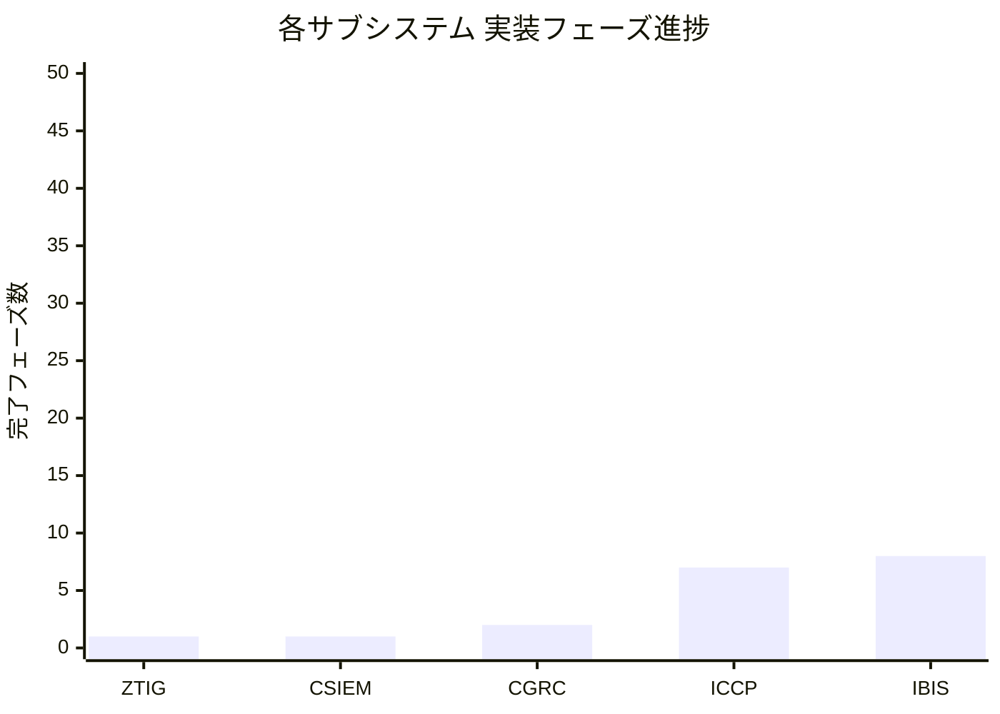
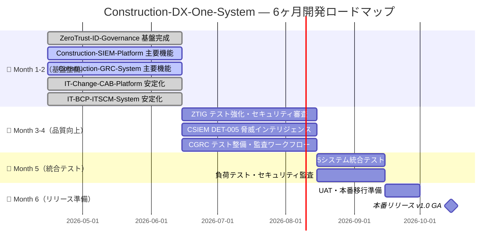
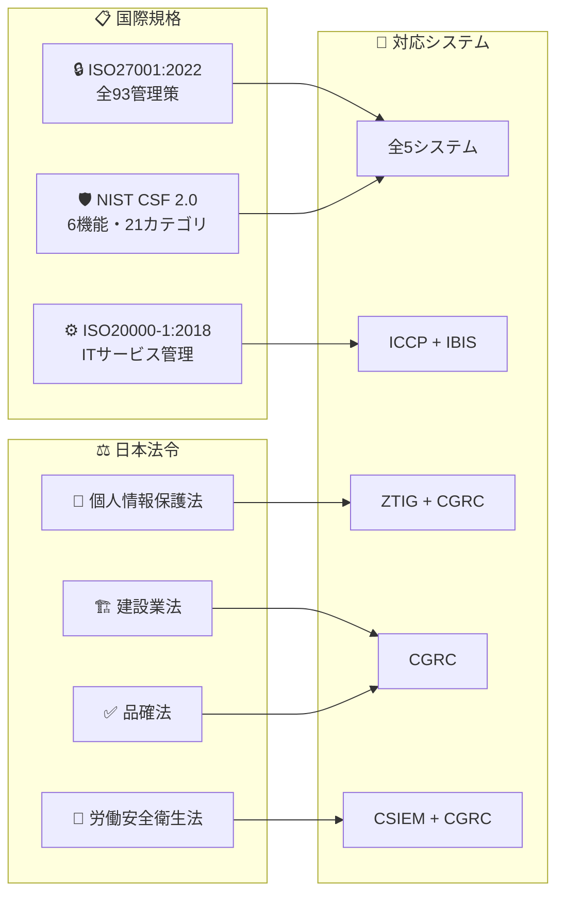
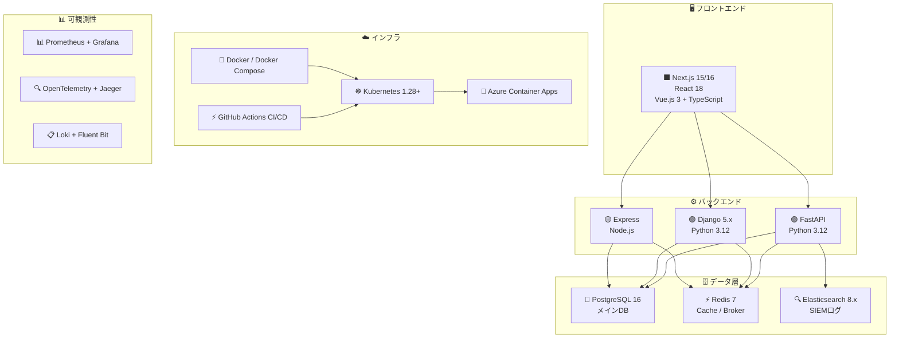
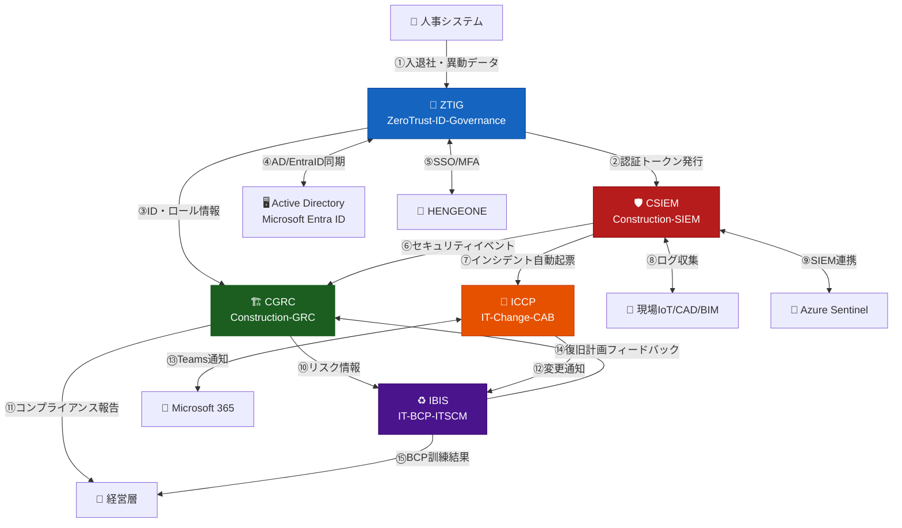
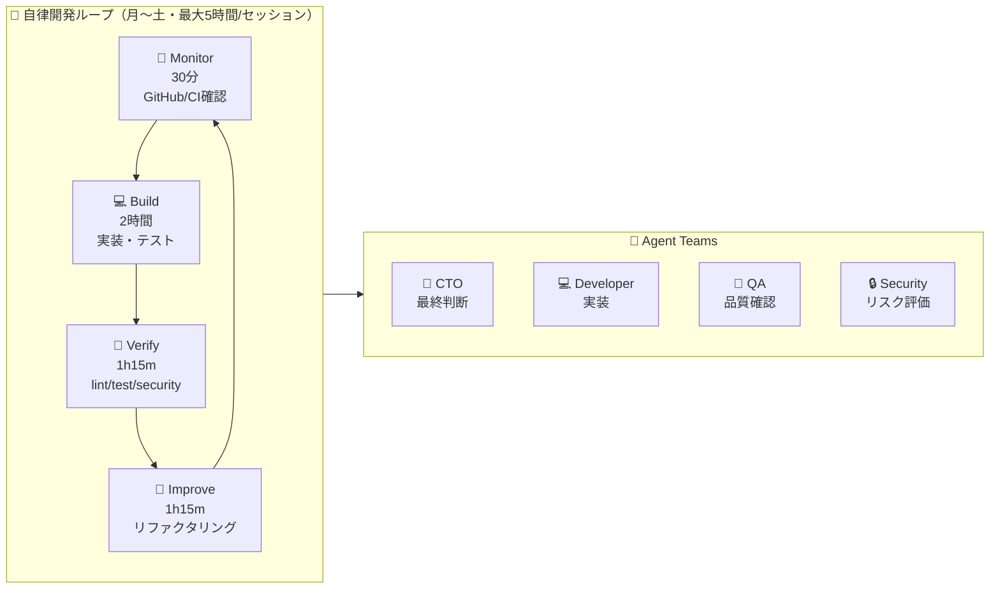

<div align="center">

# 🏗️ Construction-DX-One-System

### 建設業 統合セキュリティ＆ガバナンス基盤

**みらい建設工業（従業員600名）の IT 部門（7名）が推進する**
**建設業 DX セキュリティ統合プラットフォーム**

---

[](docs/)
[](docs/)
[](docs/)
[](LICENSE)
[](https://github.com/Kensan196948G)
[](docs/)
[](docs/)

---

| 🎯 プロジェクト期間 | 📅 登録日 | 🚀 リリース期限 | ⏳ 残日数 |
|:---:|:---:|:---:|:---:|
| **6ヶ月** | 2026-04-15 | **2026-10-15** | **173日** |

</div>

---

## 📋 目次

- [🎯 プロジェクト概要](#-プロジェクト概要)
- [🔥 なぜこのシステムが必要か](#-なぜこのシステムが必要か)
- [🏛️ システム全体アーキテクチャ](#️-システム全体アーキテクチャ)
- [🧩 5サブシステム詳細](#-5サブシステム詳細)
  - [🔐 ZeroTrust-ID-Governance](#-zerotrust-id-governance-ztig)
  - [🛡️ Construction-SIEM-Platform](#️-construction-siem-platform-csiem)
  - [🏗️ Construction-GRC-System](#️-construction-grc-system-cgrc)
  - [🔄 IT-Change-CAB-Platform](#-it-change-cab-platform-iccp)
  - [♻️ IT-BCP-ITSCM-System](#️-it-bcp-itscm-system-ibis)
- [📊 開発状況ダッシュボード](#-開発状況ダッシュボード)
- [🗓️ ロードマップ](#️-ロードマップ)
- [⚖️ 準拠規格・法令](#️-準拠規格法令)
- [🧰 共通技術スタック](#-共通技術スタック)
- [🔗 システム間連携フロー](#-システム間連携フロー)
- [📈 KPI・成功指標](#-kpi成功指標)
- [🚀 クイックスタート](#-クイックスタート)
- [📁 ドキュメント構成](#-ドキュメント構成)
- [🔒 セキュリティポリシー](#-セキュリティポリシー)
- [🤖 Claude Code 自律開発について](#-claude-code-自律開発について)

---

## 🎯 プロジェクト概要

**Construction-DX-One-System** は、みらい建設工業の建設業 DX 推進のために設計された**5システム統合セキュリティ＆ガバナンス基盤**です。

建設現場固有のサイバーリスクに対応しながら、**ISO27001 · NIST CSF 2.0 · ISO20000** への多規格準拠を同時実現します。

```
┌─────────────────────────────────────────────────────────────────┐
│  🏢 みらい建設工業                                               │
│  👥 従業員 600名 ｜ 💼 IT部門 7名 ｜ 🏗️ 現場作業員 + 協力会社 100名│
│                                                                   │
│  🎯 目標: 年間500時間超の手動監査工数を自動化で大幅削減           │
│  🛡️ 対応: ISO27001全93管理策 + NIST CSF 2.0 + 多法令準拠        │
│  🔐 セキュリティ: ゼロトラスト原則による完全ID管理               │
└─────────────────────────────────────────────────────────────────┘
```

---

## 🔥 なぜこのシステムが必要か

建設業では以下の複合的な課題が深刻化しています。

| 🚨 課題 | 📊 現状の問題 | ✅ 本システムでの解決 |
|:---:|---|---|
| 🌐 **IoT/BIM リスク** | 現場IoT機器・CAD/BIMへのサイバー攻撃が急増 | SIEM による 10,000 EPS リアルタイム監視 |
| 🔑 **ID管理の属人化** | 3システム（EntraID/AD/HENGEONE）でユーザー情報が乖離 | ゼロトラスト統合ID管理による自動プロビジョニング |
| 📋 **多法令対応工数** | ISO27001・建設業法・品確法 対応で年間500時間超 | GRC自動化・SoA自動生成で工数を大幅削減 |
| 🆘 **BCP未整備** | 災害・サイバー攻撃時のIT事業継続計画が未整備 | RTO/RPO管理・BCP訓練自動化で即応体制 |
| 🔄 **変更管理の属人化** | IT変更申請が口頭・メール・紙で記録不備 | CAB自動化ワークフローで完全証跡化 |

---

## 🏛️ システム全体アーキテクチャ



---

## 🧩 5サブシステム詳細

### 🔐 ZeroTrust-ID-Governance (ZTIG)

> **EntraID Connect × HENGEONE × AD 統合アイデンティティ管理プラットフォーム**

[](https://github.com/Kensan196948G/Construction-DX-One-System/actions)
[](ZeroTrust-ID-Governance/backend/)
[](ZeroTrust-ID-Governance/backend/tests/)
[](ZeroTrust-ID-Governance/frontend/tests/)
[](ZeroTrust-ID-Governance/frontend/)
[](ZeroTrust-ID-Governance/)

| 項目 | 内容 |
|:---:|---|
| 🎯 **目的** | ゼロトラスト原則（Never Trust, Always Verify）に基づく統合ID管理 |
| 👥 **対象ユーザー** | 正社員・嘱託500名 + 協力会社100名 + 管理者7名（PIM対象） |
| 🏗️ **技術スタック** | Python 3.12 / FastAPI 0.115 + SQLAlchemy 2.0 async + PostgreSQL 16 + JWT HS256 · Vue 3.5 + Pinia 2 + Vue Router 4 |
| ☸️ **インフラ** | Docker (python:3.12-slim, nginx:alpine, multi-stage) |
| 📊 **状態** | 🟡 バックエンド+フロントエンド基盤実装済み: backend **13テスト/87%** · frontend **20テスト/stores100%** · PR #5 |
| 🔗 **実装パス** | [ZeroTrust-ID-Governance/backend](./ZeroTrust-ID-Governance/backend/) · [ZeroTrust-ID-Governance/frontend](./ZeroTrust-ID-Governance/frontend/) |

**主要機能:**



---

### 🛡️ Construction-SIEM-Platform (CSIEM)

> **建設現場 サイバーセキュリティ監視・SIEM統合システム**

[](https://github.com/Kensan196948G/Construction-DX-One-System/actions)
[](Construction-SIEM-Platform/backend/tests/)
[](Construction-SIEM-Platform/frontend/tests/)
[](Construction-SIEM-Platform/frontend/)
[](Construction-SIEM-Platform/)

| 項目 | 内容 |
|:---:|---|
| 🎯 **目的** | 本社・支店・建設現場を跨ぐセキュリティイベントの一元収集・脅威検知 |
| ⏱️ **MTTD 目標** | **15分以内** |
| ⏱️ **MTTR 目標** | **2時間以内** |
| 📊 **処理能力** | **10,000 EPS（イベント/秒）以上** |
| 🏗️ **技術スタック（バックエンド）** | Python 3.12 / FastAPI 0.115.6 + SQLAlchemy 2.0 async + PostgreSQL 16 + Elasticsearch 8.x |
| 🖥️ **技術スタック（フロントエンド）** | Vue 3.5 + TypeScript + Vite 6 + Pinia 2 + Vue Router 4 + axios |
| 📊 **状態** | 🟡 バックエンド+フロントエンド基盤実装済み: backend **19テスト/80%** · frontend **20テスト/75%** · PR #5 |
| 🔗 **実装パス** | [Construction-SIEM-Platform/backend](./Construction-SIEM-Platform/backend/) · [Construction-SIEM-Platform/frontend](./Construction-SIEM-Platform/frontend/) |

**脅威検知シナリオ:**

| 🚨 脅威シナリオ | 検知方法 | 対応レベル |
|---|---|:---:|
| 🔓 不正ログイン試行 | 異常認証パターン検知 | P1 緊急 |
| 📡 IoT機器への攻撃 | ネットワーク異常検知 | P1 緊急 |
| 🦠 マルウェア感染 | IOC/IoC マッチング | P1 緊急 |
| 🔍 内部不正アクセス | UBA行動分析 | P2 高 |
| 📋 CAD/BIMデータ流出 | DLP ポリシー | P2 高 |

---

### 🏗️ Construction-GRC-System (CGRC)

> **建設業 統合リスク＆コンプライアンス管理システム**

[](https://github.com/Kensan196948G/Construction-DX-One-System/actions/workflows/cgrc-ci.yml)
[](Construction-GRC-System/)
[](Construction-GRC-System/)
[](Construction-GRC-System/)

| 項目 | 内容 |
|:---:|---|
| 🎯 **目的** | 多法令・多規格をワンシステムで管理、監査工数の大幅削減 |
| 👥 **利用者** | GRC管理者・リスクオーナー・監査員・経営層（約50名） |
| 📋 **管理策数** | **ISO27001 全93管理策**（4ドメイン） |
| 🏗️ **技術スタック** | Python 3.12 / Django 5.x + Vue.js 3.x / TypeScript + PostgreSQL 16 + Redis 7 |
| 📊 **状態** | 🟡 バックエンド+フロントエンド基盤実装済み: backend 30テスト/92% · frontend 19テスト/62% · PR #5 |
| 🔗 **実装パス** | `./Construction-GRC-System/backend/` · `./Construction-GRC-System/frontend/` |

**GRC管理機能:**

```
📊 統合ダッシュボード
├── ⚠️  リスク管理         → 5×5 リスクマトリクス・ヒートマップ
├── ✅  コンプライアンス   → ISO27001 SoA 自動生成・管理策進捗追跡
├── 🔍  監査管理           → 計画→実施→レビュー→完了→クローズ 5段階ワークフロー
├── 📜  法令対応           → 建設業法・品確法・労安法 チェックリスト
└── 📈  KPIレポート        → 経営層向けリスクサマリー自動生成
```

---

### 🔄 IT-Change-CAB-Platform (ICCP)

> **IT変更管理・リリース自動化プラットフォーム（CAB管理）**

[](https://github.com/Kensan196948G/IT-Change-CAB-Platform/actions)
[](IT-Change-CAB-Platform/frontend/)
[](IT-Change-CAB-Platform/frontend/)
[](IT-Change-CAB-Platform/frontend/)
[](IT-Change-CAB-Platform/)

| 項目 | 内容 |
|:---:|---|
| 🎯 **目的** | RFC承認・影響分析・CAB審議・展開・ロールバックの完全自動化 |
| 📋 **フロントエンドテスト** | **19件 全PASS** (rfcs-store: 11 / cab-meetings-store: 8) |
| 🖥️ **画面数** | **3画面** (ダッシュボード / RFC管理 / CAB会議) |
| 🔌 **フロントエンドスタック** | Vue 3.5 + TypeScript + Vite 6 + Pinia 2 + Vue Router 4 |
| 🏗️ **バックエンドスタック** | Node.js / Express + PostgreSQL 16 + Redis 7 (BullMQ) |
| 📊 **状態** | 🔨 **開発中** (バックエンド+フロントエンド基盤実装済み) |
| 🔗 **リポジトリ** | [Kensan196948G/IT-Change-CAB-Platform](https://github.com/Kensan196948G/IT-Change-CAB-Platform) |

**変更管理ワークフロー:**



---

### ♻️ IT-BCP-ITSCM-System (IBIS)

> **IT事業継続管理システム（BCP/ITSCM統合プラットフォーム）**

[](https://github.com/Kensan196948G/IT-BCP-ITSCM-System/actions)
[](IT-BCP-ITSCM-System/)
[](IT-BCP-ITSCM-System/)
[](IT-BCP-ITSCM-System/)
[](https://github.com/Kensan196948G/IT-BCP-ITSCM-System)
[](IT-BCP-ITSCM-System/)

| 項目 | 内容 |
|:---:|---|
| 🎯 **目的** | 災害・サイバー攻撃時のIT復旧計画・BCP訓練・RTOダッシュボード |
| 🌏 **インフラ** | Azure Container Apps（東日本Primary + 西日本Standby・地理冗長） |
| 📱 **対応** | PWA対応（モバイル・オフライン動作可能） |
| 🏗️ **技術スタック** | Python / FastAPI 0.135.3 + Next.js 16.2.2 + PostgreSQL 16 + Redis（Geo冗長） |
| 📊 **状態** | ✅ **STABLE** |
| 🔗 **リポジトリ** | [Kensan196948G/IT-BCP-ITSCM-System](https://github.com/Kensan196948G/IT-BCP-ITSCM-System) |

**BCP 対応フロー:**



---

## 📊 開発状況ダッシュボード

### テスト実績サマリー

| 🔢 | システム | 略称 | テスト数 | カバレッジ | PR数 | ステータス |
|:---:|:---:|:---:|:---:|:---:|:---:|:---:|
| 1 | ZeroTrust-ID-Governance | ZTIG | **13件** (backend)<br/>**20件** (frontend) | **87%** / **stores100%** | 1件 (Draft) | 🟡 バックエンド+フロントエンド基盤実装済み |
| 2 | Construction-SIEM-Platform | CSIEM | **19件** (backend)<br/>**20件** (frontend) | **80%** / **75%** | 1件 (Draft) | 🟡 バックエンド+フロントエンド基盤実装済み |
| 3 | Construction-GRC-System | CGRC | **30件** (backend)<br/>**19件** (frontend) | **92%** / **62%** | 1件 (Draft) | 🟡 バックエンド+フロントエンド基盤実装済み |
| 4 | IT-Change-CAB-Platform | ICCP | **19件** (frontend)<br/>rfcs-store 11 / cab-store 8 | **stores100%** / tsc CLEAN | 1件 (Draft) | 🟡 バックエンド+フロントエンド基盤実装済み |
| 5 | IT-BCP-ITSCM-System | IBIS | **1,012件**<br/>Backend 600+ / Frontend 412 | 80%+ | **173件** | ✅ STABLE |
| 📊 | **合計** | | **🔢 2,994件+** | | **306件** | |

### フェーズ進捗



---

## 🗓️ ロードマップ



---

## ⚖️ 準拠規格・法令



| 📋 規格/法令 | 🧩 対応システム | 📝 主要対応領域 |
|---|---|---|
| 🔒 **ISO27001:2022** | 全5システム | 情報セキュリティ管理（全93管理策） |
| 🛡️ **NIST CSF 2.0** | 全5システム | IDENTIFY / PROTECT / DETECT / RESPOND / RECOVER / GOVERN |
| ⚙️ **ISO20000-1:2018** | ICCP / IBIS | ITサービス管理・変更管理・ITSCM |
| 👤 **個人情報保護法** | ZTIG / CGRC | 個人データ処理・アクセス管理 |
| 🏗️ **建設業法** | CGRC | 建設業固有のコンプライアンス対応 |
| ✅ **品確法** | CGRC | 品質確保に関する法令対応 |
| 👷 **労働安全衛生法** | CGRC / CSIEM | 現場安全管理・記録・インシデント対応 |

---

## 🧰 共通技術スタック



| カテゴリ | 技術 | 用途 |
|:---:|---|---|
| 🐍 **Backend** | Python 3.12 / FastAPI / Django 5.x / Node.js | REST API・ビジネスロジック |
| 🖥️ **Frontend** | Next.js 15/16 / React 18 / Vue.js 3 / TypeScript | SPA・PWA・レスポンシブUI |
| 🗄️ **Database** | PostgreSQL 16 / Elasticsearch 8.x | メインDB / SIEMログ |
| ⚡ **Cache** | Redis 7 / Redis Cluster | キャッシュ・Celery Broker・BullMQ |
| 🐳 **Container** | Docker / Docker Compose 24+ | 開発・本番コンテナ化 |
| ☸️ **Orchestration** | Kubernetes 1.28+ / Helm v1.0.0 | 本番オーケストレーション |
| 🔄 **GitOps** | ArgoCD / Flux CD | GitOps 継続デリバリー |
| ⚡ **CI/CD** | GitHub Actions | 自動テスト・デプロイ |
| 📊 **Observability** | Prometheus / Grafana / Loki / OpenTelemetry / Jaeger | 可観測性・アラート |
| 🔐 **Auth** | JWT RS256 / TOTP 2FA / HENGEONE SSO | 認証・多要素認証 |
| 📋 **API Docs** | OpenAPI 3.0 | 自動APIドキュメント生成 |

---

## 🔗 システム間連携フロー



---

## 📈 KPI・成功指標

| 📊 KPI | 🎯 目標値 | 📏 現在値 | 📊 進捗 |
|:---:|:---:|:---:|:---:|
| ✅ テスト通過率 | **95%以上** | 集計中 | 🔵 計測開始 |
| 📊 コードカバレッジ | **80%以上**（ZTIG: 90%+） | ZTIG 99% / ICCP 100% | ✅ 目標達成（2システム） |
| 🔒 セキュリティブロッカー | **0件** | 0件（IBIS: CVE 0件確認済） | ✅ 達成 |
| ⚡ CI安定性 | **95%以上** | 確認中 | 🔵 計測中 |
| 🧩 システム完成数 | **5システム** | STABLE: 2システム | 🔵 進行中（2/5）|
| 📉 監査工数削減 | **年間500時間** | 目標設定済 | 🔵 計画中 |
| 🛡️ SIEM 処理能力 | **10,000 EPS** | 設計値達成 | ✅ 設計完了 |
| ⏱️ MTTD | **15分以内** | 目標設定済 | 🔵 実測予定 |
| ⏱️ MTTR | **2時間以内** | 目標設定済 | 🔵 実測予定 |

---

## 🚀 クイックスタート

### 前提条件

```bash
# 必要ツール
✅ Docker 24+  ✅ Docker Compose 2.20+  ✅ Git  ✅ Node.js 22+  ✅ Python 3.12+
```

### 各サブシステムの起動

```bash
# 1️⃣ リポジトリ クローン（統合リポジトリ）
git clone https://github.com/Kensan196948G/Construction-DX-One-System.git
cd Construction-DX-One-System

# 2️⃣ 各サブシステムを個別にクローン
git clone https://github.com/Kensan196948G/ZeroTrust-ID-Governance.git
git clone https://github.com/Kensan196948G/Construction-SIEM-Platform.git
git clone https://github.com/Kensan196948G/Construction-GRC-System.git
git clone https://github.com/Kensan196948G/IT-Change-CAB-Platform.git
git clone https://github.com/Kensan196948G/IT-BCP-ITSCM-System.git

# 3️⃣ 各プロジェクトの CLAUDE.md を確認（AI開発ガイド）
cat <プロジェクト名>/CLAUDE.md

# 4️⃣ Docker コンテナ起動
cd <プロジェクト名>
docker-compose up -d

# 5️⃣ テスト実行
# Python 系（ZTIG / CSIEM / CGRC / IBIS）
pytest tests/ -v --cov --cov-report=html

# Node.js 系（ICCP）
npm test

# E2E テスト
npx playwright test
```

### Claude Code 推奨コマンド

```bash
/plan <タスク>           # 📋 実装計画作成
/tdd <機能>             # 🧪 TDD実装（テストファースト）
/code-review            # 🔍 コードレビュー
/security-review        # 🔒 セキュリティ審査
/e2e                    # 🎭 E2Eテスト実行
/build-fix              # 🔧 ビルドエラー修正
```

---

## 📁 ドキュメント構成

```
Construction-DX-One-System/
│
├── 📄 README.md                                    ← 本ファイル（全体概要）
├── 📋 Construction-DX-One-System_要件定義書.md      ← 統合要件定義書（REQ-CDOS-001）
├── 📐 Construction-DX-One-System_詳細仕様書.md      ← API・DB・アーキテクチャ詳細
├── 📊 state.json                                   ← プロジェクト状態管理
│
├── 🔐 ZeroTrust-ID-Governance/
│   └── docs/ （12カテゴリ）
│       ├── 01_要件定義（Requirements）/
│       ├── 02_アーキテクチャ設計（Architecture）/
│       ├── 03_API仕様（API_Specification）/
│       ├── 04_開発ガイド（Development_Guide）/
│       ├── 05_セキュリティ設計（Security_Design）/
│       ├── 06_統合設計（Integration_Design）/
│       ├── 07_テスト仕様（Testing）/
│       ├── 08_データモデル（Data_Model）/
│       ├── 09_運用保守（Operations）/
│       ├── 10_プロジェクト管理（Project_Management）/
│       ├── 11_コンプライアンス（Compliance）/
│       └── 12_リリース管理（Release_Management）/
│
├── 🛡️ Construction-SIEM-Platform/
│   └── docs/ （10カテゴリ）
│       ├── 01_プロジェクト概要(project-overview)/
│       ├── 03_アーキテクチャ設計(architecture)/
│       ├── 04_API仕様(api-specification)/
│       ├── 07_セキュリティ(security)/
│       └── ...
│
├── 🏗️ Construction-GRC-System/
│   └── docs/ （10カテゴリ）
│       ├── 01_計画フェーズ（Planning）/
│       ├── 02_要件定義（Requirements）/
│       ├── 08_GRC固有（GRC-Specific）/
│       └── ...
│
├── 🔄 IT-Change-CAB-Platform/
│   └── docs/ （**42ファイル・14カテゴリ**）
│       ├── 01_計画・ロードマップ(planning)/
│       ├── 06_API設計(api-design)/
│       ├── 12_ユーザーガイド(user-guide)/
│       └── ...
│
└── ♻️ IT-BCP-ITSCM-System/
    └── docs/ （8カテゴリ）
        ├── 01_計画管理(Planning)/
        ├── 07_運用管理(Operations)/
        ├── 08_コンプライアンス(Compliance)/
        └── ...
```

---

## 🔒 セキュリティポリシー

> ⚠️ セキュリティに関する報告は **IT部門セキュリティ担当** までご連絡ください。

| 🔒 項目 | 📋 ポリシー |
|:---:|---|
| 🔑 **認証** | JWT RS256 + TOTP 2FA + HENGEONE SSO（MFA必須） |
| 🛡️ **脆弱性対策** | OWASP Top 10 全対応・依存パッケージ自動スキャン |
| 🔐 **通信暗号化** | TLS 1.3 必須・HSTS 強制 |
| 📋 **監査ログ** | SHA256 チェーンハッシュ付き改ざん防止ログ（ISO27001 A.8.15準拠） |
| 🚨 **インシデント対応** | 緊急時は Construction-SIEM-Platform の**24時間対応オンコール**へ連絡 |
| 🔍 **脆弱性スキャン** | Trivy / CodeRabbit / 依存関係自動監視 |
| 🌐 **ネットワーク** | Kubernetes NetworkPolicy Zero Trust（デフォルト Deny + 明示的許可） |

---

## 🤖 Claude Code 自律開発について

本プロジェクトは **ClaudeOS v8.0 Autonomous Operations Edition** による AI 自律開発を採用しています。



| 🤖 項目 | 📋 内容 |
|:---:|---|
| 🔄 **実行スケジュール** | Linux Cron / 月〜土 / プロジェクト別スケジュール |
| ⏱️ **1セッション最大** | **5時間（厳守）** |
| 📊 **状態管理** | `state.json` による目標駆動型開発 |
| 🧪 **品質ゲート** | test ✅ / lint ✅ / build ✅ / security ✅ / review ✅ で STABLE判定 |
| 🔗 **Git ルール** | Issue駆動・PR必須・main直接push禁止・CI成功のみmerge |

---

## 📄 関連ドキュメント

| 📋 ドキュメント | 📝 説明 |
|---|---|
| [📋 統合要件定義書](./Construction-DX-One-System_要件定義書.md) | 全5システムの要件定義（REQ-CDOS-001） |
| [📐 詳細仕様書](./Construction-DX-One-System_詳細仕様書.md) | API・DB・アーキテクチャ詳細 |
| [🔐 ZTIG README](./ZeroTrust-ID-Governance/README.md) | ゼロトラストID管理システム詳細 |
| [🛡️ CSIEM README](./Construction-SIEM-Platform/README.md) | 建設現場SIEM詳細 |
| [🏗️ CGRC README](./Construction-GRC-System/README.md) | 統合GRCシステム詳細 |
| [🔄 ICCP README](./IT-Change-CAB-Platform/README.md) | IT変更管理システム詳細 |
| [♻️ IBIS README](./IT-BCP-ITSCM-System/README.md) | IT-BCP/ITSCM システム詳細 |

---

<div align="center">

**🏗️ Construction-DX-One-System**

*みらい建設工業 IT部門が推進する建設業 DX セキュリティ統合基盤*

📅 最終更新: 2026-04-25 (CGRC backend追加) ｜ 🤖 ClaudeOS v8.0 自律開発 ｜ 🚀 本番リリース目標: 2026-10-15

</div>
