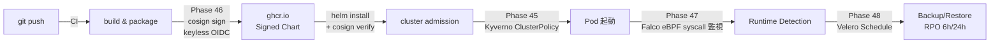
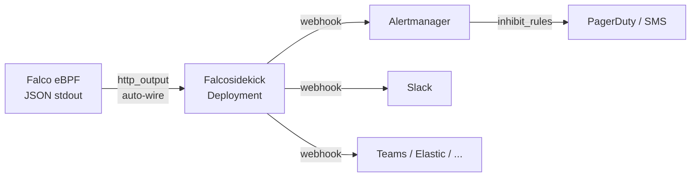

# 06. ランタイム & サプライチェーンセキュリティ

Phase 46（Sigstore Cosign）および Phase 47（Falco Runtime Security）で追加した **サプライチェーン段** と **ランタイム段** の防御、および Phase 48（Velero）で追加した **DR 段** についてまとめる。Pod Security Standards（Kyverno、Phase 45）と合わせて、Zero Trust の「verify continuously」と NIST CSF の「PROTECT → DETECT → RECOVER」を複数のチェックポイントで実現する。

## 🏗 防御層マップ



| 層 | Phase | 技術 | 狙い |
|----|-------|------|------|
| 供給 | 46 | Sigstore Cosign keyless | chart 改竄・偽 chart 防止 |
| Admission | 45 | Kyverno 5 ClusterPolicy | 設計違反 Pod の作成拒否 |
| Runtime | 47 | Falco eBPF DaemonSet | 実行中不正動作の検知 |
| **DR** | **48** | **Velero Schedule** | **データ消失・ランサムからの回復** |

---

## 📦 Supply-chain 層（Phase 46）

### 設計意図

Helm chart を OCI artifact として ghcr.io に公開する際、**keyless 署名** で改竄検出可能にする。鍵管理（Secret rotation / HSM）を避け、GitHub Actions OIDC トークンで Fulcio から短命証明書を発行 → Rekor 透過ログに永久記録。

### 証跡（Trust chain）

```
GitHub OIDC → Fulcio → ephemeral cert → cosign sign → Rekor tlog entry
                                                     → ghcr.io signature blob
```

- **OIDC issuer**: `token.actions.githubusercontent.com`
- **Subject claim**: `https://github.com/Kensan196948G/ZeroTrust-ID-Governance/.github/workflows/claudeos-ci.yml@refs/heads/main`
- **Rekor log**: public instance（永久監査）

### 運用者の責務

利用者は deploy 前に下記コマンドで検証すること:

```bash
cosign verify \
  --certificate-identity-regexp='^https://github.com/Kensan196948G/ZeroTrust-ID-Governance/' \
  --certificate-oidc-issuer='https://token.actions.githubusercontent.com' \
  ghcr.io/kensan196948g/charts/zerotrust-id-governance:<version>
```

### 影響範囲と制限

- chart のみ対応。**container image 署名は未実装**（Phase 46 follow-up 候補、docker build/publish workflow 導入時に同パターン適用可能）
- Falcosidekick 等の外部 chart は本リポジトリで再ビルド・再署名する前提

---

## 🛰 Runtime 層（Phase 47）

### 設計意図

Kyverno が admission 時点の「Pod 仕様」のみ検査するのに対し、Falco は **実行中の syscall** を監視する。攻撃者が正規 admission を通過した後、コンテナ侵入・プロセス注入で行う **動作** を検知する。

### ZTI カスタムルール（最小構成）

| Rule | Priority | MITRE | 検知対象 |
|------|----------|-------|----------|
| ZTI Shell In Container | WARNING | Execution (T1059) | container 内対話シェル起動 |
| ZTI Write Below Etc | ERROR | Persistence (T1546) | `/etc` 配下書き込み |
| ZTI Unexpected Inbound Listen | NOTICE | C2 (T1571) | 未登録プロセスの TCP listen |

プロセス許可リスト（`not proc.name in (...)`）は `python3 / node / next-server / uvicorn / gunicorn / alertmanager / grafana / loki / fluentbit / prometheus` に限定。これ以外の listen は検知対象。

### Kyverno との共存

Falco は eBPF 監視のため `privileged: true` 必須。Kyverno `disallow-privileged` Enforce と衝突するため、運用時に以下のいずれかを選択:

1. **Namespace 分離 + exclude**（推奨）: Falco 専用 namespace を `kyverno.excludeNamespaces` に追加
2. **Policy selector**: `exclude.any.resources.selector.matchLabels` で Falco DaemonSet のみ除外
3. **Policy 一時停止**: `kyverno.policies.disallowPrivileged: false`（最終手段、他の privileged も通る）

`require-ro-rootfs` については、Falco DaemonSet は `readOnlyRootFilesystem: true` に対応済み（`/var/run` / `/tmp` を emptyDir mount）で直接共存可能。

### 通知 fan-out（Phase 47.1）

Falco の JSON stdout を Falcosidekick で受信し、複数下流へ fan-out:



| 要素 | 実装 |
|------|------|
| 受信 | Falcosidekick Deployment (port 2801) |
| 転送 | Alertmanager / Slack / Teams / Elasticsearch 等 |
| 自動配線 | `falcosidekick.enabled=true` で Falco http_output URL が自動設定 |
| 設定注入 | ConfigMap `envFrom` で webhook URL 等を環境変数として展開 |
| priority フィルタ | `*_MINIMUMPRIORITY` 環境変数で転送先ごとに制御 |

### 将来拡張（Phase 47.2 以降候補）

- **Grafana dashboard**: Falco イベント可視化 panel（Falcosidekick Prometheus endpoint から収集）
- **Kyverno verify-images**: deploy 時点で image 署名を検証する ClusterPolicy
- **Webhook secret 管理**: ExternalSecret + Azure Key Vault 連携

---

## 💾 DR 層（Phase 48）

### 設計意図

Velero `Schedule` CRD を chart から宣言的に定義し、定期 Backup を Velero controller に実行させる。本 chart は **「何を」「いつ」** を宣言するのみで、Velero controller 本体（BackupStorageLocation / VolumeSnapshotLocation 含む）はクラスタ事前導入を前提とする。

### RPO 階層設計

| Schedule | Cron | TTL | 対象 | RPO |
|----------|------|-----|------|-----|
| daily-full | `17 2 * * *` | 720h (30d) | 全リソース + PVC snapshot | **24h** |
| db-snapshot | `3 */6 * * *` | 168h (7d) | PostgreSQL PVC (label selector) | **6h** |

**RTO**: `velero restore create --from-backup <name>` で 10〜30 分（データ量依存）。

### 保存方式

- **Resource manifests**: BackupStorageLocation（S3 / Azure Blob / GCS）に YAML として保存
- **PVC data**:
  - CSI 対応ストレージ → VolumeSnapshot（高速）
  - 非 CSI → File System Backup (Restic/Kopia、`defaultVolumesToFsBackup=true` で有効化)

### Ransomware 対策

- バックアップ保存先は **別リージョン + Object Lock (WORM)** 推奨
- Velero 本体を separate namespace (velero) に隔離し、`storageLocation` 認証情報を secret rotation

### 運用者の責務

- 月 1 回は復元 drill（staging で `velero restore create`）を実施し、RTO 実測
- BackupStorageLocation の残容量 / 失敗回数を Grafana で監視

---

## 📋 コンプライアンスマッピング

| 規格 | 統制 | 対応 Phase |
|------|------|-----------|
| ISO27001 | A.8.15 監視ログ | Phase 6 / 47 |
| ISO27001 | A.8.16 活動監視 | Phase 47 |
| ISO27001 | A.5.15 アクセス制御 | Phase 8 / 45 |
| ISO27001 | A.8.29 ソフトウェア保護 | Phase 46 |
| NIST CSF | PROTECT (PR.AA) | Phase 45 |
| NIST CSF | DETECT (DE.CM-1, DE.CM-7) | Phase 47 |
| NIST CSF | RESPOND (RS.CO-2 内部通知) | Phase 47.1 |
| NIST CSF | PROTECT (PR.DS-6 Integrity) | Phase 46 |
| Supply-chain SLSA | Build L3（provenance） | Phase 46（keyless OIDC）|
| NIST CSF | RECOVER (RC.RP-1) | Phase 48 |
| ISO20000 | 業務継続管理 (SMS) | Phase 48 |
| ISO27001 | A.8.13 バックアップ / A.5.30 ICT 事業継続 | Phase 48 |

---

## 🔗 参照

- [Phase 45 Kyverno Policy Engine 統合 #69](https://github.com/Kensan196948G/ZeroTrust-ID-Governance/issues/69)
- [Phase 45.5 readOnlyRootFilesystem 段階 2 #73](https://github.com/Kensan196948G/ZeroTrust-ID-Governance/issues/73)
- [Phase 46 Sigstore Cosign #80](https://github.com/Kensan196948G/ZeroTrust-ID-Governance/issues/80)
- [Phase 47 Falco Runtime Security #83](https://github.com/Kensan196948G/ZeroTrust-ID-Governance/issues/83)
- [Phase 47.1 Falcosidekick 統合 #92](https://github.com/Kensan196948G/ZeroTrust-ID-Governance/issues/92)
- [Phase 48 Velero Backup/Restore #88](https://github.com/Kensan196948G/ZeroTrust-ID-Governance/issues/88)
- Sigstore: <https://www.sigstore.dev/>
- Falco: <https://falco.org/>
- Kyverno: <https://kyverno.io/>
- Velero: <https://velero.io/>
